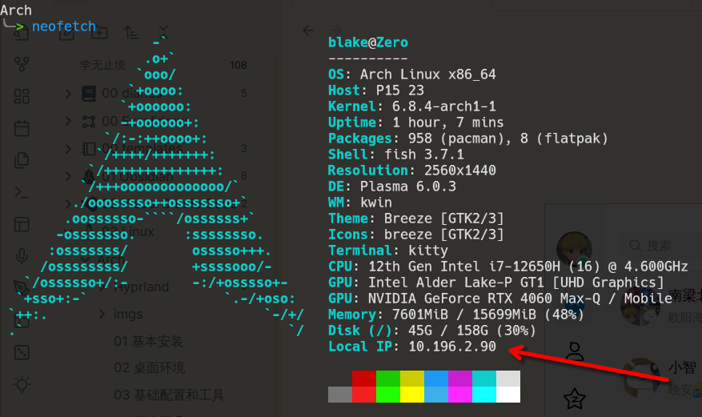

## 1.1目录内容

* `bin`：全称binary，含义是二进制。存储二进制文件，可被运行
* `dev`：主要存放外界设备，如盘、光盘等。存放的外界设备不能直接被使用，需要挂挂载
* `etc`：存储一些配置文件
* `home`：除了root用户以外的其他用户的家目录
* `proc`：全称process，表示进程，存储linux运行时的进程
* `root`：root用户的家目录
* `user`：存放用户安装的程序，二进制文件，头文件等，是用于存放资源的地方
* `var`：存放日志文件

更详细的信息可以看 -> [Arch如何给电脑分区](Arch/01%20基本安装##3.1%20分区)

## 1.2指令与选项

* 指令的含义：在Linux终端（命令行）中输入的内容
* 指令格式：

```bash
命令 [选项] [操作对象]
ls -l /home
```

```ad-tip
选项和操作对象可以没有，也可以是多个
```

## 1.3重要指令

### pwd
> *Print current working directory
> 打印当前终端所在的目录*

```bash
pwd
```

### ls
> *List directory contents
> 列出当前所有文件/文件夹的名称*

```bash
ls ./
ls ./home/blake_john/
```

```ad-tip
1. 可以在命令后接 `--help` 来获取命令具体说明文档，获取选项及其作用
2. 可以通过敲击 `Tab` 自动补全指令
3. 可以通过连续敲击两次 `Tab` 来查看可选择项
```

### cd
> *Change directory
> 切换工作目录*

```bash
cd [相对路径]
cd [绝对路径]
cd ~
```

```ad-tip
`~` 表示用户的家目录
```

### mkdir
> *Make directory
> 创建目录*

```bash
mkdir [文件名]
# 在当前路径创建文件
mkdir -p [路径]
# 可以一次性创建多层不存在的目录，即创建嵌套目录
````

### touch
> *创建文件*

```bash
touch [路径/文件名]
```

```ad-tip
touch既可以创建文件夹，又可以创建文件
```

### rm
> *Remove files or directories
> 删除文件或文件夹*

```bash
rm [文件名]
# 直接接文件名会删除当前目录下的文件
rm -rf [路径/目录名]
# -r 用于递归删除每个目录及其内容
# -f 用于没有提示的情况下强制删除不存在的文件和参数
```

### cp
> *Copy files and directories
> 复制文件/文件夹到指定路径*

```bash
cp [被复制的文件路径] [文件被复制到的路径]
cp -r [文件夹路径]
# `-r`表示递归复制，复制文件夹的时候需要加
```

### mv
> *Move (rename) files
> 移动文件或重命名文件*

```bash
mv [文件] [目标路径]
# 会移动当前路径下的文件到目标路径
# 若在统一移动到同一路径下，但是名字不同则重命名文件
```

### man
> *manuals
> 查看命令手册*

```bash
man [命令]
man ls
man mkdir
```

### cat
> 可以读取一个文件，并在终端中打印出来

```bash
cat [文件]
```

### reboot
> *reboot the machine
> 重启linux系统*

```bash
	roboot
```

### shutdown
> *power-off the machine
> 关机*

```bash
	shutdown -h now
	# 立刻关机
```

### ip
> *检查电脑的ip地址*

```bash
	ip addr show
	ip a
```

> 也可以通过打开 `neofetch` 中显示 ip 地址的选项，能够更直观地看到



## 1.4 进阶指令

### 1. `echo` 

`echo` 是一个用于输出内容到控制台的命令，同时，还可以通过移位符 `>>`  `>` 将输出内容 **重定向** 到指定文件，从而实现文件追加写入的效果 : 

```bash
echo "Hello World !"
# 在终端中会输出 `Hello World !`

echo "export PATH=~/Scripts:$PATH" >> ~/.bashrc
# 将 `export PATH=~/Scripts:$PATH` 追加到 `.bashrc` 文件中
```

`echo` 能够接受系统变量，来输出系统变量的内容

```bash
echo $HOME
echo "$HOME"

# 输出的结构都是 用户所在的家目录
```

此外， `echo` 支持将字符格式化输出，让输出结果变成彩色的 : 

```bash
echo -e <characters>
# -e 用于使后续的字符串支持转译字符，如颜色转译码, \t, \n 等转译字符
```

其中 `<characters>` 是通过 `ANSI` 转译码形成的字符串，如 : 

```bash
# 黄色字体
echo -e "\033[33mThis is yellow !\033[0m"

# 绿色背景
echo -e "\033[42mThis is green background !\033[0m"

# 黄底绿字
echo -e "\033[32;43mHello ECHO !\033[0m"
```

输出的结果 : 


常见的前景转译码 : 

- **黑色：** `\033[30m`
- **红色：** `\033[31m`
- **绿色：** `\033[32m`
- **黄色：** `\033[33m`
- **蓝色：** `\033[34m`
- **洋红色（品红）：** `\033[35m`
- **青色：** `\033[36m`
- **白色：** `\033[37m`

常见的背景转译码 : 

- **黑色背景：** `\033[40m`
- **红色背景：** `\033[41m`
- **绿色背景：** `\033[42m`
- **黄色背景：** `\033[43m`
- **蓝色背景：** `\033[44m`
- **洋红色背景（品红）：** `\033[45m`
- **青色背景：** `\033[46m`
- **白色背景：** `\033[47m`

### 2. `shuf` 

`shuf` 是用来生成随机数的命令 : 

```bash
Usage: shuf [OPTION]... [FILE]
  or:  shuf -e [OPTION]... [ARG]...
  or:  shuf -i LO-HI [OPTION]...
Write a random permutation of the input lines to standard output.

With no FILE, or when FILE is -, read standard input.

Mandatory arguments to long options are mandatory for short options too.
  -e, --echo                treat each ARG as an input line
  -i, --input-range=LO-HI   treat each number LO through HI as an input line
  -n, --head-count=COUNT    output at most COUNT lines
  -o, --output=FILE         write result to FILE instead of standard output
      --random-source=FILE  get random bytes from FILE
  -r, --repeat              output lines can be repeated
  -z, --zero-terminated     line delimiter is NUL, not newline
      --help        display this help and exit
      --version     output version information and exit
```

```bash
echo -i <range> -n <count>

echo -i 1-10 -n 2
# 从 1-10 中随即生成 2 个数字
```

### 3. `read` 

`read` 可以读取用户的输入并储存到一个变量中。

```bash
read: read [-ers] [-a array] [-d delim] [-i text] [-n nchars] [-N nchars] [-p prompt] [-t timeout] [-u fd] [name ...]
    Read a line from the standard input and split it into fields.
    
    Reads a single line from the standard input, or from file descriptor FD
    if the -u option is supplied.  The line is split into fields as with word
    splitting, and the first word is assigned to the first NAME, the second
    word to the second NAME, and so on, with any leftover words assigned to
    the last NAME.  Only the characters found in $IFS are recognized as word
    delimiters. By default, the backslash character escapes delimiter characters
    and newline.
    
    If no NAMEs are supplied, the line read is stored in the REPLY variable.
    
    Options:
      -e	use Readline to obtain the line
      -i text	use TEXT as the initial text for Readline
      -n nchars	return after reading NCHARS characters rather than waiting
    		for a newline, but honor a delimiter if fewer than
    		NCHARS characters are read before the delimiter
      -p prompt	output the string PROMPT without a trailing newline before
    		attempting to read
      -t timeout	time out and return failure if a complete line of
    		input is not read within TIMEOUT seconds.  The value of the
    		TMOUT variable is the default timeout.  TIMEOUT may be a
    		fractional number.  If TIMEOUT is 0, read returns
    		immediately, without trying to read any data, returning
    		success only if input is available on the specified
    		file descriptor.  The exit status is greater than 128
    		if the timeout is exceeded
      -u fd	read from file descriptor FD instead of the standard input
    
```

```bash
read <variable>

read -p "<prompt>" <variable>
```
