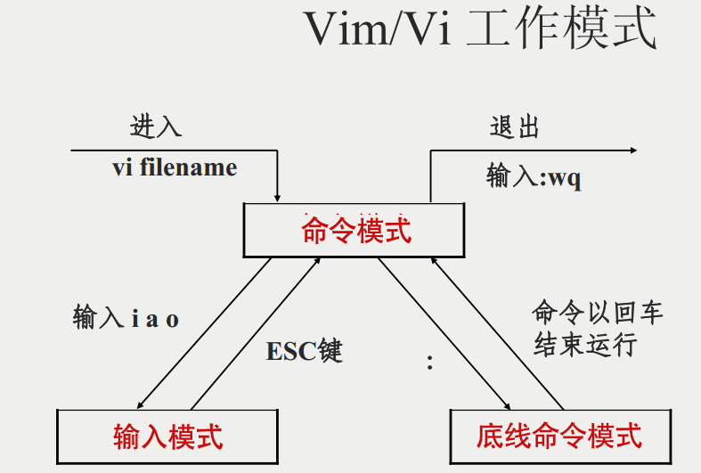
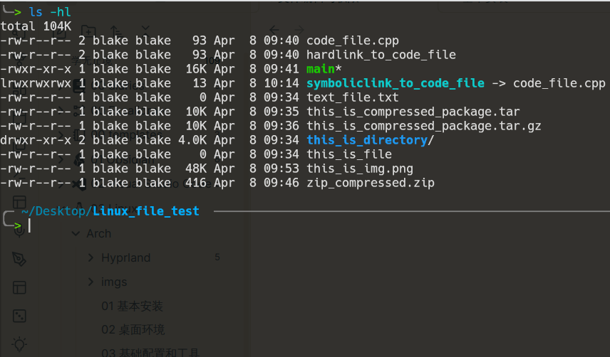
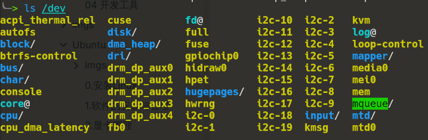
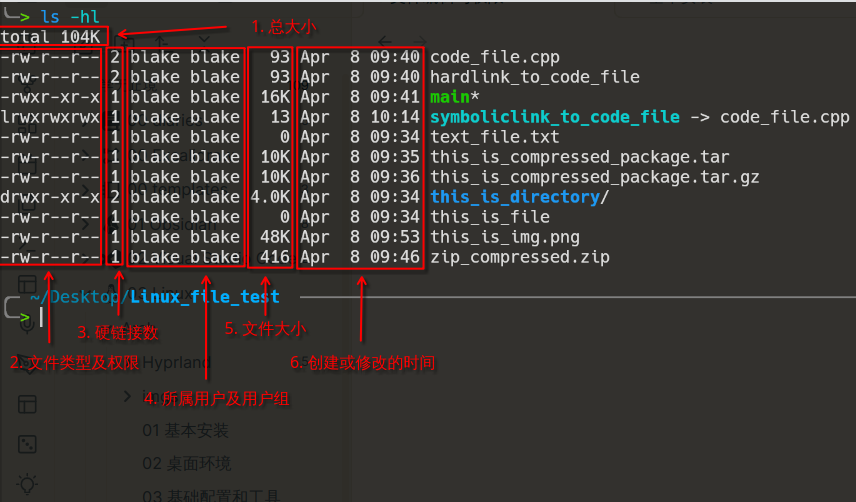
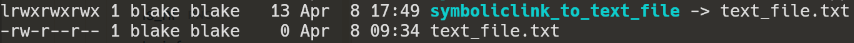
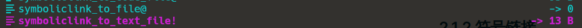

# 01 vim

* 几乎所有linux都会内置vim
* 是所有Unix及Linux系统下标准的编辑器
* vim具有**程序开发能力**，也可以用来对文件进行简单的编辑
* vim最大的特点是可以在**终端中使用**

## 1.1 vim的基本使用

* vim分为三种模式
	* 命令模式
	* 输入模式
	* 底线命令模式
	*具体模式转换可以参考下图



[如何使用vim](https://zhuanlan.zhihu.com/p/120985792)

```
vim [文件]
# 打开文件或创建文件
```

- **_normal_ 模式 --> _insert_ 模式**：

	**_i_**： 在当前光标所在字符的**前面**，转为输入模式；
	
	**_I_**：在当前光标所在**行的行首**，转换为输入模式
	
	**_a_**：在当前光标所在字符的**后面**，转为输入模式；
	
	**_A_**：在当前光标所在**行的行尾**，转换为输入模式
	
	_**o**_：在当前光标所在**行的下方**，**新建一行**，并转为输入模式；
	
	_**O**_：在当前光标所在**行的上方**，**新建一行**，并转为输入模式；

- **_insert_ 模式 --> _normal_ 模式：**

	键入“ _**Esc**键_ ”

* _**normal**_ 模式下关闭文件

	- _**:q**_  退出 _**（quit）**_
	
	- _**:wq**_ 保存并退出 _**（write quit）**_
	
	- _**:q!**_ 不保存并退出
	
	- _**:w**_ 保存 _**（write） :w + 文件名**_ 写入某个文件中
	
	- _**:w!**_ 强行保存
	
	- _**:wq**_ 或 _**:x**_ 保持并退出
	
	- _**ZZ**_ 保存并退出（_**按住Shift+z+z**_）
	
	- **_:saveas <path/to/file>_** 另存为 _**<path/to/file>**_ 

## 1.2 Vim的进阶使用

# 02 文件类型与权限

Linux 系统的文件管理是十分严密，安全的。对于文件的权限的操作与管理也是十分成体系的。

在了解文件的权限之间，我们需要先了解以下文件的类型。

在一个目录下，我们可以通过 `ls -hl` 来展示文件的详细信息 : 





我们能看到，一些终端和 Shell 能够通过颜色来指示文件的类型 : 

- `普通的文件/文本文件` -> 一般是 **灰色/白色** 的，这取决于你终端的最基本的颜色
- `目录` -> 目录在终端中一般为 **蓝色** 
- `设备文件` -> 设备文件一般存放于 `/dev` 目录下，呈现 **黄色** 
- `压缩包` -> 可能为 **红色** 
- `可执行文件` -> 一般为 **绿色** 
- `链接` -> 一般为 **浅蓝色** ，并且带有箭头指向

除了文件本身， `ls -hl` 还展示了很多其他的信息 : 



我们将重点讲讲 2, 3, 4，来进一步学习和了解 Linux 的文件及权限。

## 2.1 链接

在上图中中的第二列显示了所有的硬链接数 。而在 Linux 中，链接分为 **「硬链接」(hard link)** 和 **「符号链接」(symbolic link)**  。

而不管是硬链接还是符号链接，更改其中一个都会导致数据的变化。

### 2.1.1 硬链接

硬链接是指向一个 **索引节点(inode)** 的文件，也就是指向硬盘中特定区块数据的文件。每一个硬链接都是一个 **单独的文件**，但是他们指向了 **同样的硬盘区块**，相当于对当前区块的数据有 **多个入口** 。

#### 特点

1. 指向相同 inode 的文件互为硬链接，即 **文件本身就是一个指向硬盘中某区块的硬链接，每个文件都可以是硬链接，每个硬链接也就是源文件** 
	1. 所以对于系统来说，无论你创建的源文件也好，还是创建的硬链接也好，都同样是普通的文件，是同样的文件类型。因此在上面的图中，硬链接并没有特殊颜色和标识，而是和普通文件一样
	2. 既然指向同样的数据区块，那么其中任何一个文件的改动都会导致另一文件的改动
2. 硬链接可以理解为 C++ 中的 **指针**，一个指向内存的地址，一个指向硬盘的区块
3. 当存在多个硬链接时，删除其中任意一个硬链接，数据本身不会受到影响，相当于只是删除了一个入口而已。当 **所有的硬链接都被删除之后**，数据才真正从你的 **操作系统中消失** 。但是，根据硬盘存储数据的原理，一个文件的删除也只是一个文件标识的清楚，在这一区块的空间被重新利用之前，数据始终存在
	1. 因此，我们可以为某一个重要的文件创建多个硬链接，并对这些硬链接统一管理，防止意外删除那些重要的文件

#### 限制

1. 硬链接不能跨文件系统链接
2. 普通用户不能链接到目录

对于上面的 `code_file.cpp` 和 `hardlink_to_code_file` ，他们互为硬链接，删去其中任何一个，对数据都不会有影响，两个文件的大小也都相等，为 `93 byte` 。因此，我们可以看到，对于这两个文件而言，他们的硬链接数量都为 `2` 。

而对于一个目录而言，每个目录都有一个指向自己的 `.` 和一个指向副目录的 `..` ，因此，当你创建一个目录的时候，就已经会有两个硬链接。而当你在这个目录下创建子目录的时候，由于子目录的 `..` 指向当前目录，那么硬链接数还会再增加 1 。

### 2.1.2 符号链接

符号链接又称为软链接。与硬链接不同，符号链接是一种特殊的文件类型，因此在上图中我们可以看到第一列中的开头有个字母 `l` ，代表着 `link` ，说明了该文件是符号链接文件，而在最后也能看到一个箭头 `->` 指向了被链接的文件。

软链接几乎可以认为就是 windows 系统中的快捷键，是一个特殊的文件。在软链接中就有了源文件的说法，因为软链接和源文件的索引节点inode 并不相同。

#### 特点

1. 软链接是一个独立的文件，有着自己的 inode
2. 软链接实际上是一个 **指向源文件路径** 的文件，我们对软链接操作实际上是对源文件进行操作，软链接的内容并没有变化，还是指向源文件的路径
	1. 因此我们可以发现 **软链接的大小和源文件的大小并不同**，因为是两个不同的文件，源文件存放实际的内容，软链接存放源文件的路径。及时源文件为空，大小为 `0` ，软链接仍然有大小
3. 删除软链接对源文件并没有影响，而删除源文件会让软链接失效
	1. 因为源文件的路径已经不存在，软链接指向一个空路径，这时可能会出提示，告诉你链接已经失效





#### 限制

1. 当被链接的文件路径改变时，软链接就无法再链接到目标文件
2. 源文件删除后，文件就彻底消失

### 2.1.3 创建链接

在了解了链接的类型和区别之后，我们也要学会创建链接。

在 Linux 中，用于创建链接的命令为 `ln` ，最基本的使用如下 : 

```bash
ln [options] <source_file> <link>
```

#### 创建硬链接

```bash
ln <source_file> <link>
ln code_file.cpp hardlink_to_code_file
```

#### 创建软链接

```bash
ln -s <source_file> <symboliclink>
ln -s code_file.cpp symboliklink_to_code_file
```

还有其他的选项具体可以查看帮助文档或使用手册。

> 通过 `<command> --help` 来查看帮助文档，通过 `man <command>` 来查看使用手册。
> 此外，还可以通过 `tldr <command>` 来查看使用案例。

## 2.2 权限

我们已经知道，Linux 有着一套十分严密的权限管理系统，而在 `ls -hl` 中，第一列和第三列共同展示出一个文件的权限信息。

### 2.2.1 权限列

```bash
-rw-r--r-- 2 blake blake   93 Apr  8 09:40 code_file.cpp
-rw-r--r-- 2 blake blake   93 Apr  8 09:40 hardlink_to_code_file
-rwxr-xr-x 1 blake blake  16K Apr  8 09:41 main*
drwxr-xr-x 3 blake blake 4.0K Apr  8 10:19 this_is_directory/
lrwxrwxrwx 1 blake blake   13 Apr  8 10:14 symboliclink_to_code_file -> code_file.cpp
crw-rw-rw- 1 root  tty      5,     0 Apr  8 12:24 tty
brw-rw---- 1 root  disk   259,     0 Apr  8 12:24 nvme0n1
# ^^^^^^^^
# 这一列
# 展示出权限
```

Linux对于一个文件的基本权限有三个 : 可读，可写，可执行。分别对应着缩写 `r(read)` , `w(write)` , `x(execute)` 。

在这一列中，一共有 10 个字符

- 第一个字符指示文件的类型， `-/.` 为普通文件， `d` 为目录(directory)文件， `l` 为符号链接文件， `c` 为字符(character)设备文件，有串口，终端等， `b` 为块(block)设备文件，有硬盘，闪存等。
- 后九个字符每三个一组，分别表示 **`User`** , **`Group`** , **`Others`** 对该文件的权限， `-` 代表没有该权限，权限的顺序都为 `rwx` 可读，可写，可执行。

### 2.2.2 所有权

```bash
-rw-r--r-- 2 blake blake   93 Apr  8 09:40 code_file.cpp
-rw-r--r-- 2 blake blake   93 Apr  8 09:40 hardlink_to_code_file
-rwxr-xr-x 1 blake blake  16K Apr  8 09:41 main*
drwxr-xr-x 3 blake blake 4.0K Apr  8 10:19 this_is_directory/
lrwxrwxrwx 1 blake blake   13 Apr  8 10:14 symboliclink_to_code_file -> code_file.cpp
crw-rw-rw- 1 root  tty      5,     0 Apr  8 12:24 tty
brw-rw---- 1 root  disk   259,     0 Apr  8 12:24 nvme0n1
#             ^^^^^^^^
#             这一列
#             展示出所有权
```

Linux 的文件有两个所有属性，一个是 **`User用户`** ，一个是 **`Group用户组`** 。

第三列按照 `User Group` 的顺序列出文件的所有权，对于列出的 `User` 有着第一列中前2-4个字符的权限，对于列出的 `Group` 有着第一列中前 5-7 个字符的权限。其他的均只有 `Others` 列出的第 8-10 个字符的权限。

例如，

- 对于文件 `main*` 来说，所有用户为 `Blake` ，所有组为 `Blake` ，则只有用户 `Blake` 拥有 `rwx` 可读可写可执行的权限，而在用户组 `Blake` 中的用户拥有 `rx` 可读可执行的权限，至于其他用户则有 `rx` 可读可执行的权限
- 对于文件 `nvim0n1` 来说，用户 `root` 拥有 `rw` 可读可写的权限，而用户组 `disk` 中的用户拥有 `rw` 可读可写的权限，而其他用户对该文件没有任何权限

> [!note] 
> 在 Linux 系统中，**一切皆文件** ，包括串口，终端，硬盘，闪存等设备都有一个相应的文件可以来修改，我们操作那个文件就是在操作对于的设备。

### 2.2.3 修改文件权限

在 Linux 中，我们可以通过 `chmod` (change mode) 命令来更改文件的权限。基本的使用如下 : 

```bash
chmod [options] <mode> <file/dir>
```

#### 1. 使用字符来设置权限

我们可以通过 `+/-` 为每一个组设置对应的权限，如 : 

```bash
chmod u+x main
# 对 User 添加可执行的权限

chmod u-w main
# 对 User 移除可写的权限

chmod o+w code.cpp
# 对 其他用户 添加可写的权限

chmod g-w main
# 对 Group 移除可写的权限

chmod ug+x main
# 对 User 和 Group 添加可写的权限

chmod go-wx main
# 对 Group 和 Others 移除可写可执行的权限

chmod +x main
# 对所有组添加可执行的权限
```

在上面的命令当中， `+` 添加该权限， `-` 移除该权限，我们可以通过指定组的名称来设置权限，也可以略去来为所有组设置权限。

#### 2. 通过组来设置权限

我们还可以通过 \`=\` 来将某一组的权限设置得与其他组的权限一致，如 : 

```bash
chmod o=g main
# 将 Others 的权限设置得和 Group 的权限一样
```

#### 3. 通过数字来设置权限

在 Linux 系统中， `r` 用数字 `4` 来表示， `w` 用数字 `2` 来表示， `x` 用数字 `1` 来表示，想要设置什么权限，就将什么权限的数字加上，如 : 

```bash
chmod 644 main
# 对 User 设置 可读可写 权限
# 对 Group 设置 可读 权限
# 对 Others 设置 可读 权限

chmod 777 main
# User Group Others 都有 可读可写可执行 的权限

chmod 640 main
# User 有 可读可写 的权限
# Group 有 可读 的权限
# Others 没有任何权限
```

我们只需要分别为 `User` , `Group` , `Others` 三个位置设置需要的权限的代数就可以了。

此外，我们还可以通过添加一些选项，如 `-R` 选项可以递归设置权限，即将该目录及目录下的所有文件和子目录都设置成同样的权限。

#### 4. 其他

在 Linux 中，你可能会发现不知道什么情况下，有一些目录下的所有文件都被绿色高亮显示，这是因为所有人 `User` , `Group` , `Others` 都有可读可写可执行的权限，系统认为这是一个危险的文件。因此，要去掉不必要的绿色高亮，我们需要重新设置文件权限。

系统创建的普通文件默认的权限为 `644` ，即 `rw-r--r--` ，只有 `User` 有可读可写的权限，其他组都对该文件只读。

若是我们通过 `chmod -R 644 ./` 来将当前目录下的所有都设置成 `644` ，这时候我们会发现，无法进入到子目录中。

这是因为对于目录来说，还需要一个额外的 `x` 可执行权限，我们才能通过 `cd` 命令切换到该目录中，因此，我们不能将目录设置为 `644` ，而因该设置为 `755` 。但是，一个一个设置还是太麻烦，这时，我们需要通过 `find` 命令来查找普通文件，并设置其权限 : 

```bash
find . -type f -exec chmod 644 {} \;
```

其中， `-type f` 用于检查文件是否为 `file` 类型，所有类型为 : 

- `l` - symbolic link
- `b` - block
- `d` - directory
- `c` - character device
- `f` - file
- `p` - named piped
- `s` - socket

这个命令的作用是在当前目录（以 `.` 表示）及其所有子目录中查找所有类型为普通文件（即常规文件，而不是目录、设备文件等）的文件，并将它们的权限设置为 `644` 。

具体步骤如下：

1. `find .`: 这个命令使用 `find` 工具，在当前目录及其所有子目录中搜索文件。
2. `-type f`: 这个选项告诉 `find` 只查找普通文件。
3. `-exec chmod 644 {} \;`: 对于每个找到的文件，使用 `chmod 644` 命令来修改其权限。
	1. `{}` 表示 `find` 命令找到的文件名， `\;` 表示命令的结尾。 `chmod 644` 将文件的权限设置为 `-rw-r--r--`，即拥有者具有读写权限，而组和其他用户只有读权限。
	2. `{}` 是 `find` 的特殊符号，用来代表找到的文件名或者路径

综合起来，这个命令的目的是将当前目录及其所有子目录中的所有普通文件的权限设置为 `-rw-r--r--`，即用户可读写，而组和其他用户只有读权限。


### 2.2.4 修改文件所有权

在 Linux 中，我们可以通过 `chown` (change owner) 来更改文件的所有权 : 

```bash
chown [options] <User>[:<Group>] <file>

chown blake:wheel main
# 将 main 的所有权转移到 User 为 blake, Group 为 wheel
chown -R root:root ./ 
# 将当前目录及所有文件/子目录的所有权转移到 User 为 root, Group 为 root
```

