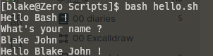
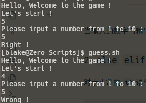
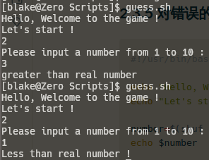
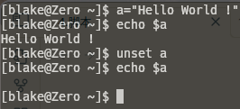

脚本就是一系列系统命令的集合，能够实现自动化和减轻负担的功能。

# 01 什么是脚本文件

脚本文件可以是任意扩展名，也可以没有扩展，但是在脚本第一行必须指明 **解释器** 。

在声明解释器之后，就是我们的脚本内容，还可以为脚本添加注释。

## 1.1 解释器

解释器是用来分析并执行脚本文件的 Linux 内核。我们可以通过 `cat /etc/shells` 来查看系统中具有的解释器 : 

```bash
cat /etc/shells
```

```Output
# Pathnames of valid login shells.
# See shells(5) for details.

/bin/sh
/bin/bash
/bin/rbash
/usr/bin/sh
/usr/bin/bash
/usr/bin/rbash
/usr/bin/git-shell
/usr/bin/fish
/bin/fish
```

通常，我们使用 `sh` 或 `bash` 来编写并执行脚本，因为这两个解释器是所有 `Linux` 系统都自带的。

## 1.2 脚本内容

脚本的内容十分丰富 : 

- 命令
- 函数
- 控制结构
- 循环结构
- 变量
- ...

我们可以在脚本中写入任何我们需要的，语法正确的命令。

> `Bash` 脚本也可以看成是一门编程语言，具有编程语言的大多数特性

## 1.3 注释

脚本中的注释通过在命令前添加 `#` 来实现，与 `Python` 一致，如 : 

```bash
# this is my first script
echo "Hello Bash !"
```

# 02 脚本快速入门

## 2.1 编写脚本

我们编写一个 `hello.sh` : 

```bash
#!/usr/bin/bash

echo "Hello Bash"
echo "What's your name ? "
read your_name
echo "Hello $your_name"
```

其中，第一行 `#!/usr/bin/bash` 声明了该脚本使用的解释器， `echo` 能够将内容输出到终端， `read` 能够获取用户输入并保存到变量中，而 `$your_name`  则是在引用变量。

> 脚本的变量默认都是全局的，在当前的 `Bash` 或 `Shell` 中，任意的函数都可以直接引用我们在终端中定义的变量

## 2.2 执行脚本

脚本的执行主要有两种方式 : 

1. 作为可执行文件直接执行
2. 通过指定解释器来执行脚本

### 2.2.1 可执行文件

在 `Linux` 中，我们可以把脚本文件 [转化成可执行文件](3.文件编辑与权限#2.2.3%20修改文件权限)，这样，我们就可以在终端中直接执行这一脚本 : 

```bash
chmod +x hello.sh
./hello.sh
```

此时，脚本就会执行。

### 2.2.2 通过解释器执行

我们还可以通过解释器来执行脚本文件 : 

```bash
bash hello.sh
```

执行结果 :



## 2.3 猜数字游戏

我们现在思考一个猜数字游戏需要实现哪些功能 : 

1. 输出初始化信息
2. 生成随机数
3. 获取用户输入结果
4. 判断用户输入结果与生成的结构是否一致
5. 猜对了结束，猜错了给出提示，并循环进行

### 2.3.1 输出初始化信息

所谓初始化信息，其实就是输出一些 `greeting` 来让程序显得更完整 : 

```bash
#!/usr/bin/bash

echo "Hello, Welcome to the game !"
echo "Let's start !"
```

`echo` 是一个用于输出传入的内容到控制台上的命令，可以查看 [echo](1.基本使用手册#1.%20`echo`) 。

### 2.3.2 获取随机数

在 `Bash` 中，我们可以通过 `shuf` 命令来获取一个随机数，并将其保存在变量 `number` 中 : 

```bash
#!/usr/bin/bash

echo "Hello, Welcome to the game !"
echo "Let's start !"

number=$(shuf -i 1-10 -n 1)
```

其中， `$()` 是一个 **命令替换语法**，会替换成 `()` 内的结果，及通过这种方法我们可以将 `()` 中的命令的输出结果赋值给 `number` 。

不仅是命令，变量的使用也是需要通过 `$` 来实现，不过变量是通过增加 `{}` 来实现引用。但一般情况下，变量名没有空格，不需要增加 `{}` 来告诉解释器 `$` 的作用范围。

```bash
echo $number
# 输出 number 的值

echo ${number} 
# 结果一致
```

> `shuf` 的使用可以见 [shuf](1.基本使用手册#2.%20`shuf`) 

### 2.3.3 获取用户输入结果

我们可以通过 `read` 来获取用户的输入结果 : 

```bash
#!/usr/bin/bash

echo "Hello, Welcome to the game !"
echo "Let's start !"

number=$(shuf -i 1-10 -n 1)

echo "Please input a number from 1 to 10 : "
read guess
```

其中， `read guess` 将用户的输入结果存储到变量 `guess` 中。

> `read` 的使用可以见 [read](1.基本使用手册#3.%20`read`) 

### 2.3.4 判断用户输入结果是否正确

#### 1. `if`

既然要判断结果是否正确，那么就需要用到条件分支 `if` ，在 `bash` 中， `if` 的基础语法为 : 

```bash
if [ <condition> ]; then
	# do something
fi
```

值得注意的是，在判断条件的语句中， `<condition>` 和 `[]` 之间 **必须有一个空格**，且 **仅能有一个空格**，否则命令无法执行，此外， `if` 的结束标志为 `fi` ，若少了也无法执行。

因此，我们可以这样写脚本 : 

```bash
#!/usr/bin/bash

echo "Hello, Welcome to the game !"
echo "Let's start !"

number=$(shuf -i 1-10 -n 1)
echo $number

echo "Please input a number from 1 to 10 : "
read guess

if [ $guess -eq $number ]; then
	echo "Right !"
fi
```

其中 `-eq` 是用于比较两个 **数字** 是否相等(equal)的表达式，相等为真。

当输入的数字与输出的数字相等的时候，我们就会得到 `Right !` 

#### 2. `else` `elif` 

对于正常的 `if` 语句，自然要能够产生不同的分支 : 

```bash
if [ <condition ]; then
	# do something
elif [ <condition> ]; then
	# do something
else
	# do something
fi
```

当我们想对错误的结果输出 `Wrong !` 时，就可以使用 `else` 分支 : 

```bash
#!/usr/bin/bash

echo "Hello, Welcome to the game !"
echo "Let's start !"

number=$(shuf -i 1-10 -n 1)
echo $number

echo "Please input a number from 1 to 10 : "
read guess

if [ $guess -eq $number ]; then
	echo "Right !"
else
	echo "Wrong !"
fi
```

此时，如果我们去掉输出随机数的命令，就有了猜数字游戏的雏形了 : 



### 2.3.5 对错误的输入做出提示

```bash
#!/usr/bin/bash

echo "Hello, Welcome to the game !"
echo "Let's start !"

number=$(shuf -i 1-10 -n 1)
echo $number

echo "Please input a number from 1 to 10 : "
read guess

if [ $guess -eq $number ]; then
	echo "Right !"
elif [ $guess -lt $number ]; then
	echo "Less than real number !"
else
	echo "greater than real number"
fi
```

其中， `-lt` 是 `less than` ，判断是否小于，小于为真。



### 2.3.6 循环

在 `Bash` 中，我们也可以编写循环语句，在这里，我们需要用到 `while` 语句 : 

```bash
while [ <condition> ]; do
	# do something
done
```

当输入的结果和生成的结果不相同时，就一直循环 : 

```bash
#!/usr/bin/bash

echo "Hello, Welcome to the game !"
echo "Let's start !"

number=$(shuf -i 1-10 -n 1)
guess=0 # 为了让 while 循环可以判断，我们需要先定义好 guess
echo $number

while [ $guess -ne $number ]; do
	echo "Please input a number from 1 to 10 : "
	read guess
	
	if [ $guess -eq $number ]; then
		echo "Right !"
	elif [ $guess -lt $number ]; then
		echo "Less than real number !"
	else
		echo "greater than real number"
	fi
done
```

其中， `-ne` 是 `not equal` ，不等时为真。

> `bash` 中的条件判断十分灵活，这得益于变量的类型可以改变，例如，我们可以将 `$guess -eq $number` 改写成 `$guess == "$number"` ，将他们当成字符串来比较。

### 2.3.7 重复游戏

在上面的脚本中，当我们猜对时，游戏就会结束，此时我们可以通过新增一个用于判断用户是否要结束游戏的判断 : 

```bash
#!/usr/bin/bash

echo "Hello, Welcome to the game !"
echo "Let's start !"

number=$(shuf -i 1-10 -n 1)
guess=0 # 为了让 while 循环可以判断，我们需要先定义好 guess
echo $number

while true; do
	echo "Please input a number from 1 to 10 : "
	read guess
	
	if [ $guess -eq $number ]; then
		echo "Right ! To contiue ? (y/n) "
		read choice
		if [ $choice == "y" ] || [ $choice == "Y" ]; then
			number=$(shuf -i 1-10 -n 1)
			continue
		else
			break
		fi
	elif [ $guess -lt $number ]; then
		echo "Less than real number !"
	else
		echo "greater than real number"
	fi
done
```

其中， 字符串之间的判断使用 == 或 `!=` 来判断是否相同，而且，我们也可以通过 `||` `&&` 来连接不同的条件。 `break` 和 `continue` 同其他编程语言的用法一致。

除了使用 `shuf` 来生成随机数，系统变量 `$RANDOM` 每次被调用生成 `0-32767` 之间的随机数。所以我们可以通过 `number=$(($RANDOM % 10 + 1))` 来生成  `1-10` 的随机数。

其中， `$(())` 是 **数学运算符** ，所有的数学运算必须包括在 `$(())` 中，才能正常运算

# 03 变量

脚本中的变量可以 **存储任意数据类型**，也 **可以是任意数据类型**。而且我们说过，脚本中的变量 **默认都是全局变量**，我们在函数或者结构体中定义的变量可以在当前环境下的任意位置使用。

## 3.1 操作变量

### 3.1.1 如何定义一个变量

#### 1. 定义一个普通变量

在 `Bash` 中，我们可以通过 `<variable>=<value>` 来定义一个变量。

```bash
number=1
string="I am a string"
arry=(I am A array with lens of 8)
```

变量的名字可以是任意的，但 **不能数字开头** ，也 **不能以系统命令为名** 。同时，在定义变量的时候，变量名和值之间通过 `\=` 号连接，且 **与等号之间最好不要有空格** 。

#### 2. 使用命令的结果定义变量

在上面我们讲过，把命令执行后的结果赋值给一个变量需要使用 `$()` **命令替换语法** ，如 : 

```bash
dir_list=$(ls)
server_id=$(hostID)
```

#### 3. 通过 `read` 给变量赋值

`read` 能够获取标准输入 `Standard Input` 并将其赋值给一个变量 : 

```bash
read <variable>
read -p "<prompt>" <variable>
```

#### 4. 只读变量

我们可以通过 `readonly` 来声明一个变量为只读 : 

```bash
PI=3.1415926
readonly PI
```

### 3.1.2 引用变量

我们可以通过 `$` 操作符来引用变量，获取其值，如 : 

```bash
a="Hello World !"
echo $a

echo ${a}    # 结果和上面的一致，对于变量可加可不加
```

> 关于 `$a` 还是 `${a}` ，并没有太大的所谓。如果我们需要将一个路径赋值给变量，如 : 
> `root_path=./scripts` ，当我们需要调用 `root_path` 下的脚本时，我们可以通过 `${root_path}/my_scripts.sh` 或者 `$root_path/my_path` 来调用。
> 
> 如果是将文件名除去后缀后赋值给变量，如 : 
> `file=main` ，那么在引用时应当注意应该使用 `cat $file\.cpp` 或者 `cat ${file}.cpp` 

### 3.1.3 解除变量

我们可以通过 `unset` 来接触一个变量，例如 : 

```bash
a="Hello World !"
echo $a

unset a
echo $a
```

在解除了变量之后，输出为空 : 



## 3.2 变量类型

变量类型主要有 : 

- 整数
- 浮点数
- 字符串
- 数组
- 特殊变量

其中，最值得讲讲的就是 **字符串** ， **数组** 和 **特殊变量**。

我们在上面曾讲过变量可以是任意类型，实际上，系统默认的变量都是 **字符串** 类型，但是在一些测试 (test) 中变量的类型又不是定死的。

我们可以声明变量的类型 : 

```bash
declare -i my_int=42                  # 定义整数
declare -a index_array=(1 2 3)        # 定义索引数组
declare -A associate_array            # 定义关联数组，如同字典
```

### 3.2.1 字符串

#### 1. 字符串的定义

字符串是脚本中最常用的变量，**既可以是单引号，也可以是双引号，还可以没有引号** 。但是，一般建议使用双引号来括起字符串 : 

- 双引号里可以 **直接引用变量** 
- 双引号里可以 **出现转译字符** 

```bash
name="Blake John"
echo -e "Hello! \n $name !"
```

#### 2. 拼接字符串

`Bash` 中的字符串拼接十分暴力，直接将两个字符串摆在一起即可 : 

```bash
str1="Hello "
str2="Blake !"
echo $str1$str2
# Hello Blake !

str3=$str1$str2
echo $str3
# Hello Blake !
```

#### 3. 获取字符串长度

`Bash` 中，获取字符串的长度应该使用 `${#<string>}` 或 `${#<string>[0]}` : 

```bash
str="abcd"
echo "${#str}"
# 4
```

> 在后面，我们会讲到， `${#<variable>}` 方法不止能用来获取字符串的长度，还可以用来获取数组的长度

#### 4. 字符串切片

我们可以通过 `${<string>:<start>:<count>}` 的方法来提取字符串的一部分内容 : 

```bash
str="Bash_is_a_good_shell"
echo ${str:5:15}
# is_a_good_shell
```

### 3.2.2 数组

`Bash` 仅支持一维数组，不支持多维数组，但是没有限定数组的大小。

#### 1. 定义一个索引数组

我们可以直接通过 `array=(<value1> <value2> ...)` 的方法来定义一个数组，不同数组元素之间通过 **空格隔开** 。

既然是 **索引数组**，我们也可以通过索引来定义数组的各个分量，即特定索引的元素 : 

```bash
array=(1 2 3 4)
# 1 2 3 4
array[1]=5
array[3]=6
# 1 5 3 6
```

#### 2. 读取数组

读取数组也是需要通过 `$` 来获取其值，但是，由于我们要添加额外的索引，因此 `$` 的作用域不再只是变量名，而是扩展到索引。此时我们需要使用 `${}` 来规定 `$` 的作用域 : 

```bash
arry=(1 2 3 4)
echo ${arry}
echo $arry[1]
# 1

echo ${arry[1]}
# 2
```

在上面的 `echo $arry[1]` 中，由于没有 `{}` 指示 `$` 的作用域，因此默认读取第一个元素。

除了获取单个元素，我们也可以获取以整个数组 : 

```bash
arry=(1 2 3 4)
echo ${arry[@]}
# 1 2 3 4
```

#### 3. 获取数组长度

获取数组长度和获取字符串的长度使用的方法都是 `${#<variable>}` ，只不过数组需要 **额外增加一个用来代表全部元素的索引** : 

```bash
arry=(1 2 3 4)
echo ${#arry[@]}
# or
echo ${#arry[*]}

# 4
```

#### 4. 获取数组索引列表

我们可以通过 `${!<array>[@]}` 或 `${!<array>[*]` 来生成一个由数组索引组成的数组 : 

```bash
array=(1 3 6 9)
echo ${!array[@]}
# 0 1 2 3

echo ${!array[*]}
# 0 1 2 3
```

#### 5. 关联数组

关联数组其实可以认为是 `Python` 中的字典，一个关联数组的元素由 **键** 和 **值** 组成，每个键由 `[]` 包起来，并用 `\=` 来连接键值对。

关联数组可以通过 `declare -A <array_name>` 来声明 : 

```bash
# 直接定义关联数组
declare -A webs=(["google"]="www.google.com" ["baidu"]="www.baidu.com" ["github"]="github.com")

# 通过 declare 声明数组
declare -A web_sites
web_sites["gitee"]="gitee.com"
web_sites["bilibili"]="www.bilibili.com"
```

获取关联数组的值可以通过键来访问 : 

```bash
echo ${webs["github"]}
# github.com

echo ${web_sites["gitee"]}
# gitee.com
```

输出整个关联数组 : 

```bash
echo ${webs[@]}
# or
echo ${webs[*]}
```

获取数组长度 : 

```bash
echo ${#webs[@]}
# or
echo ${#webs[*]}
```

与索引数组不同的是，索引数组通过 `${!<array>[@]` 或 `${!<array>[*]` 的方法获取的是索引组成的列表，而对于关联数组，则输出由 **键** 组成的列表 : 

```bash
echo ${!webs[@]}
# or
echo ${!webs[*]}

# google baidu github
```

### 3.2.3 特殊变量

`Bash` 中的特殊变脸指的是在脚本运行过程中参数传递时产生的变量，这里的参数传递既包含脚本的参数传递，又包含脚本内函数的参数传递。

- `$#` - 传递给脚本的参数个数
- `$0` - 脚本的名称
- `$n` - 传递给脚本的第 `n` 各参数， $n \in [1, +\infty), n \in Z$ 
- `$*` - 以一 **单字符串** 显示所有向脚本传递的参数，即 `"$1$2...$n` 
- `$@` - 通过 **多字符串** 形式返回所有参数
- `$$` - 脚本运行的当前进程 ID
- `$!` - 后台运行的最后一个进程的 ID
- `$?` - 显示最后命令的推出状态， `0` 表示没有错误，其他任何值都表明有错误

# 04 运算和测试

运算指的是运算的过程，如数学运算，判断大小等，而测试则是利用其中一些运算的到的结果 (bool) 来判断条件真假。

通常情况下，我们会在测试的时候使用一些关系运算符，逻辑运算符等等。

测试使用 `[ <condition> ]` 来进行，通过接受运算结果来判断条件是否为真，广泛用于 `if` 和 `while` 中。

## 4.1 数学运算

`Bash` 中的数学运算必须包含在 `$(())` 中，才能得到运算结果，才能用于赋值，比较，输出等操作 : 

```bash
a=$((1 + 5))
echo $a
# 6

if [ $a == $((12 / 2)) ]; then
	echo "$a = 12 / 6"
else
	echo "$a != 12 / 6"
fi
# 6 != 12 / 6
```

`+` `-` `*` `/` `%` 是最常见的数学运算符

## 4.2 关系运算符

数字之间的关系可以通过关系运算符来完成 : 

- `-eq` - equal
- `-ne` - not equal
- `-gt` - greater than
- `-ge` - greater or equal
- `-lt` - less than
- `-le` - less or equal

其中， `-eq` 可以用 `\==` 来代替， `-ne` 可以用 `!=` 来代替。其他不可用 `<` 等符号代替 : 

```bash
a=5
b=6
if [ $a -eq $b ]; then
	echo "$a -eq $b"
elif [ $a -lt $b ]; then
	echo "$a -lt $b" 
elif [ $a -gt $b ]; then
	echo "$a -gt $b"
fi
```

## 4.3 逻辑运算

逻辑运算无非三者 : 

- `&&` - 与
- `||` - 或
- `!` - 非

```bash
a=10
b=20

if [ $a -lt 100 ] && [ $b -lt 100 ]; then
	echo "$a and $b -lt 100"
fi

# or

if [[ $a -lt 100 && $b -lt 100 ]]; then
	echo "$a and $b -lt 100"
fi

if ! [ $a -gt 100 ]; then
	echo "$a is not -gt 100"
fi

if [ $a -lt 100 ] || [ $b -lt 100 ]; then
	echo "$a or $b -lt 100"
```

## 4.4 字符串运算

对于字符串，我们主要判断 : 

- `\=` / `\==` - 是否相等
- `!=` - 是否不等
- `-z` - 是否为空，空为真
- `-n` - 是否非空，非空为真
- `$` - 是否非空， `[ $a ]` 当 `a` 非空时返回 `true` 

```bash
a="abc"
b="abc"
c="abcd"
d=

if [ $a ]; then
	echo "$a is not none"
fi

if [ -n $a ]; then
	echo "a is not none"
fi

if [ -z $d ]; then
	echo "d is none"
fi

if [ $a == $b ]; then
	echo "$a is equal to $b"
fi

if [ $a != $c ]; then
	echo "$a is not equal to $c"
fi
```

## 4.5 文件测试运算

文件测试运算符主要用于检测 Linux 文件系统的各种属性 : 

| 操作符         | 说明                                              | 举例                     |
| ----------- | ----------------------------------------------- | ---------------------- |
| `-b <file>` | 是否是 **块设备文件**，是则返回 true                         | \[ -b $file ] 返回 false |
| `-c <file>` | 是否是 **字符设备文件**，是则返回 true                        | \[ -c $file ] 返回 false |
| `-d <file>` | 是否是 **目录**，是则返回 true                            | \[ -d $file ] 返回 false |
| `-f <file>` | 是否是 **普通文件**(既 **不是目录**，也 **不是设备文件**),是则返回 true | \[ -f $file ] 返回 true  |
| `-g <file>` | 检测文件是否设置了 SGID 位，如果是，则返回 true                   | \[ -g $file ] 返回 false |
| `-k <file>` | 检测文件是否设置了粘着位(Sticky Bit)，如果是，则返回 true           | \[ -k $file ] 返回 false |
| `-p <file>` | 检测文件是否是有名管道，如果是，则返回 true                        | \[ -p $file ] 返回 false |
| `-u <file>` | 检测文件是否设置了 SUID 位，如果是，则返回 true                   | \[ -u $file ] 返回 false |
| `-r <file>` | 检测文件是否可读，如果是，则返回 true                           | \[ -r $file ] 返回 true  |
| `-w <file>` | 检测文件是否可写，如果是，则返回 true                           | \[ -w $file ] 返回 true  |
| `-x <file>` | 检测文件是否可执行，如果是，则返回 true                          | \[ -x $file ] 返回 true  |
| `-s <file>` | 检测文件是否为空（文件大小是否大于0），不为空返回 true                  | \[ -s $file ] 返回 true  |
| `-e <file>` | 检测文件（包括目录）是否存在，如果是，则返回 true                     | \[ -e $file ] 返回 true  |

其他检查符：

- `-S` - 判断某文件是否 socket
- `-L` - 检测文件是否存在并且是一个符号链接

# 05 控制流

`Bash` 可以视为一个编程语言，因此也具有他自己的控制流。最主要的有 : 

- `if - elfi - else` 
- `case` 
- `for` 
- `while` 

## 5.1 `if` 

```bash
if [ <condition> ]; then
	# do something
elif [ <condition> ]; then
	# do something
else
	# do something
fi
```

我们已经简单讲过 `if` 的语法，仍然需要注意的就是 `[ <condition> ]` 中 `<condition>` 和 `[]` 之间的空格不能少， `if` - `fi` 构成一整个控制流， `fi` 也不能少。

> 如果想要使用 `<` `>` 来作为运算符，则可以使用 `if (( <condition> )); then` 的语法

## 5.2 `case` 

```bash
case <value> in
	(<case1>)
		# do something
		;;
	(<case2>)
		# do something
		;;
	...
esac
```

需要注意的是， `case` - `esac` 构成一个完整的控制流， `esac` 不能漏。

而在每一种情况中，我们逐行写完所有的命令，最后需要用 `;;` 来表示情况的结束。

## 5.3 `for` 

`Bash` 的 `for` 循环既可以像 `Python` 一样使用一个变量遍历一个列表，又可以像 `C++` 一样使用三段式结构 : 

```bash
for item in item1 item2 item3 ... itemn; do
	# do something
done

# or

for item in iterator; do
	# do something
done

# or

for ((var=0; var<n; var++)); do
	# do something
done
```

需要注意的是， `iterator` 实际上就是一个用来表示 `item1 item2 item3 ... itemn` 的变量，如 `${arry[@]}` 一个数组的展开， `${!array[@]}` 由数组索引组成的数组，甚至可以 : 

```bash
colors="yellow green blue white"
for color in $colors; do
	echo $color
done
# yellow
# green
# blue
# white
```

## 5.4 `while` 

`Bash` 的 `while` 语句也和其他编程语言一样大差不差 : 

```bash
while [ <condition> ]; do
	# do something
done
```

# 06 函数

`Bash` 中的函数极为灵活，既不要求返回值，又不要求参数列表。

```bash
function <function_name> ()
{
	# body
}

# or 

<function_name> ()
{
	# body
}
```

函数的调用只需要使用 `<function_name> <param1> <param2> ...` 即可，不需要额外添加括号 : 

```bash
print_len ()
{
	echo ${#1}
}

print_len "abcd"

# 4
```

至于函数传递参数，则可以看 [特殊变量](#3.2.3%20特殊变量) 。

# 07 重定向输入/输出

我们常常能够见到 `echo "export PATH=~/scripts:$PATH" >> ~/.bashrc` ，这个实际上是用到了 **输出重定向** ，通过 `>>` 将输出重定向到 `~/.bashrc` 。

| 命令                | 说明                             |
| ----------------- | ------------------------------ |
| `command > file`  | 将输出重定向到 file。                  |
| `command < file`  | 将输入重定向到 file。                  |
| `command >> file` | 将输出以追加的方式重定向到 file。            |
| `n> file`         | 将文件描述符为 n 的文件重定向到 file。        |
| `n>> file`        | 将文件描述符为 n 的文件以追加的方式重定向到 file。  |
| `n>&m`            | 将输出文件 m 和 n 合并。                |
| `n<&m`            | 将输入文件 m 和 n 合并。                |
| `<< tag`          | 将开始标记 tag 和结束标记 tag 之间的内容作为输入。 |

值得注意的是 `>` 为 **覆盖** ，而 `>>` 为 **追加** 。

## 7.1 标准文件

一般情况下，每个 Unix/Linux 命令运行时都会打开三个文件：

- **标准输入文件**(`stdin`)：stdin的文件描述符为 `0`，Unix程序默认从 `stdin` 读取数据。
- **标准输出文件**(`stdout`)：stdout 的文件描述符为 `1`，Unix程序默认向 `stdout` 输出数据。
- **标准错误文件**(`stderr`)：stderr的文件描述符为 `2`，Unix程序会向 `stderr` 流中写入错误信息。

默认情况下，`command > file` 将 `stdout` 重定向到 `file`，`command < file` 将 `stdin` 重定向到 `file`。

如果我们希望将错误信息重定向到 `error.log` 文件，方便后续查看，则可以 : 

```bash
command 2> file
# 覆盖输出

command 2>> file
# 追加输出
```

如果我们希望将 `stdout` 和 `stderr` 都输出到一个文件中，则可以 : 

```bash
command > file 2>&1
```

# 08 文件包含

`Bash` 还可以像其他编程语言一样，通过包含外部脚本，将一些封装后的代码作为一个独立的文件。文件包含的语法如下 : 

```bash
. <source_file>
# or
source <source_file>
```

> 被包含的文件可以不需要 **可执行权限** 

