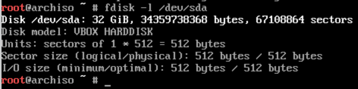
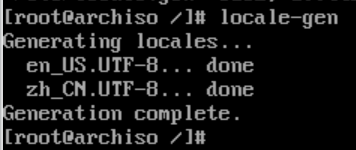

# 1 Why is Arch ?

Arch 是一个极度精简，高度自定义的系统。从安装开始便由用户自己做选择，而非使用固有的配置。但是，Arch 有着一个及其完美的社区，能解决几乎所有问题。同时，他的安装包来源广泛，软件资源丰富，安装起来十分方便。再加上 Arch 为滚动升级，不用为了升级系统而重装一遍。

可能有人觉得 Arch 难以安装和配置，但其实 Arch 的安装和配置体现了你对 Linux 的理解，在安装和配置 Arch 的过程中，也能加深你对 Linux 的理解。同时也不用过于担心配置困难，因为我们有着大量的开箱即用的，非常友好的工具。

# 2 Preparations

## 2.1 系统盘

系统盘的制作可以看——[如何制作系统盘](Ubuntu/0.安装Linux#0.1%20启动盘的制作)

## 2.2 Image

Arch 有着许多著名且优秀的发行版如 Manjaro 等，我们选择原始的 Arch 进行安装。

- [中科大源](https://mirrors.ustc.edu.cn/archlinux/iso/2024.03.01/)
- [清华源](https://mirrors.tuna.tsinghua.edu.cn/archlinux/iso/2024.03.01/)
- [阿里源](https://mirrors.aliyun.com/archlinux/iso/2024.03.01/)

# 3 Start Installation

## 3.0 预备处理

### 3.0.1 禁用 `reflector.service` 

Arch 有一个内置的服务 `reflector` ，他会自动根据镜像源的速度选择前20的源，但是这对于中国来说并没什么用，我们选择自己设置镜像源，因此 : 

```bash
systemctl stop reflector
```

### 3.0.2 更换镜像源

Arch 的镜像源服务在 `/etc/pacman.d/mirrorlist` 文件中，里面根据国家把所有可用的镜像源都列出来了。而对于该文件来说， **放在第一位的镜像源便是设置的镜像源** ，因此，我们找到中国的镜像源，随便选一个你喜欢的，复制/剪切然后粘贴到 **文件最上方** ，接着保存退出即可。

```bash
vim /etc/pacman.d/mirrorlist

$/etc/pacman.d/mirrorlist
Server = https://mirrors.ustc.edu.cn/archlinux/$repo/os/$arch
```

这里我选择使用 `vim` 编辑器打开该文件，输入 `/` 进入 **搜索模式** ，然后输入 `ustc` 搜索，按 `enter` 选择搜索结果，接着按 `dd` 将这一行 **剪切** ，然后按 `gg` 返回文件 **最上方** ，找个好位置按下 `p` 或者 `P` 将剪切的这一行粘贴，最后按下 `esc` 进入命令模式，输入 `:wq` 并按 `enter` 保存退出。 ^32169

这样，镜像源就更换好了。

### 3.0.3 连接网络

安装 Arch 时，我们可以通过 `iwctl` 服务来连接 **无线网络** 。

> 有线网络不需要手动设置，插好网线后检查网络是否可用就好了。
> `ping bilibili.com` 
> 如果有数据回传就证明网络连接无误。

1. 在终端中输入 `iwctl` 进入该服务提供的交互模式
2. 输入 `device list` 查看我们的设备名 `Name` 一列，通常为 `wlan0` 
3. 输入 `station wlan0 scan` 扫描附近的网络
4. 输入 `station wlan0 get-networks` 输出扫描结果
5. 输入 `station wlan0 connect <wifi_name>` 连接，按照提示输入密码即可

当连接网络成功后，会看到一个箭头指向该网络，此时我们可以输入 `quit` 退出交互模式，并通过 `ping` 检查网络连接。

> `ping` 是用于测试网络连接的命令，通过 `ping <url>` 我们可以向目标网址发送请求，并接收目标网址返回的包，如果连接正常，我们能够一直看到目标网址向我们发送数据。 ^32125


## 3.1 分区

Arch 的分区和其他 Linux 系统的分区并无不同。对于任何一个 Linux 系统来说，我们都需要了解其目录结构，以便我们能够正确地选择合适的分区和挂载方式。

Linux 的目录结构一般为

```
/
├── bin -> usr/bin
├── boot
├── dev
├── etc
├── home
├── lib -> usr/lib
├── lib64 -> usr/lib
├── lost+found
├── mnt
├── opt
├── proc
├── root
├── run
├── sbin -> usr/bin
├── srv
├── sys
├── tmp
├── usr
└── var
```
^32158

所有目录在 **逻辑上都是 `/` 根目录的子目录** 。其中， 
- `home` : 用于存放用户的 **家目录**，所有用户的工作区都在 `home` 目录下
- `etc` : **配置文件目录**，系统的几乎所有配置都存放在这个目录下
- `dev` : 外设串口，USB等硬件都以文件的形式存放在这个目录下
- `usr` : **`unix shared resources`** ，是各种应用程序，二进制文件，库文件，头文件等系统运行是所需要的文件存放的位置，是一个及其重要的目录
- `root` : 超级用户目录，跟普通用户的目录结构类似
- `bin` : **链接到 `/usr/bin` 目录** ，用于存放 **二进制文件** 
- `lib` : **链接到 `/usr/lib` 目录**， 用于存放 **库文件** 
- `boot` : **存放引导信息的目录** 
- `opt` : optional，一般下载的软件会安装在这里
- `tmp` : 用于存放临时文件
- `var` : 这是一个非常重要的目录，系统上跑了很多程序，那么每个程序都会有相应的日志产生，而这些日志就被记录到这个目录下，具体在 `/var/log` 目录下，另外 mail 的预设放置也是在这里。
- `mnt` : 系统提供该目录是为了让用户 **临时挂载别的文件系统的**，我们可以将光驱挂载在 `/mnt/<target>` 上，然后进入该目录就可以查看光驱里的内容了。

在了解了目录结构及各目录的作用之后，我们可以知道大概可以如何分区和挂载目录， ^32114

1. 对于系统的运行文件，我们最好把他们都放在一起，不要单独分开，因此， `/usr` 和 `/var` 都是用于系统运行的重要目录，因此我们最好将他们和根目录放在一起，即 **在物理上不推荐将这两个目录和根目录单独挂载，而是要将他们挂载在同一分区下** 
2. 对于用户而言， `/home` 目录就是用户的工作空间，用户对下载的各种软件的配置都存放在 `~/.config` 目录下，用户的工作区即是 `/home` 下的家目录，因此我们可以将 `/home` 单独挂载在一个分区上，这样 **即使用户将分区的空间使用完，系统仍然有自己独立的空间可以运行** ，避免了用户行为影响到系统运行
3. 对于系统的引导程序，如果是 UEFI 引导则需要额外划分一个 `EFI` 分区来挂载 `/boot` 
4. 如果我们需要装很多应用程序，我们则可以将 `/opt` 单独挂载在一个分区上，专门用来存放应用程序
5. 如果硬盘空间较大，预算比较充足，我们也可以将 `/tmp` 单独挂载在一个分区上，这样那些临时文件和缓存文件就有了专门的存放地点，~~我们可以通过格式化的方式一劳永逸~~

一般情况下可选的分区有很多，但是有几个是必须的挂载的分区，如

- `/` : 根目录是整个系统的 **根** ，没有挂载根目录系统就无法运行
- `/boot` : 对于 [UEFI 引导](./01%20基本安装#^32147) ，我们必须将其挂载在 `EFI` 分区下
- `/home` : 虽然不是必须但是强烈建议单独分区

> 在 Linux 中还有一个名为 `swap` 的交换空间，是内存的扩展，用于存放临时的交换文件，如果我们电脑内存太小，则可以为其单独建立一个分区， **一般情况下都需要 swap 分区** 

正如上面叙述的，Arch 的分区有许多种选择，而文件系统类型也有许多选择，如 `brtfs` `lvm` 等。这里我们使用最传统，最常见的文件系统类型 `ext4` 来安装 Arch。

硬盘也有这不少分区格式如 `GPT` `MBR` 等分区表，我们需要根据系统的引导类型来选择分区表。

### 3.1.0 检查引导类型

我们可以在终端中输入 `ls /sys/firmware/efi/efivars` ，如果该目录存在且成功输出一大堆内容(efi 变量)，证明系统为 UEFI 引导模式，否则为 BIOS 的 Legacy 引导模式。


### 3.1.1 UEFI

UEFI 为现在较为流行的，速度较快，启动更安全的引导模式，能够很好地处理这种多系统的引导问题。UEFI 引导需要一个额外的 `EFI` 分区专门用于存放引导信息，因此可以很方便地管理引导程序。 ^32147

UEFI 引导模式要求硬盘为 `GPT` 分区格式。GPT 分区相较于 MBR 分区的优势在于，MBR 只能用于处理最大 `2T` 的硬盘，而且其 **只能建立4个主分区**，而 GPT 可以处理更大的硬盘，并且分区个数远远大于 MBR 格式的硬盘。

因此，我们便确定了我们所需要的分区方式 : 使用 GPT 分区格式，并为 UEFI 引导额外建立一个 EFI 分区。

#### 1. 场外分区

我们可以通过一些分区工具提前对硬盘格式以及分区方式进行规划，省去了在命令行界面分区的麻烦，如使用 `Diskgenuine` 来操作硬盘。

#### 2. 现场分区

虽然场外分区确实十分方便，但是我们也要学会如何使用命令行界面来进行分区的操作。

首先我们需要知道 : 在 Linux 系统中，所有的设备都能在 `/dev` 目录下找到，因此，我们的硬盘会根据型号的不同在 `/dev` 目录下有着不同的名字，如果是外接的硬盘，一般会以 `/dev/sd[x]` 的形式出现。如果只有一个硬盘，那么就是 `/dev/sda` ，其他的硬盘则分别 `sdb` , `sdc` 等排序，一般我们还能在其中找到我们的系统盘。

而对于 `nvme` 协议的固态硬盘，则会以 `/dev/nvme[n]n1` 的形式出现，`n` 为 `1, 2, ...` 。

##### 1. 查看分区 : 

1. 我们可以通过 `lsblk` 命令来查看现在的分区 

> 

2. 也可以通过 `fdisk -l` 来展示更加具体的分区情况 

> 

> 一般来说屏幕上能够展示出所有的硬盘及其信息（只要你的硬盘不要太多），如果自己需要的硬盘信息被刷到屏幕外了，我们可以通过 `fdisk -l [target]` 来展示特定的硬盘，如 
> 
	
##### 2. 使用 `cfdisk` 进入命令行图形化界面分区

1. 输入 `cfdisk <target>` 选择对目标硬盘进行操作，我这里对应的命令是 `cfdisk /dev/sda` 
2. 在第一次对硬盘进行分区操作时，我们需要选择特定的分区格式，建立新的分区表，如下图 

> 

> `gpt` 对应着 GPT 分区表， `dos` 则对应着 MBR 分区表，这里我们应该选择 `gpt` 

3. 选择好分区表之后，我们便会看到这样一个界面。在这个界面下，我们可以通过  `⬆` 和 `⬇` 箭头选择需要操作的分区，通过 `⬅` 和 `➡` 箭头来选择需要执行的操作，我们选定 `Free space` ，并选择 `New` 按下 `enter` 后输入我们所需要的大小（带单位），就成功建立了一个分区。
 
> 

4. 建立好分区后，我们应该通过 `Type` 为分区选择特定的格式，一般情况下

	1. 普通的文件系统使用 `ext4` 格式，需要选择 `Linux filesystem` ，如 `/` , `/home` , `/opt` 等挂载点

	2. `EFI` 分区用于存放引导信息，需要使用 `fat32` 格式，选择 `EFI System` 
	
	3. `swap` 需要选择 `Linux swap` 

5. 建立好的分区如下图 

> 

6. 然后就可以选择 `Write` 并输入 `yes` 确定将分区信息写入硬盘，接着选择 `Quit` 退出

##### 3. 格式化并挂载分区

在完成分区后，我们可以再次通过 `fdisk -l` 来查看硬盘信息，这是我们发现，硬盘以及成功分区并选择了特定的格式。


> 注意：
> 这里我是使用虚拟机来演示，所以分区较小。
> 事实上， `/` 不能只分 10G !!! `/boot` 也不能只有 100M !!! 否则后面会遇到空间不足，无法安装软件的问题。
> 而我这里的分区就是一个错误示范，100M的 /boot 不足以装下 grub，这就会导致后面启动引导的安装无法正常进行。

一般来说，`/` 分至少50G， `/boot` 分至少512M，这样才能保证系统的安装能够正常运行，而建议的分区大小如下 : 

- `/` : ext4 - Linux filesystem - 50G
- `/boot` : fat32 - EFI System - 1G
- `swap` : Linux swap - 两倍物理内存的大小
- `/home` : ext4 - Linux filesystem - 50G

这里的建议是对于硬盘空间较少的用户而言，空间较大的用户请随意，可以参考 [上述分区建议](#^32114)

接下来，我们通过 `mkfs` 命令对硬盘进行格式化 : 

```bash
# 格式化根目录所要挂载的分区
mkfs.ext4 /dev/sda1

# 格式化EFI分区
mkfs.fat -F32 /dev/sda2

# 建立交换空间
mkswap /dev/sda3

# 格式化/home所要挂载的分区
mkfs.ext4 /dev/sda4
```

格式化完成后，我们就可以来挂载目标目录。上文提到过，Linux 提供 `/mnt` 用于挂载别的文件系统，而我们的 `ISO` 镜像其实是一个及其精简的 Linux 系统，被 **装载在内存中，我们此时的操作界面其实就是一个小的 Linux 系统** ，所以我们可以通过将我们所需要的目录挂载在 `/mnt` 下，然后再安装 Linux 系统，即 **我们要在 `/mnt` 下挂载一个我们要安装的 Linux 系统** 。

既然我们将一个系统挂载在 `/mnt` 下，**则 `/mnt` 就是我们要安装的新系统的 `/`** ，我们对 `/mnt` 的操作实际上就是对新系统的 `/` 进行操作。

> 因为我们是在操作一个系统，所以 **挂载目录的顺序十分重要，一定要符合逻辑顺序， `/` 一定要最先挂载，然后才能挂载其他目录** 

```bash
# 挂载 /
mount /dev/sda1 /mnt
# 挂载 /boot
mount --mkdir /dev/sda2 /mnt/boot
# 开启 swap 交换空间
swapon /dev/sda3
# 挂载 /home
mount --mkdir /dev/sda4 /mnt/home
```

其中， `--mkdir` 选项制定了如果没有目标目录，则创建该目录。

可能到这里我们会感觉到疑惑，Linux 系统的根目录下不应该是上面提到的[目录结构](01%20基本安装#^32158)吗？为什么我们还需要创建这个目录？

其实，到现在为止我们都只是在作安装的准备工作，Arch 还没正式开始安装， `/mnt` 下就是一片空白，什么都没有，我们要做的就是 **把 `/mnt` 当作新系统的 `/`** ，并往这个根目录下添加 Linux 的内核与组件，从而实现系统的安装 。在安装系统的时候上述的目录结构会自动生成，但是我们选择特定的目录挂载在其他分区上 **是在系统安装之前** ， 自然需要我们先手动创建一下目录。

> 输入命令后没有反应就是最好的反应！

## 3.2 安装系统

### 3.2.1 系统组件

在做了这么多的准备工作以后，我们终于要开始安装这个系统了，安装系统其实特别简单，我们只需要往新系统的根目录中下载 **Linux 的内核及必要组件** 就行了，几行命令就能解决。

```bash
pacstrap /mnt base base-devel linux linux-firmware linux-headers
```

`pacstrap` 命令是 `ISO` 中用于将软件下载到目标目录的下载工具。 其中， `linux` 是 **系统内核** ， `linux-firmware` 是 **系统固件包(驱动)** ， `linux-headers` 是 **内核头文件** ， `base` , `base-devel` 是 **基础工具包** ，都是必须安装的。

对于系统内核，Arch 提供了 : 
- `linux` - 原版的 Linux 内核和模块，采用了一些补丁。

- `linux-hardened` - 注重安全的 Linux 内核，采用一系列加固补丁以缓解内核和用户空间漏洞。和 `linux` 相比，它启用了上游更多的内核加固功能。

- `linux-zen` - 一些内核黑客合作的结果，提供了最适合日常使用的内核。可在 https://liquorix.net 上找到一些细节（他们为 Debian 提供基于 Zen 的内核二进制文件）。

- `linux-lts` - 受长期支持（LTS）的 Linux 内核和模块。

- `linux-rt` 和 `linux-rt-lts` - 由Ingo Molnar领导的一小群核心开发人员维护。这个补丁允许几乎所有的内核被抢占，除了少数非常小的代码区域（“原始自旋锁关键区域”）。这是通过将大多数内核自旋锁替换为支持优先级继承的互斥锁，以及将所有中断和软件中断移动到内核线程来实现的。

而新手不建议跟换内核。

### 3.2.2 生成分区表

在安装好系统的基本组件之后，我们就需要将现在的分区表，挂载信息写入新系统中，让他知道哪些目录挂载在哪里，那些分区属于自己的系统。

我们通过以下命令来写入挂载信息。

```bash
genfstab -U /mnt >> /mnt/etc/fstab
```

其中 `/mnt` 指定目标目录的分区和挂载信息，即 **我们当前所设置的挂载方式** ，`>>` 则是用于输入到文件的操作符， `/mnt/etc/fstab` 则是新系统用于存放挂载信息的文件。

> 正如上文提到的，系统的几乎所有配置都在 `/etc` 下，如挂载信息写于 `/etc/fstab` ，主机 `hosts` 写于 `/etc/hosts` ，安装用的镜像源在 `/etc/pacman.d/mirrorlist` ， `pacman` 的配置在 `/etc/pacman.conf` 

然后我们可以通过 `cat /mnt/etc/fstab` 查看一下分区表是否有误。


> `cat` 是用于将文件内容打印到终端上的命令，是 `catch` 的缩写

### 3.2.3 进入系统

恭喜你，在检查分区无误后，我们就可以通过 `arch-chroot /mnt` 切换到这个新的系统中了。

此时系统已经算安装成功了，可喜可贺，可喜可贺！

## 3.3 配置系统

系统虽然已经安装成功，但是却还未配置，没有任何属于你的痕迹。我们接下来要将系统设置成自己的系统。

### 3.3.0 安装编辑工具

我们只是安装了系统最基本的组件，而刚刚可以使用的工具如 `vim` 是没有被带过来的，因此我们首先需要一个编辑工具让我们可以编辑系统的配置。这时我们可以通过 `pacman` 这个 Arch 上的 **包管理器** 来安装我们需要的软件。我们选择安装 `vim` 作为自己的编辑器，因此在终端中输入 `pacman -S vim` 。其中， `-S` 是 `sync` 的意思，将软件从仓库中同步到本机上，也就是安装软件。

### 3.3.1 设置主机

我们可以为这个系统起一个新的名字。

```bash
vim /etc/hostname

$/etc/hostname

Arch
```

在编辑器中，按下 `a` 进入输入模式，左下角也会有对应的 `INSERT` 作为提示，[保存退出](#^32169)后，我们便成功将该电脑命名为 `Arch` 


然后，我们需要为该主机设置 `hosts` 

```bash
vim /etc/hosts

$/etc/hosts
127.0.0.1    localhost
::1          localhost
127.0.1.1    Arch.localdomain Arch
```

我们需要手动编辑 `hosts` 文件，记得将 `Arch` 换成你自己的主机名

> 如果第一次使用 vim ，觉得使用起来难度很大，则可以安装 `nano` 作为编辑器，`nano` 的界面和操作方式较为友好，对于命令也有提示。
> `nano /etc/hostname` 
> 
> 
> `Ctrl-S` 保存， `Ctrl-X` 退出

### 3.3.2 设置语言

我们需要手动将系统要支持的语言开启，并生成语言信息。

```bash
vim /etc/locale.gen
```

在该文件中，我们需要[通过搜索找到](#^32169) `en_US.UTF-8` 以及 `zh_CN.UTF-8` 并将其取消注释(通过将光标移动到 `#` 下，然后按下 `del` 删去前面的井号)，然后保存退出。


其中 `zh_CN` 有四种编码格式，我们选择 `UTF-8` 的编码格式。

> 每次使用 `/` 进行搜索都需要在 **命令模式下进行** ，因此我们如果在输入模式(INSERT)下删除井号，则需要按下 `esc` 来退出输入模式，进入命令模式

接着只需要

```bash
locale-gen
```

就能生成对应的语言信息。



最后，我们需要设置系统的默认语言

```bash
echo "LANG=en_US.UTF-8" >> /etc/locale.conf
```

其中， `echo` 表示输出后面的内容， `>>` 操作符则将输出的内容重定向到目标文件中，即将 `echo` 后的内容输入到目标文件中。

> 你也可以选择通过 vim 来编辑这一文件，就如我们前面设置主机名，设置 `hosts` 一样

### 3.3.3 设置时间

我们通过将系统内置的时区链接到 `/etc/localtime` 下来设置系统的时间

```bash
ln -sf /usr/share/zoneinfo/Asia/Shanghai /etc/localtime
```

其中， `ln` 是用于创建链接的命令， `-s` 是 `soft` ，代表建立软链接， `-f` 是 `force` ，代表强制建立链接，如果没有链接错过，可以省略 `f` 。

> 中国的时区一般只有上海可以选，不用找北京了

然后，我们可以通过输入 `date` 来查看系统的时间 : 

```bash
date

# Mon Mar 18 21:43:15 CST 2024
```

看到 `CST` 就证明时区设置成功，否则默认为 `UST` 。

## 3.4 安装引导及其他工具

```bash
pacman -S grub os-prober efibootmgr networkmanager intel-ucode
```

其中

- `grub` 是我们要使用的引导选择工具
- `os-prober` 用于发现其他系统的引导，让 `grub` 能够引导多个系统
- `efibootmgr` 是UEFI启动的管理工具
- `nerworkmanager` 是网络服务
- `intel-ucode` 是适用于 Intel 芯片的微码

接下来，我们来安装引导 : 

### 3.4.1 安装引导

#### 1. UEFI

```bash
grub-install --efi-directory=/boot --bootloader-id=ARCH
```

UEFI 启动的用户需要指定引导程序的安装位置， `--efi-directory` 选择我们挂载的 `/boot` ， `--bootloader-id` 则可以指定我们当前系统 `grub` 的名称。

若是安装成功，则不会有错误。


#### 2. 安装Legacy引导

```bash
grub-install --bootloader-id=ARCH /dev/sda
```

Legecy 启动则将引导程序安装在这一整个硬盘上。

### 3.4.2 编辑引导文件

Arch 提供了一个默认的引导文件配置，在 `/etc/default/grub` ，我们可以通过编辑这个文件来配置 grub。

为了引导多个系统，我们需要将 `GRUB_DISABLE_OS_PROBER=false` 取消注释，意为启用 OS_PROBER 来寻找其他系统引导。


同时，我们也可以在 `GRUB_CMDLINE_LINUX_DEFAULT="loglevel=3 quiet"` 一行添加 `splash` ，使其变成 `GRUB_CMDLINE_LINUX_DEFAULT="loglevel=3 quiet splash"` ，这样，我们便能在启动时显示特定的引导界面。


### 3.4.3 生成grub配置

```bash
grub-mkconfig -o /boot/grub/grub.cfg
```


> 在 ISO 镜像中，我们还没有检测到其他系统的存在。因此要能够引导其他系统，我们需要在进入新系统之后重新生成 grub 配置，即重新执行一遍这行代码。届时我们便能看到输出的信息中提示发现了其他系统。

### 3.4.5 启用 NetworkManager 服务

```bash
systemctl enable NetworkManager
```

## 3.5 设置 root 密码

我们需要在安装系统后并在第一次进入新系统之前设置好 root 用户的密码，否则我们无法登陆到 Linux 中。

```bash
passwd
```

按照提示输入密码即可。


> 注意，输入密码时密码不可见 !

在完成了 root 用户的密码设置之后，我们就可以 `exit` 退出当前环境，回到 `ISO` 中，然后输入 `reboot` 重启之后，通过 root 用户登陆到新系统。

至此，系统已经能够正常开机使用，系统的安装彻底结束，可喜可贺可喜可贺！

## 3.6 配置新系统

在重启之后，我们能够看到一个引导选择界面 grub : 


选择了 Arch Linux 之后，我们便启动了我们的系统。

在新系统的界面，我们能够看到一个 `login` 标志，我们可以通过此时系统有的用户 `root` 来登陆，密码就是刚刚我们设置的密码。


此时我们所处的环境为 Linux 的 tty 终端界面，现在的终端便是 Linux 终端的本体。我们在图形化界面 (GUI) 中所使用的终端不过是 tty 的模拟器。我们可以在 tty 中执行任何 Linux 操作。

### 3.6.1 连接网络

在安装了 `networkmanager` 之后，我们可以通过 `nmcli` 来连接网络。

```bash
# 列出可用 wifi
nmcli dev wifi list

# 连接 wifi
nmcli dev wifi connect <wifi_name> password <password>
```

连接完成后 [`ping`](#^32125) 一下看看网络连接是否有误。

> 如果无法使用 `nmcli` 命令，则要么忘了装 `networkmanager` ，要么忘了开启服务。
> 对于忘记装的同学，可以回到 ISO 中重新挂载根目录并安装。
> 对于忘记开启服务的，我们可以输入 `systemctl enable --now NetworkManager` 来 **立刻** 开启服务。如果没有 `--now` 参数，则服务需要重启后才能使用。

### 3.6.2 建立个人用户

我们在 root 用户中可以建立自己的用户，并将其添加到特定的用户组中。

```bash
useradd -m -G wheel arch
```

在上面的命令中，我们建立名为 `arch` 的用户， 并通过 `-G` 选项将用户分配到 `wheel` 组，`-m` 选项则告诉系统要为该用户创建家目录。

> 如果我们想要多个 Linux 共用同一个家目录，则可以通过 `-d` 为创建的用户指定家目录。
> `useradd -d /home/<exist_user_folder> -G wheel blake` 

对于用户来说，我们希望能够拥有一些操作系统的权力，比如使用 `root` 用户的权限来安装软件，编辑系统文件等。但是我们又不希望自己的用户直接成为超级用户，不拥有超级用户的所有权限，此时我们就可以为用户分配到一个可以使用超级用户命令，具有一定超级用户权限的 **用户组** 中，而 Linux 默认提供了 `wheel` 组来使用户获得一定的超级用户权限，这就是为什么我们要将用户分配到 `wheel` 组中。

### 3.6.3 设置用户权限

但是，此时的 `wheel` 还没有使用超级用户权限的能力，需要我们在系统中配置。我们便可以通过编辑 `/etc/sudoers` 来使得 `wheel` 组拥有一定的超级用户权限。

我们在该文件中找到 `%wheel ALL=(ALL:ALL) ALL` ，并将其取消注释。


此时我们能够看到底下有一个提示，警告我们正在改变只读文件。因为更改超级用户的配置是非常危险的，所以我们需要慎重！


此时，我们无法通过正常的 `:wq` 来保存退出，必须加上 `!` ，使用 `:wq!` 来强制保存退出，否则就会报错。


### 3.6.4 Yay

Arch 的强大之处便在于有个 `AUR(Arch Users' Repository)` ，这里面是用户上传的软件包，是作为官方仓库的扩展， `pacman`  无法安装的软件一般可以在这里面下载。而 `aur` 中还包含了大量软件的 **git版本** ，即开发版，能让你下载到最新的软件。

因此，我们需要下载一个用来管理 AUR 包的软件。可供选择的有 : 
- `yay` 
- `paru` 
- `pakku` 
- `aura` 
- ...

我选择使用 `yay` 作为我的 AUR包管理器。

除了 AUR，ArchLinux 有一个 中国社区 archlinuxcn，我们可以通过该社区安装各种资源包。因此，软件众多是 Arch 的优点，但是由于 AUR 中是由用户自己上传的软件，我们要小心那些恶意软件。

#### 1. 开启 archlinuxcn / multilib支持

我们需要编辑 `/etc/pacman.conf` 文件来开启这两个软件源的支持。在该文件中找到 `[multilib]` 一节，并将其内容一并取消注释；然后再添加新的一个节点 : 

```bash
vim /etc/pacman.conf

$/etc/pacman.conf
[archlinuxcn]
Server = https://mirrors.ustc.edu.cn/archlinuxcn/$arch
```

我这里选择中科大的源作为 archlinuxcn 的软件源，你们也可以选择其他软件源。


> 注意，multilib 有两个，我们不要选错了 !!!

#### 2. 安装钥匙和yay

我们需要为 archlinuxcn 中的软件包导入 keyring，否则可能因为信任环出问题而无法安装其中的软件。

```bash
pacman -S archlinuxcn-keyring yay
```


这时，我们会看到报错说数据库未更新。这是因为我们添加了软件源但没有更新数据库，此时我们需要输入 `pacman -Sy` 来更新数据库。


细心的小伙伴可能会发现，现在比原本多了两个 `databases` ，这就是我们新添加的软件源。

现在我们可以再次执行 `pacman -S archlinuxcn-keyring yay` 。

这时，他会提示我们 `Import PGP key ...` ，我们输入 `Y` 并回车。


然后，我们又会看到报错说正在安装不受信任的软件，并给出了两个地址。这两个地址分别对应 `archlinuxcn-keyring` 和 `yay` 的软件来源，我们需要先将这两个地址注册为受信任的地址，才能正常安装。

我们通过 `pacman-key` 来管理 `keys` : 

```bash
pacman-key --lsign-key "farseerfc@archlinux.org" "lilac@build.archlinuxcn.org"
```


接下来，我们再次安装，就可以看到安装成功了。

到此为止，一个完整的终端里的 Arch 就已经安装成功了，可喜可贺，可喜可贺！

接下来，我们会为这个系统安装[桌面环境](02%20桌面环境)。