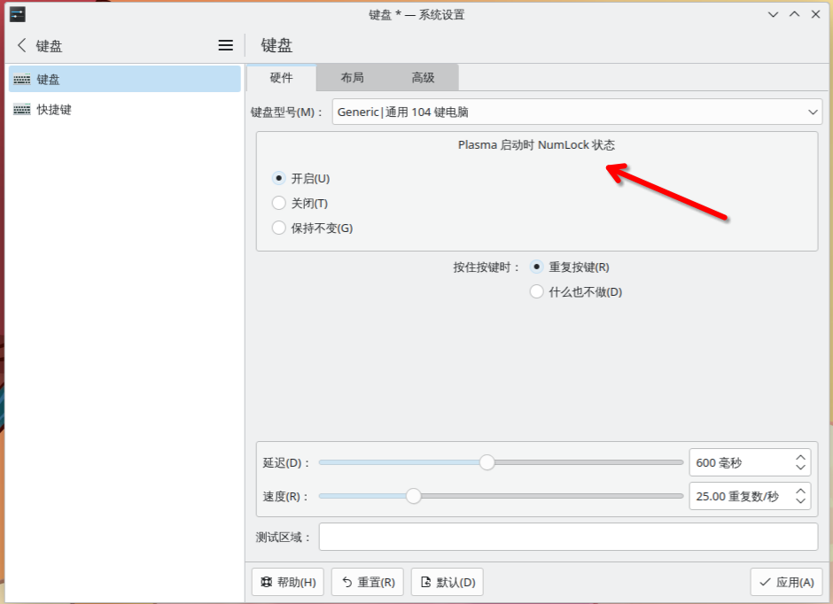
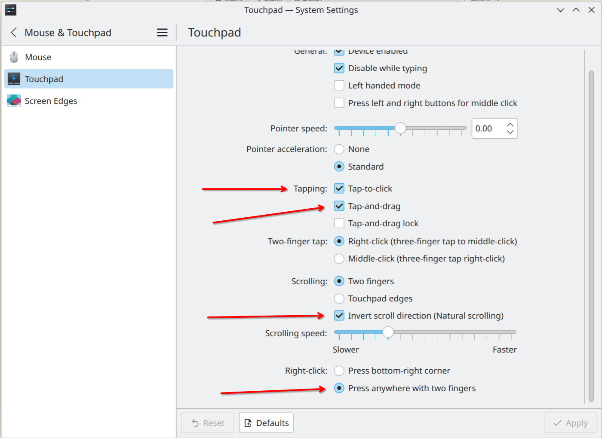
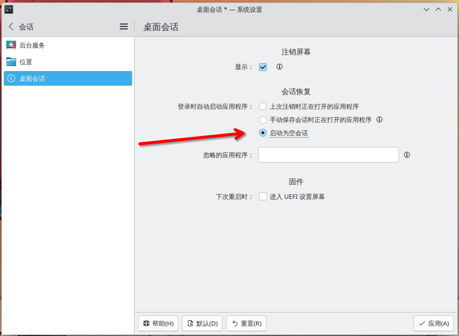
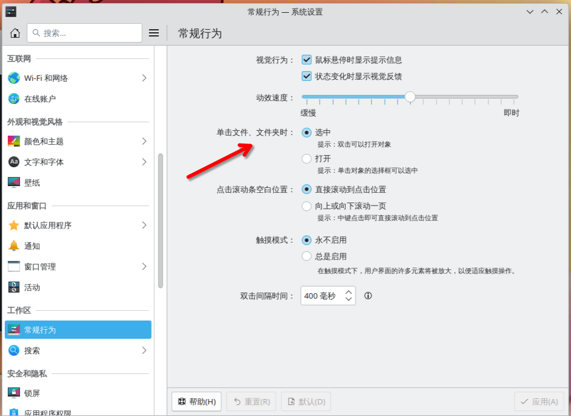
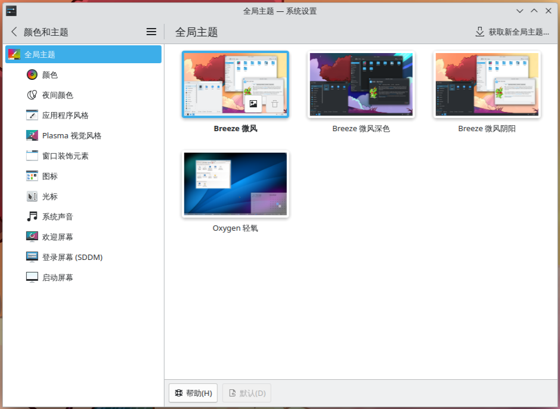
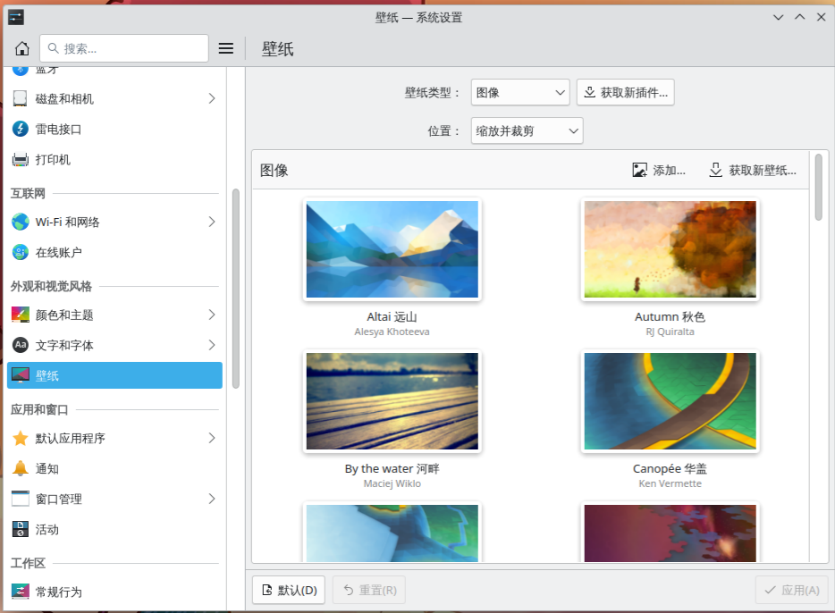
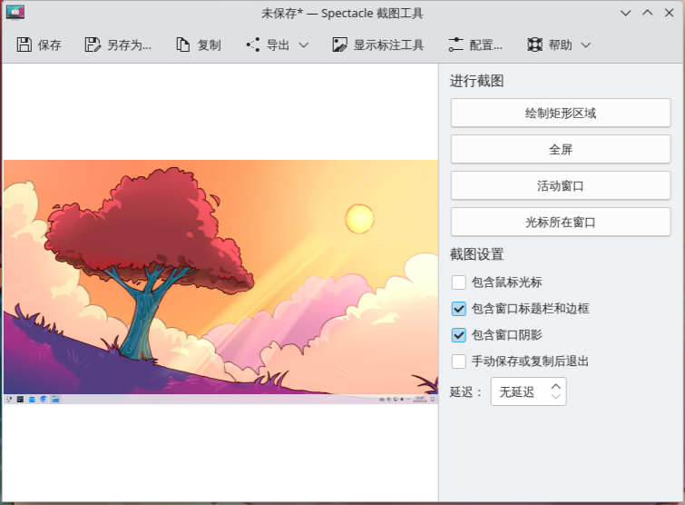
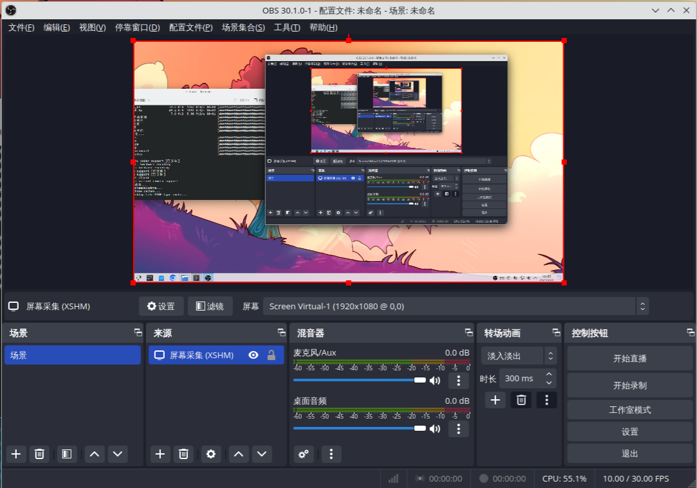
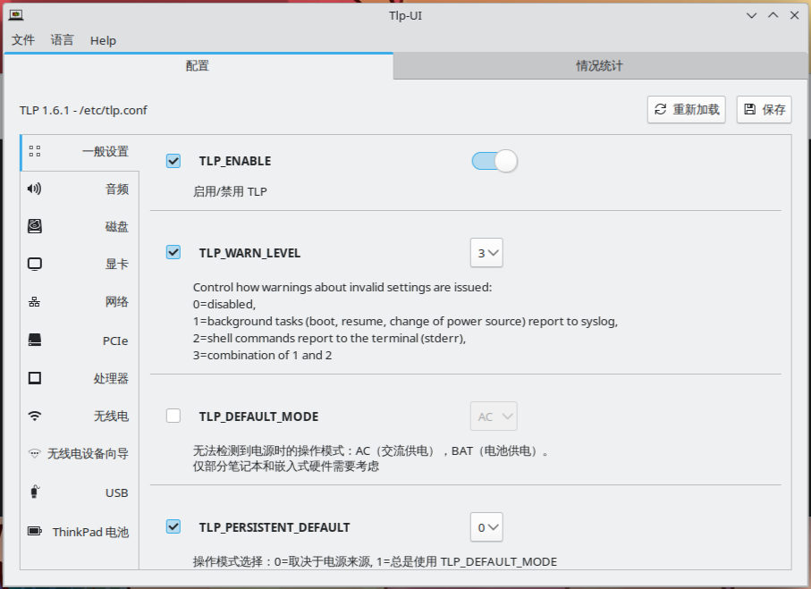

上一节，我们讲了如何安装桌面环境以及必要的工具，这一节，我们回到 Arch 本身，在 KDE 桌面下进行一些更符合我们使用习惯的设置。

# 1 输入设置

## 1.1 numlock

我们时常需要用到数字键盘，但是 KDE 是默认关闭的，这就导致了我们每次重启后都需要手动开机 numlock，但其实，我们可以在设置中选择自动开启键盘锁。



## 1.2 shortcut

我们还可以自行设置快捷键，既能为单个应用设置，也能设置一些全局快捷键，比如窗口和桌面的操作 `KWin` 

> `KWin` 提供了超级丰富的窗口及桌面操作的快捷键，可以好好看看

## 1.3 触摸板设置

触摸板需要我们单独设置，它默认不会开启轻触点击，双指右键，并且滚动方向也不是自然滚动。



# 2 启动设置

我们可以设置 KDE 的启动会话。 KDE 默认会打开上一次注销时正在打开的应用，但是很多人都不习惯，因此我们可以在 `会话 - 桌面会话` 中设置 `启动为空会话` ，这样，每次启动后就是空白的桌面了



此外，有可能 KDE 是默认单击打开文件，这和我们的使用习惯并不相符，因此我们可以在设置中设置单击选中，双击打开。



# 3 轻度美化

## 3.1 样式

每次看到开机时的 `sddm` 界面是不是都觉得不忍直视？我们可以在 `颜色和主题` 中为 `sddm` 选一个喜欢的主题，为鼠标选一个样式，为启动屏幕选一个样式，还能设置主题和图标等等。



## 3.2 壁纸

此外，我们还可以为桌面选择一张好看的壁纸，系统自带的壁纸质量都极高。



## 3.3 桌面小组件

KDE 提供了丰富的桌面小组件供我们选择，我们也可以在桌面右键 `进入编辑模式` 来设置桌面的小组间和面板。

一般可以为桌面添加资源监视器以及一个好看的时钟。

# 4 小工具

## 4.1 截图

KDE 桌面上有一个及其强大的截图工具 `spectacle` ，可以支持全屏，窗口，指定区域的截图以及录屏。

```bash
sudo pacman -S spectacle
```



此外，它还支持截屏后进行标注，以及直接将图片复制到剪切板而不保存图片。

## 4.2 录屏

`spectacle` 的录屏功能已经很完备了，但是我们还可以通过更加专业的录屏软件 `obs-studio` 来实现更丰富录制功能。

```bash
sudo pacman -S obs-studio
```



## 4.3 电源模式

我们可以下载 KDE 自带的电源管理配置来设置电源模式。


```bash
sudo pacman -S power-profiles-daemon
```

安装完成并重启后我们就可以通过电池设置来选择电源管理方案


或者我们可以使用第三方的电源管理器 `tlp` 

```bash
sudo pacamn -S tlp
```

但是 `tlp` 是一个命令行工具，我们想要更方便地管理电源，因此我们可以选择安装 `tlpui` 来获得一个 GUI 界面 : 

```bash
yay -S tlpui
```



> 左上角可以选择语言

