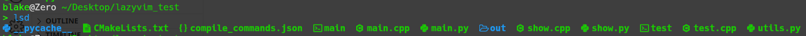
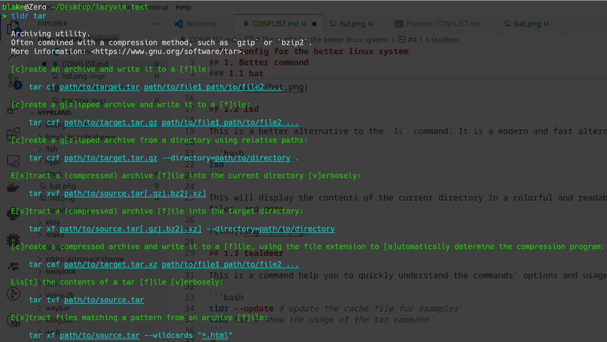
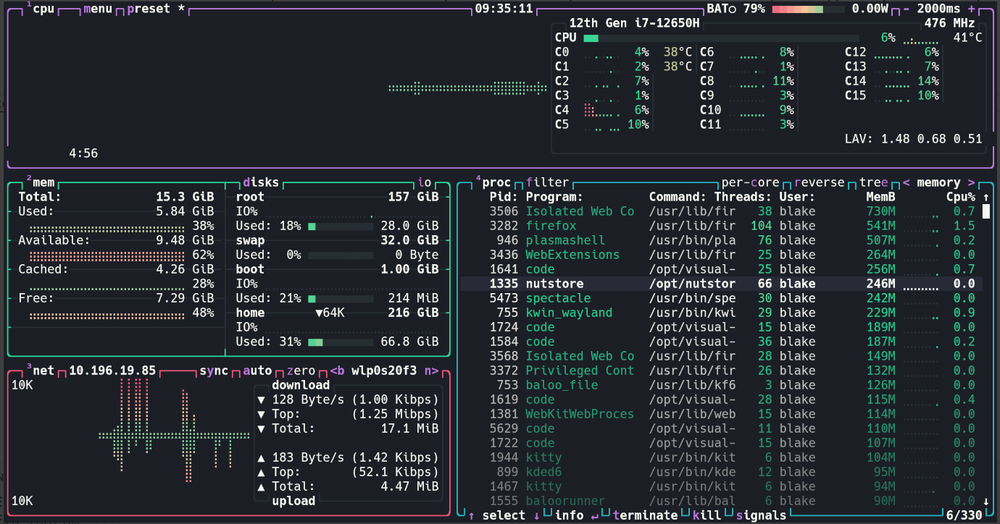
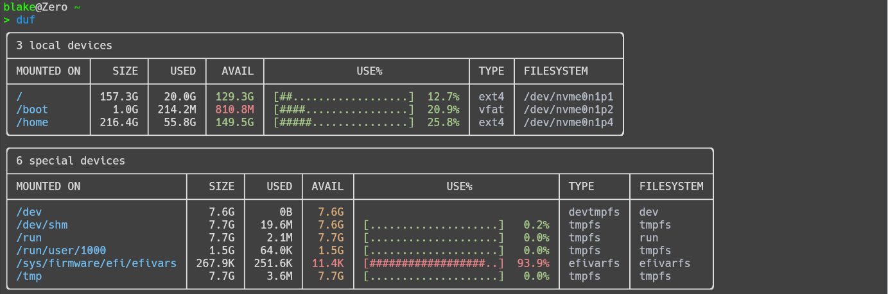
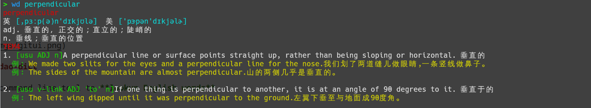

# 01 压缩

## 1.1 tar

tar 是 Linux 下默认的，也是及其强大的压缩软件。

### 1.1.1 Create Archive

```bash
# [c]reate an archive and write it to a [f]ile:
tar -cf path/to/target.tar path/to/file1 path/to/file2 ...

# [c]reate a g[z]ipped archive and write it to a [f]ile:
tar -czf path/to/target.tar.gz path/to/file1 path/to/file2 ...

# [c]reate a g[z]ipped archive from a directory using relative paths:
tar -czf path/to/target.tar.gz --directory=path/to/directory .

# [c]reate a compressed archive and write it to a [f]ile, using the file extension to [a]utomatically determine the compression program:
tar -caf path/to/target.tar.xz path/to/file1 path/to/file2 ...
```

### 1.1.2 Extract

```bash
# E[x]tract a (compressed) archive [f]ile into the current directory [v]erbosely:
tar -xvf path/to/source.tar[.gz|.bz2|.xz]

# E[x]tract a (compressed) archive [f]ile into the target directory:
tar -xf path/to/source.tar[.gz|.bz2|.xz] --directory=path/to/directory

# E[x]tract files matching a pattern from an archive [f]ile:
tar xf path/to/source.tar --wildcards "*.html"
```

### 1.1.3 List

```bash
# Lis[t] the contents of a tar [f]ile [v]erbosely:
tar tvf path/to/source.tar
```

## 1.2 7-zip

7-zip 是一款原本用于 Windows 系统的优秀的开源压缩软件。由于 7-zip 支持的文件格式多，压缩速度及质量好，受到不少人的喜爱。因此在 7-zip 官方提供 Linux 版本之前，就已经有人将 7-zip 移植到 Linux 系统上，并作为软件 `p7zip` 存在，可以直接从各大系统的仓库中下载。

目前 7-zip 已经有了官方的版本，因此我们可以自由选择。

### 1.2.1 Installation

#### 1. Package Manager

```bash
# for Ubuntu/Debian
sudo apt install p7zip
sudo apt install p7zip-full

# for Arch
sudo pacman -S 7-zip
sudo pacman -S 7-zip-full
```

#### 2. From Authority

可以直接从 [官方](https://sparanoid.com/lab/7z/download.html) 下载 Linux 上的可执行程序，然后将其解压缩到想要存放的目录，最后将该目录其添加到环境变量即可。

```bash
sudo mkdir /opt/7z
sudo tar -xf 7z2402-linux-x64.tar.xz -C /opt/7z
```

对于 bash 用户

```bash
echo "export PATH=/opt/7z/:$PATH" >> ~/.bashrc
```


对于 zsh 用户

```bash
echo "export PATH=/opt/7z/:$PATH" >> ~/.zshrc
```

对于 fish 用户

```bash
echo "set PATH /opt/7z $PATH" >> ~/.config/fish/config.fish
```

> 注意，在官方给出的程序中，7z 是使用 `7zz` 和 `7zzs` 两个应用程序完成的，因此命令会稍有不同，但是，我们可以通过设置命令的别名来使用 `7z` 作为我们的命令名。

### 1.2.2 Usage

`7z <command> [<switches>...] <archive_name> [<file_names>...] [@listfile]`

#### 1. 添加文件到压缩格式

使用 `a` 作为 `<command>` ，能够将文件或文件夹添加到目标压缩包中，如果压缩包不存在，则创建压缩包

```bash
7z a <archive_name> <fil/dir_ename>...
# a 为 add，向压缩包中添加没有的文件

7z a test test.sh
# 生成 test.7z 

7z a test.tar test.sh
# 生成 test.tar 

7z a test.zip testshell/
# 生成 test.zip
```

默认的压缩方式为 `7z` ，我们可以通过设置压缩的后缀来设置压缩格式，也可以通过设置 `<switches>` 的 `-t{Type}` 来指定压缩格式 : 

```bash
7z a -tzip test test.sh
# 生成 test.zip
```

> 可以通过 `7z i` 来查看支持的格式

此外，在压缩大文件的时候，我们也可以通过 `-m{Parameters}` 设置压缩的等级和使用的线程数 : 

```bash
7z a -mmt[N] <archive_name> <file/dir>...
# 设置使用的线程数
7z a -mnt[16] test testshell
# 通过16线程压缩

7z a -mx[N] <archive_name> <file/dir>...
# 设置压缩的等级，压缩的等级从 1 ~ 9
# 1 压缩最快，9 压缩程度越高
7z a -mx5 test testshell
# 通过等级 5 来压缩文件
```

和其他的压缩一样，我们还可以为其设置密码 : 

```bash
7z a -p{Password} <archive_name> <file/dir>...

7z a -p1234 test testshell
```

#### 2. 解压缩

```bash
7z e <archive_name>
# 直接解压缩，生成和压缩包一样的文件夹名
# e 为 extarct

7z e test.7z
```

我们也可以指定将压缩包输出至特定文件夹

```bash
7z e -o{DIR} <archive_name>

7z e -otest_extract/ test.7z
```

#### 3. 更新文件

我们还可以将已经在压缩包中的文件更新为我们想要的新版本

```bash
7z u <archive_name> <file/dir>...
# u 为 update

7z u test.7z test.sh
```

#### 4. 测试压缩包

我们可以检查压缩包有没有损坏 : 

```bash
7z t <archive_name>
# t 为 test

7z u test.7z
```

## 1.3 Zip

## 1.3.1 压缩

`zip [-options] [-b path] [-t mmddyyyy] [-n suffixes] [zipfile list] [-xi list]` 

```bash
# Add files/directories to a specific archive:
zip -r <compressed.zip> <target1> <target2> ...

# Remove files/directories from a specific archive:
zip --delete <compressed.zip> <target1> <target2> ...

# Archive files/directories e[x]cluding specified ones:
zip <compressed.zip> <target1> <target2> ... --exclude <to_be_excluded>

# Archive files/directories with a specific compression level (`0` - the lowest, `9` - the highest):
zip -r -[0~9] <compressed.zip> <target1> <target2> ...
```

除了正常压缩之外，我们还可以将目标拆分成多个压缩文件

```bash
# Archive files/directories to a multi-part [s]plit Zip archive (e.g. 3 GB parts):

zip -r -s <splited_size> <compressed.zip> <target1> <target2> ...

zip -r -s 512M compressed.zip part1 part2
# 按照每分片 512M 的大小来拆分压缩包

```

### 1.3.2 解压缩

`unzip [-Z] [-opts[modifiers]] file[.zip] [list] [-x xlist] [-d exdir]` 

```bash
# Extract all files/directories from specific archives into the current directory:
unzip <archive1.zip> <archive2.zip> ...

# Extract files/directories from archives to a specific path:
unzip <archive1.zip> <archive2.zip> ... -d <output_path>

# List the contents of a specific archive without extracting them:
unzip -l <archive.zip>

# Extract a specific file from an archive:
unzip -j <archive.zip> <target1_in_archive> <target2_in_archive> ...
```

# 02 命令行工具

## 2.1 查看 `bat`

`bat` 是 `cat` 更便于使用和阅读的替代软件。可以在单独的页面从头查看目标文档，而不是单纯地打印在终端上，这对于一些较长的文档有很好的阅读体验提升。

此外，它还支持代码的语法高亮与行号，让我们可以轻松地阅读代码。

```bash
# installation
sudo pacman -S bat
sudo apt install bat

# Usage
bat main.cpp
```


除了简单地查看文档，我们还可以通过和其他软件配合来获得及其强大的使用体验，例如，我们可以将一些命令的长输出结果通过管道 `|` 传给 `bat` ，从而获得极为舒适的阅读体验，例如：

```bash
tar --help | bat # 可以更好地阅读帮助文档
tldr tar | bat # 更加舒适地查看常用命令
```

## 2.2 列出文件 `lsd` 

`lsd` 是一个可以展示图标的 `ls` 替代软件，语法一致。



## 2.3 命令帮助 `tealdeer` 

`tealdeer` 是一个用来查看命令常用使用方法的软件，可以不用阅读 `man` 中一些无用的信息。



## 2.4 资源管理器 `btop` 

`btop` 是一款优秀的资源管理器，支持查看各种资源。



## 2.5 磁盘占用

### 2.5.1 `dust` 

`dust` 是 `du` 的更便于阅读和使用的替代软件，支持树状展示以及展示深度设置，而不是将所有文件列出来。


### 2.5.2 `duf` 

`duf` 是 `df` 更加便于阅读的替代软件。



## 2.6 英语字典

`wudao-dict` 是一个开源的英语字典软件，在下载了词典缓存后就可以离线使用。

```bash
wd --update # 更新缓存

wd <word>
wd perpendicular
```



# 03 视频下载

`you-get` 是一款基于 `python` 的多媒体下载工具，可以下载目前主流视频网站的视频和音乐，可以查看 [主页](https://github.com/soimort/you-get) 

## 3.1 Installation

### 3.1.1 pip

```bash
pip install you-get

# for arch
yay -S you-get
```

### 3.1.2 Git

```bash
git clone https://github.com/soimort/you-get
cd you-get
sudo ./setup.py install
```

## 3.2 Usage

### 3.2.1 Shell Completion

#### 1. for fish

```bash
cp contrib/completion/you-get.fish ~/.local/share/fish/generated_completions
```

#### 2. for bash

```bash
./contrib/completion/you-get-completion.bash
```

### 3.2.2 Download

```bash
you-get <url>
```
