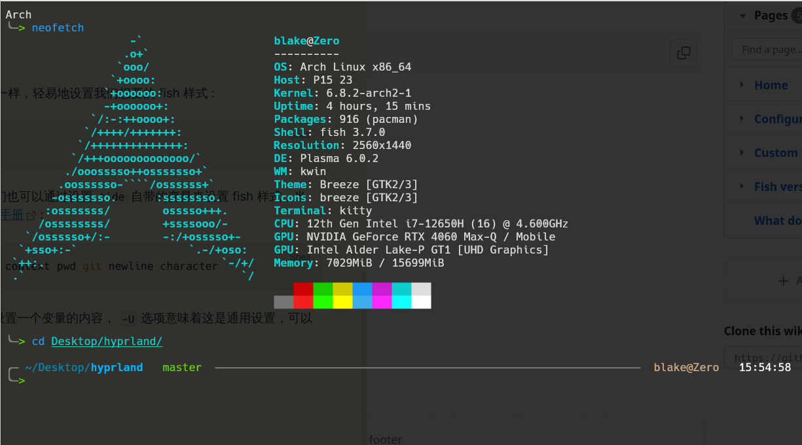

Linux 的终端自然是 Linux 的重头货，拥有一个好看的终端，拥有一个带有好工具的终端自然能提高我们的工作效率。

关于终端中好用的工具，可以看 [工具](工具集#02%20命令行工具) 。

这里主要讲的是如何配置一个好用且好看的 `shell` 。

# 01 `fish` 

fish 是一款开箱即用的 `shell` ，即能像 `zsh` 一样拥有强大的补全和提示，又不需要你进行任何配置。

我们可以直接通过 `sudo pacman -S fish` or `sudo apt install fish` 来安装 `fish` 。

安装好 `fish` 之后，我们就可以将自己的 shell 更换为 fish 了 : 

```bash
chsh user -s /uer/bin/fish
```

你可以自由地探索 fish 的强大之处，不过，他还可以更强。

# 02 `fisher` 

`fisher` 是 fish 的一款轻量级的插件管理器，我们可以在github上[查看](https://github.com/jorgebucaran/fisher) 。

## 2.1 下载 `fisher` : 

```bash
curl -sL https://raw.githubusercontent.com/jorgebucaran/fisher/main/functions/fisher.fish | source && fisher install jorgebucaran/fisher
```

## 2.2 安装和移除插件

使用 fisher 安装和移除插件十分简单 :

```bash
fisher install <plugins>
fisher remove <plugins>
```

但是请记住， `<plugins>` 要求的是 github 上发布的插件。

```bash
fisher install edc/bass
fisher install ilancosman/tide@v6
```

上面的命令将从 https://github.com/edc/bass 安装 `bass` ，从 https://github.com/ilancosman/tide@v6 安装 `tide` 。

> 可供选择的 fish 插件—— [awsm.fish](http://github.com/lengyijun/awsm.fish)

## 2.3 列出插件

我们可以使用 `fisher list` 来查看我们安装的插件。

> `fisher list | fisher remove` 一键删除所有插件，包括 `fisher` 本身

## 2.4 使用 `bash` 脚本

fish 有着自己的脚本语言，其脚本语言也更加现代化，和编程语言有着更加相似的地方，但是几乎所有的 Linux 都默认使用 `shell/bash` 脚本，因此我们也要能够通过 fish 来运行 `shell/bash` 脚本。

我们可以通过 `bass` 插件来运行和 `bash` 有关的脚本，如 :

```bash
bass source ~/.bashrc
bass bash install.sh
```

## 2.5 设置外观

通过使用 `tide` ，我们可以想做问卷一样，轻易地设置我们想要的 fish 样式 : 

```bash
tide configure
```

当然，这并不能满足我们的需要，我们也可以通过设置 `tide` 自带的变量来设置 fish 样式，当然，这就要求你去阅读 `tide` 的 [使用手册](https://github.com/IlanCosman/tide/wiki) : 

```bash
set -U tide_left_prompt_items context pwd git newline character
```

我们在 fish 中可以直接使用 `set` 来设置一个变量的内容， `-U` 选项意味着这是通用设置，可以被覆盖。



这就是设置之后的样式，建议可以先跟着 `tide configure` 设置好后再来更改。

# 02 `ranger` 

`ranger` 是一款强大的终端文件资源管理器，也可以下载插件来获得强大的体验。

`ranger` 的配置文件存放在 `~/.config/ranger` 中，我们可以通过 `ranger --copy-config all` 来获取系统的默认配置，然后在进行修改。

其中

- `rc.conf` 是 `ranger` 的基础配置，可以在其中设置图片预览，绘制边框等
- `rifle.conf` 用于设置打开不同类型的文件用那些软件
- `scope.sh` 是一些脚本集，主要用于扩展 `ranger` 的预览体验

你还可以在 github 上查找 `ranger` 有的 [插件](https://github.com/ranger/ranger/wiki/Plugins) ，然后直接将插件对应的仓库克隆到 `~/.config/ranger/plugins` 中即可。

推荐

- [ranger-devicons2](https://github.com/cdump/ranger-devicons2), icons and types (like `ls -F`) in file list
- [ranger-archives](https://github.com/maximtrp/ranger-archives), support for creating and extracting archives

除了安装插件，为了能让你的使用体验更加良好，还可以安装其他用于支持 ranger 的软件 : 

```bash
sudo pacman -S atool less # archive file preview
sudo pacman -S highlight # code highlight
sudo pacman -S python-pillow # image preview for kitty
sudo pacman -S ffmpegthumbnailer # video preview
sudo pacman -S catdoc docx2txt # doc docx preview
```

