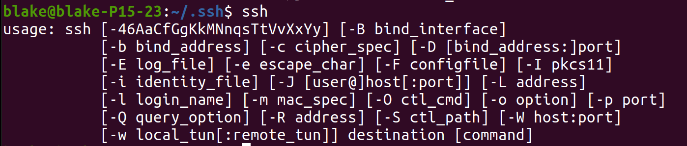
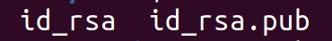
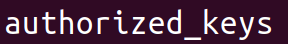
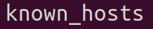
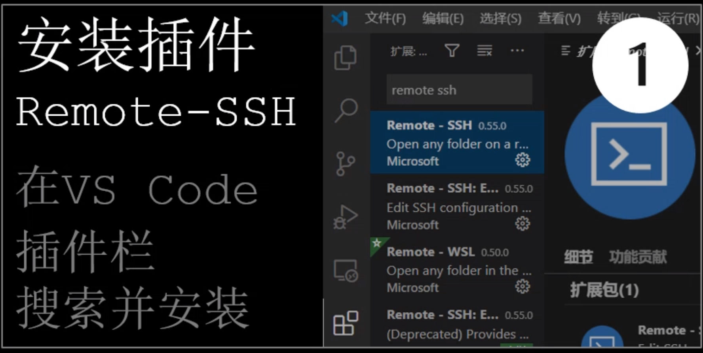
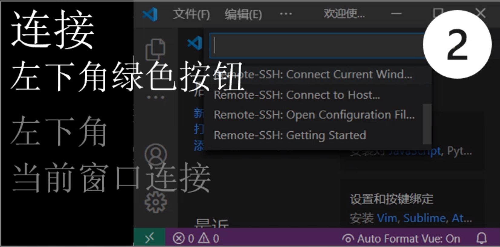
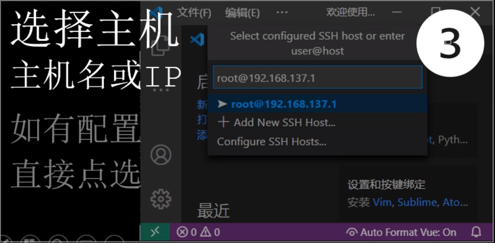
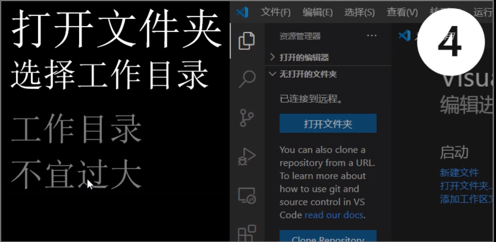

# 1.1 什么是SSH

* 即Secure Shell
* SSH是远程控制协议，可以用于远程控制计算机
* 绝大多数Linux系统自带了SSH，新版Windows也有

## 1.1.1 查看Linux中是否有SSH

```bash
ssh
```



## 1.1.2 安装服务器

* 若想要远程控制本本机，需要安装SSH服务器
* Linux自带SSH客户端，但是没有安装SSH服务器

```bash
sudo apt install openssh-server
```

## 1.1.3 连接到远程主机

```bash
ssh [用户名]@[IPv4地址]
```

# 1.2 IP地址

* IPv4地址可以自动获取，也可以设置固定地址
* IPv4自动获取的IP地址是随机的，每次都不一样
* 而固定的IPv4若被别人占用了，则会出现奇怪的问题

# 1.3 SSH可以使用密钥对

* 密钥包括公钥和私钥
* 公钥存在于服务器中
* 私钥用于解锁公钥

### 1.生成密钥对

```bash
ssh-keygen
# 然后一直回车
```

```ad-tip
你也可以选择进行一些配置，如邮箱、密码等
*生成成功后在`~/.ssh`文件夹下会有如下两个文件*

```

### 2.上传密钥对到远程机

```bash
ssh-copy-id [远程主机用户名]@[IPv4]
# 第一次上传需要输入远程主机的密码

ssh-copy-id -i [文件] [远程主机用户名]@[IPv4]
# -i 指定传输的密钥
```

```ad-tip
*上传成功后在远程主机的`~/.ssh`文件夹中会出现如下文件*

*而在本地则会出现一个配置文件*

```

```ad-seealso
若目标机为 `Windows`，则 `ssh-copy-id [远程主机用户名]@[IPv4]` 会失效需要另外进行配对
可以看看[如何连接Windows](2.SSH-连接Windows)
```

### 3.连接到远程电脑

```bash
ssh [用户名]@[IPv4地址]
```

### 4.文件传输

使用scp命令，与cp命令一致，但能进行远程拷贝
* 从本机发送文件给远程主机

```bash
scp [文件名] [远程主机用户名]@[IPv4地址]:[拷贝的目标地址]
```

* 从远程主机拷贝文件/文件夹到本机

```bash
scp -r [远程主机地址用户名]@[IPv4]:[文件/文件夹] [拷贝到本机的地址]
```

```ad-seealso
关于 `scp` 命令可以参考 [cp](1.基本使用手册#cp) 命令
```

# 1.4 权限修改
```bash
sudo chmod 700 ~/.ssh
sudo 600 ~/.ssh/*
```

```ad-caution
慎重！！！
```

# 1.5 VScode使用SSH

1. 安装插件



2. 连接



3. 选择主机


4. 选择工作目录



> 看看插件清单：


