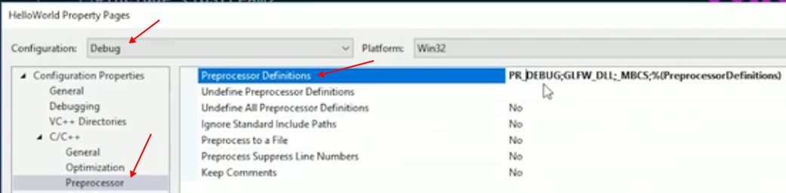

# 01 Replace

**Marco** is actually some codes or lines that will be sent to the **pre-processer** . Then the pre-processor prerform the preprocess, **using the specific texts/codes to replace the marco we write before the codes being sent to compiler for compile** , which means the **compiler gets a different version of code in which the macro is replaced by what we have defined** . That means the macro is highly **associated with the ****[pre-process step](../01 Basic/02.How C++ Work.md)** .

Let's see a simple example :

```C++
#include <iostream>

int main ()
{
    std::cin.get ();
    return 0;
}
```

In the code above, `std::cin.get ()` simply waits for our press on the keyboard. We can define a macro to replace it like :

```C++
#include <iostream>

#define WAIT std::cin.get ()

int main ()
{
    WAIT;
    return 0;
}
```

> [!attention]
> 
> A macro can replace any code but **do not write the code seems to be stupid !**

Another way to use macro is that we can define a macro somewhat like a function and use this "function" :

```C++
#include <iostream>

#define log(x) std::cout << x << std::endl;

int main ()
{
    log ("Hello");
    return 0;
}
```

This time, the console will output `Hello` .

# 02 Compile

Another function of macro is to determine **what is going to be compiled** . Such as, if we develop an application, it commonly has two types : Debug and Release. When we build the project **in debug mode, we may want to log out the information for debug** . However, when we **publish the application** , we consider its performance or other things, then we may want to **drop out the logging system**. To achieve this goal, we can use the macro to determine what is going to be compiled.

```C++
#include <iostream>

#ifdef DEBUG
    #define log(x) std::cout << x << std::endl;
#else
    #define log(x)
#endif

int main ()
{
    log ("Hello");
    return 0;
}
```

In the code above, `#ifdef` judges whether the macro `DEBUG` is defined or not, then will define the macro `log(x)` in two types.

## 2.1 How can we add the definition of `DEBUG` to the code ?

### 2.1.1 Visual Studio

In Visual Studio, we can add the macro `DEBUG` to the **project properties** and specify the build type to be Debug or Release. If the build type is Debug, the `DEBUG` will be defined.



### 2.1.2 Visual Studio Code

In Visual Studio Code, we can add the macro `DEBUG` to the project in the **C/C++ Configurations** . Or add the compile args in `task.json` .


### 2.1.3 CMake

You can add definition in `CMakeLists.txt` -> see [add_compile_definitions](../../CMake/CMake%20Commands.md#14.%20`add_compile_definitions ()`) 

```CMake
add_compile_definitions (DEBUG)
```

## 2.2 Improvement

We can use `#if` to judge whether the macro is set to a specific value :

```C++
#include <iostream>

#define DEBUG 1

#if DEBUG == 1
    #define log(x) std::cout << x << std::endl;
#else
    #define log(x)
#endif

// #ifdef DEBUG
//     #define log(x) std::cout << x << std::endl;
// #else
//     #define log(x)
// #endif

int main ()
{
    log ("Hello");
    return 0;
}
```

Now we can control whether the `log(x)` is to be defined or not in the code.
