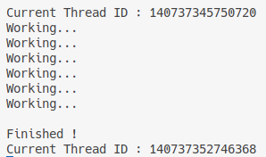

This section is a brief introduction of **Thread** in C++. Many times, we may need to perform two functions together, while our code only supports running the program in series, which means we can only achieve one function at a time.

To solve this problem, we can make multiple functions **run in different threads in parallel** . `<thread>` library provides us a basic solution. Let's see an example :

```C++
#include <iostream>
#include <thread>

static bool s_Finished = false;

void DoWork ()
{
    while (!s_Finished)
    {
        std::cout << "Working..." << std::endl;
        std::this_thread::sleep_for (std::chrono_literals::operator""s(1));
    }
}

int main (int argc, char const* argv[])
{
    std::thread worker (DoWork);

    std::cin.get ();
    s_Finished = true;

    worker.join (); // wait for this thread to finish
    std::cout << "Finished !" << std::endl;
    
    std::cin.get ();

    return 0;
}
```

In the code above, we achieve a function that **prints out** **`Working...`** **continuously while waiting for the press of the keyboard** . We use `std::thread workder (DoWork)` to create a thread instant, in which the parameter `DoWork` is actually a function pointer. **Since the** **`worker`** **is created,** **`DoWork`** **will be performed in another thread instead of the thread of the main function** .

We define a **static** variable to communicate with the function `DoWork` . In the main function, after we move `DoWork` into another thread, we use `std::cin.get ()` to wait for keyboard response. When the keyboard is pressed, we set the static variable `s_Finished` to be true, then in the function `DoWork` will stop the loop.

The line `worker.join ()` **stops the running of the main function and waits for the finish** of the thread `worker` . **Only when** **`DoWork`** **is finished can the program run over this line** .

We can print out the thread id to see the difference between `worker` thread and main function thread intuitionally :

```C++
#include <iostream>
#include <thread>

static bool s_Finished = false;

void DoWork ()
{
    std::cout << "Current Thread ID : " << std::this_thread::get_id () << std::endl;
    while (!s_Finished)
    {
        std::cout << "Working..." << std::endl;
        std::this_thread::sleep_for (std::chrono_literals::operator""s (1));
    }
}

int main (int argc, char const* argv[])
{
    std::thread worker (DoWork);

    std::cin.get ();
    s_Finished = true;

    worker.join (); // wait for this thread to finish
    std::cout << "Finished !" << std::endl;
    std::cout << "Current Thread ID : " << std::this_thread::get_id () << std::endl;

    std::cin.get ();

    return 0;
}
```


