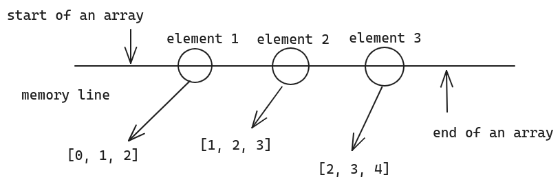
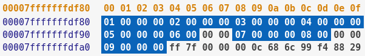
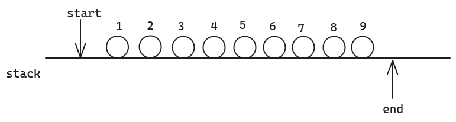
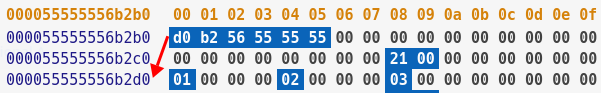
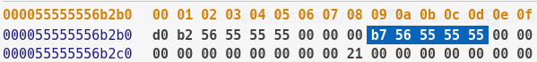
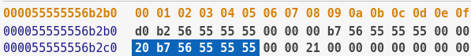
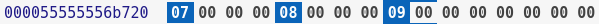
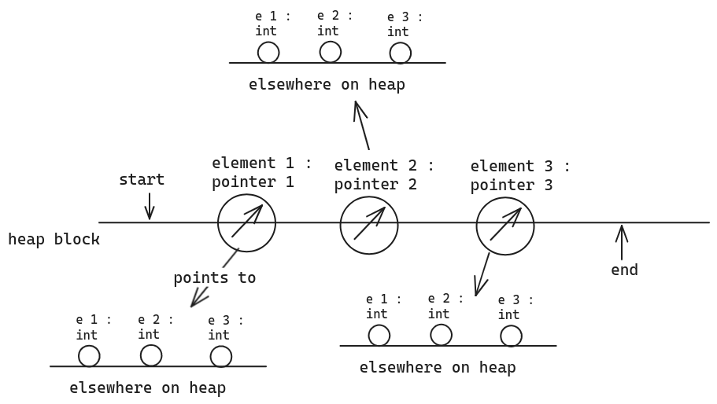

# 01 What is a multi-dimensional array ?

The multi-dimensional array is just the array of the array. Which means the multi-dimensional array is the collection of some variables while the variables are some arrays. It is easy to realize the multi-dimensional array by declining its dimension.

Such as a 2-D array on the stack :

```C++
int a2d[3][3];
for (int i = 0; i < 3; i++)
{
    for (int j = 0; j < 3; j++)
    {
        a2d[i][j] = i + j;
    }
}
```

The code above creates a 3 * 3 array. You can flat the array on a 2-D plane to visualize it such as :

$$\begin{bmatrix} [0 && 1 && 2], \\ [1 && 2 && 3], \\ [2 && 3 && 4] \end{bmatrix}$$

So that we can know the 2-D array has rows and columns, we can access the array by the row index and column index. This seems easy to understand and also works when the array is a 3-D array, for which we can set up a 3-D model with x, y, z three axis. But what if the dimension is 4 and more ?

I personally like to treat all dimensional arrays as a 1-D array. **No matter how many dimensions the array has and no matter what type of value is stored in the array, the array is basically** _**a container to store a collection of elements**_ . The type of the elements vary with different purposes. Maybe the element is an `int` variable, a `float` variable, a structure or a class we defined, or **an array** . So the multi-dimensional array is also a container **whose elements just happen to be an array** . That's all.



So take the `a2d` as an example. `a2d` is an array with 3 elements, which happen to be an array with 3 other elements. So that we can access the first element of `a2d` by index `a2d[0]` , which is an array. So if we want to create a variable to store the first element of `a2d` , its type should be an array type :

```C++
int* element1 = a2d[0];
```

Since `element1` is also an array, we can access its second element by index `element1[1]` , which is an integer `1` :

```C++
std::cout << element1[1] << std::endl;
// 1
```

So substitute `element1` by `a2d[0]` , we can access the element at row1, column2 of `a2d` , which is the same element as the second element of `element1` :

```C++
std::cout << a2d[0][1] << std::endl;
// 1
```

No matter how many dimensions an array has, we can treat it as a 1-D array, and just do what we have learnt to deal with the 1-D array on the multi-dimensional array.

# 02 Create an Array

We have known that to define a variable, we can create it on stack or on heap by `new` . For the array, it is the same as the normal variables.

## 2.1 On Stack

Creating a multi-dimensional array on stack is easy by using `[]` :

```C++
int a2d_s[3][3]; // 3 * 3
int a3d_s[3][3][3] // 3 * 3 * 3
```

Easy right ? To initialize the array, we can use `{}` to give the array an initialized value :

```C++
int a2d_s[3][3] = {{1, 2, 3}, {4, 5, 6}, {7, 8, 9}};
```

Or use the `for` loop to give it value :

```C++
for (int i = 0; i < 3; i++)
{
    for (int j = 0; j < 3; j++)
    {
        a2d_s[i][j] = i * 3 + j + 1;
    }
}
```

## 2.2 On Heap

### 2.2.1 One-D

We use `new` to create multi-dimensional arrays on heap by using multiple pointers. To create a 1-D array, we can just :

```C++
int* a1d_h = new int[3]; // a 1-D array with length of 3
```

This will return a pointer to the array, and **we assign 4 * 3 bytes of memory to that pointer** **`a1d_h`** , because an `int` is 4 bytes and there are 3 `int` . But **attention ! The result of** **`sizeof (a1d_h)`** **is** **`8`** **in x64 system or** **`4`** **in x86 system** . This is because `a1d_h` is just a pointer, it **does not store any value, the value is stored in memory** .

### 2.2.2 N-D

To create a 2-D array `a2d_h`, we need to **note that the variable we created is just a pointer** . And the 2-D array is an array of arrays. The element of the `a2d_h` is with the type of array, which can be (almost is) **pointer** . So to create 2-D array on heap, we need to use multiple pointer :

```C++
int** a2d_h = new int*[3];
```

In the code above, we **actually do not create a 2-D array, we just assign 3 integer pointers to** **`a2d_h`** . That means we assign **24 bytes (****`sizeof (int*) * 3`****) of memory to** **`a2d_h`** **because my system is x64** . To completely create the 2-D array, we need to assign memory to the element of `a2d_h` , that is, we need to assign memory to the pointers in `a2d_h` :

```C++
for (int i = 0; i < 3; i++)
{
    a2d_h[i] = new int[3];
    for (int j = 0; j < 3; j++)
    {
        a2d_h[i][j] = i * 3 + j + 1;
    }
}
```

We know that the elements of `a2d_h` are all `int*` , so that we can rewrite the code in a more intuitional style :

```C++
for (int i = 0; i < 3; i++)
{
    int* & element = a2d_h[i];
    element = new int[3];
    for (int j = 0; j < 3; j++)
    {
        element[j] = i * 3 + j + 1;
        std::cout << a2d_h[i][j] << " ";
    }
    std::cout << std::endl;
}
```

In the code above, we go through all the elements of `a2d_h` , and then **assign 12 bytes (****`sizeof (int) * 3`** **memory to each of them** . By far, we can say that the 2-D array is built up and **the size of the array is 36 bytes but we totally assign 60 bytes (24 bytes for pointers + 36 bytes for contents) to our variables** .

# 03 Memory Layout

It is very important to clear how the array is stored in memory. For a 1-D array, we know that the element of the array is one by one on the memory line. But what's the situation in a multi-dimensional array ?

## 3.1 Multi-Dimensional Array on Stack

This is the same as the 1-D array. All the elements are stored in a line one by one. So that **we can use the continuous offset to dereference the pointer** . Let's look in memory :

```C++
int a2d_s[3][3] = {{1, 2, 3}, {4, 5, 6}, {7, 8, 9}};
// &a2d_s == 0x7fffffffdf80
```

The memory layout of `a2d_s` is :



We can find that each element takes up 4 bytes of memory and they are stored one by one, for which we say that the **elements are stored continuously or the array is continuous in memory** . So if we want to access `4` by pointer, we can simply write `*(a2d_s + 3)` , and `*(a2d_s + 3) == a2d_s[1][0]` .



## 3.2 Multi-Dimensional Array on Heap

From the steps we create a 2-D array on heap, we can easily find that every element of `a2d_h` is assigned a memory block individually. Do their memory addresses lay one by one ? Let's look in memory :


When we run over the **line** **`int** a2d_h = new int*[3]`** **, it will assign these three memory blocks to** **`a2d_h`** , but now the **content of memory is being cleared** . When we **run over the line** **`a2d_h[i] = new int[3]`** **or** **`element = new int[3]`** , the **three pointers will be assigned another memory block** , such as in the graph, `a2d_h[0] : 0x 55 55 55 56 b2 d0` , `a2d_h[1] : 0x 55 55 55 56 b7 00` , `a2d_h[2] : 0x 55 55 55 56 b7 20` .

When we run over the line `a2d_h[i][j] = i * 3 + j + 1;` or `element[j] = i * 3 + j + 1;` , the contents of these three pointers will be initialized :

- `0x 55 55 55 56 b2 d0`
	

- `0x 55 55 55 56 b7 00` 
	
		......
	

- `0x 55 55 55 56 b7 20`
	
		......
	

So from the analysis above, we know that **the assignment of memory blocks is not continuous**. That means **where the 3 pointers to are not lay one by one**. It is like :



So **we can not use pointer with the continuous offset to dereference the content** . That means `a2d_h[1][0] != *(a2d_h + 3)` .

# 04 Accession

Since we know how the array is stored in memory, we can easily use the pointer to refer to the content .