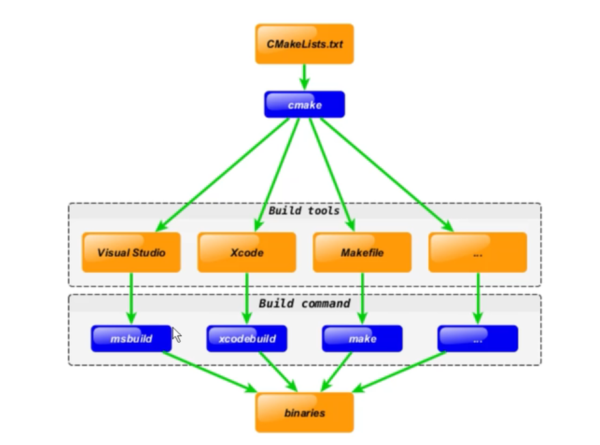
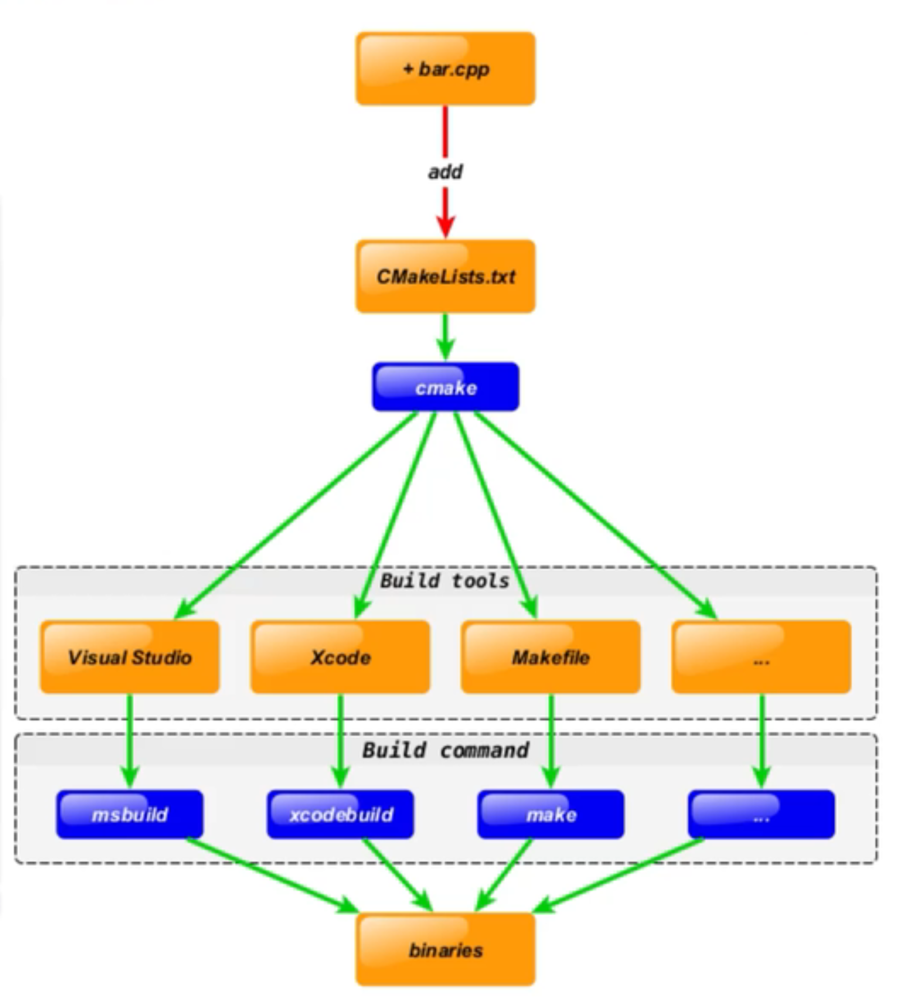

# 01 What is CMake ?

`CMake` 是一个 **跨平台** 的安装编译工具，可以使用 **简单** 的程序语句来描述 **所有平台的安装（编译过程）** ，可以说是大部分 C++ 开源项目的标配

# 02 How do the CMake work ?





# 03 语法特性

1. 基本语法格式：
	- 参数使用 `()` 括起
	- 参数之间用 `空格` 或 `;` 分开

```CMake
<command> (<parameter1> <parameter2> ...)
```

2. 特色：
	- **指令** 是**大小写无关的** 
	- **参数** 和 **变量** 是 **大小写相关的** 

```CMake
set (HELLO hello.cpp)
set (hello main.cpp)
# HELLO 和 hello 的内容不一

add_executable (main main.cpp)
ADD_EXECUTABLE (main main.cpp)
# 指令一样
```

3. 特殊：
	- **变量** 需要使用 `${<variable>}` 的方式来取值
	- 而在 `IF` 语句中则 **直接使用变量名** 