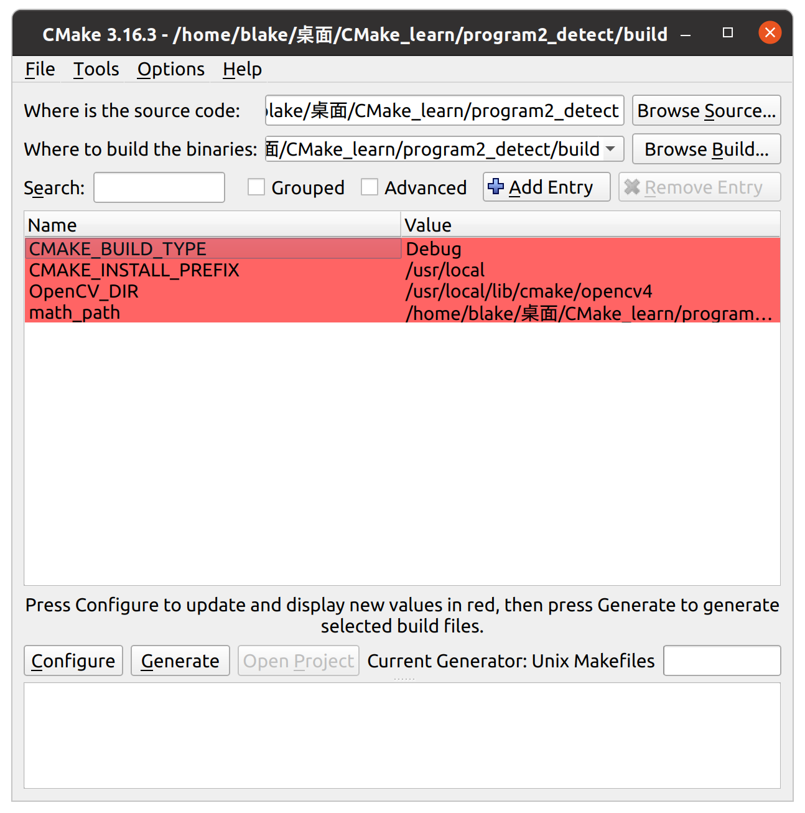
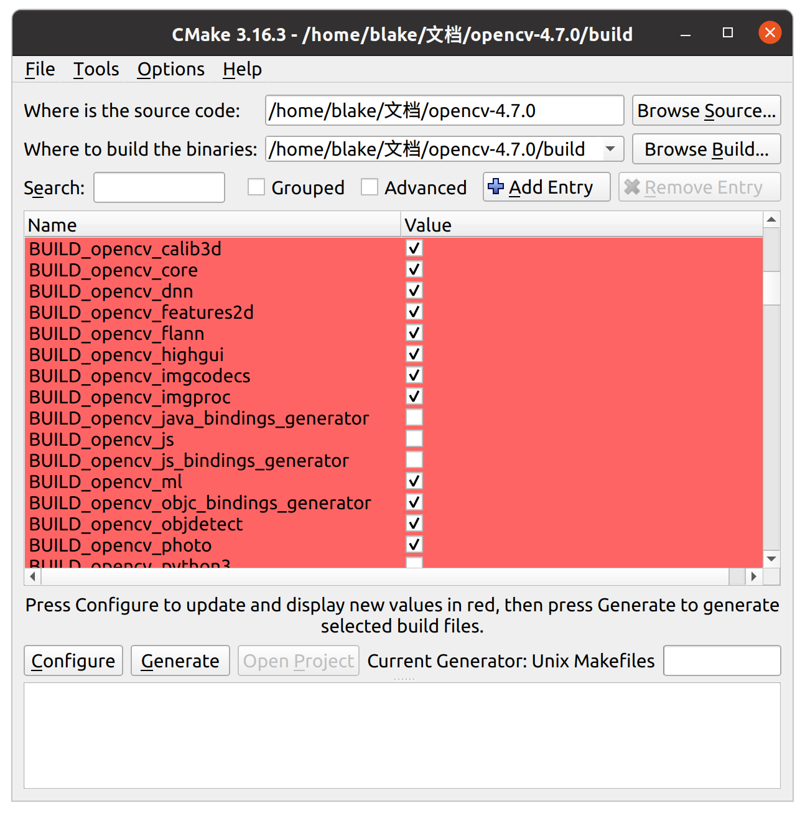

通过上面两个项目的实践，我们已经掌握了 **最基本，最通用，也是最重要的编写规则** ，接下来，我们将详细叙述CMake中具体的语法规则

# 01 变量

变量的定义通过 `set (<variable_name> <source>)` 来定义，通过 `${<variable_name>` 来调用，通过 `unset (<variable_name>` 来解除

`CMake` 中的变量分为 **局部变量** 和 **缓存变量** 。

## 1.1 局部变量

局部变量是指在 **当前模块** 和 **子模块** 中可以访问的变量

>  `子模块` ：通过 `include` 找到的 `.cmake` 文件或者通过 `add_subdirectory ()` 找到的包含 `CMakeLists.txt` 的目录

```CMake
set (A "a") # 将 A 的值设置为 "a"
set (B ${A} "b") # 将 B 的值设置为 "a", "b"

unset (A) # 解除变量 A 的定义
```

## 1.2 缓存变量

缓存变量是指在定义后被添加至 `CMakeCache.txt` 文件中，访问时从该文件中获取，可以在任意位置调用的变量。缓存变量又分为 **内置环境变量** 和 **自定义缓存变量** 。

### 1.2.1 内置环境变量

内置环境变量是 `CMake` 默认提供，默认定义好的变量

> 注意：其定义方式 **与局部变量的定义方式相同** ，但是其作用方式是 **缓存变量的作用方式**

#### 1.2.1.1 编译选项 

##### 1. `CMAKE_C_FLAGS` 和 `CMAKE_CXX_FLAGS`

`CMAKE_C_FLAGS` 是 C 文件编译选项，而 `CMAKE_CXX_FLAGS` 是 C++ 文件编译选项。一般情况下， **这两项没有默认值** ，但是我们设置的值会 **作为附加参数追加在编译命令之后** 

```CMake
set (CMAKE_CXX_FLAGS "${CMAKE_CXX_FLAGS} -std=c++11")
# 在 CMAKE_CXX_FLAGS 后追加 -std=c++11 选项
```

> 在上面的代码中，为了保证默认编译选项保持不变，能够正常执行编译命令，我们设置其值的时候调用它本身 `${CMAKE_CXX_FLAGS}` 来赋值，并加上我们想要的选项 `-std=c++11` 。这个可以理解为 `a += 1`

##### 2. `CMAKE_BUILD_TYPE`

`CMAKE_BUILD_TYPE` 用于设置编译类型 **Release** 或 **Debug**
- 调试的时候需要选择 Debug
- 发布时需要选择 Release

```CMake
set (CMAKE_BUILD_TYPE Debug)
# 设置编译类型为 Debug

set (CMAKE_BUILD_TYPE Release)
# 设置编译类型为 Release
```

除了 `Release` 和 `Debug` ，还有其他可供选择的编译选项 : 

- - Release —— 不可以打断点调试，程序开发完成后发行使用的版本，占的体积小。 它对代码做了优化，因此速度会非常快，
    
    在编译器中使用命令： `-O3 -DNDEBUG` 可选择此版本。
    
- Debug ——调试的版本，体积大。
    
    在编译器中使用命令： `-g` 可选择此版本。
    
- MinSizeRel—— 最小体积版本
    
    在编译器中使用命令：`-Os -DNDEBUG`可选择此版本。
    
- RelWithDebInfo—— 既优化又能调试。
    
    在编译器中使用命令：`-O2 -g -DNDEBUG`可选择此版本。


##### 3. `CMAKE_CXX_STANDARD` 和 `CMAKE_CXX_STANDARD_REQUIRED`

其中， `CMAKE_CXX_STANDARD` 用于指定 C++ 编译版本， `CMAKE_CXX_STANDARD_REQUIRED` 则用于选择是否使用指定版本

```CMake
set (CMAKE_CXX_STANDARD 11)
# 设置 C++ 编译版本为 c++11

set (CMAKE_CXX_STANDARD_REQUIRED True)
```

#### 1.2.1.2 与项目相关

1. `PROJECT_NAME` : 默认值为该项目的名称
2. `PROJECT_SOURCE_DIR` : 项目所在 **根目录的路径** (最顶层 `CMakeLists.txt` 所在路径)
3. `PROJECT_BINARY_DIR` : 项目的 **二进制路径**

```CMake
# 可以这样使用与项目相关的变量
add_executable (${PROJECT_NAME} main.cpp)
```

> 注意 : `CMAKE_SOURCE_DIR` 与 `PROJECT_SOURCE_DIR` 默认都为项目根目录路径

#### 1.2.1.3 与路径相关

1. `CMAKE_SOURCE_DIR` 与 `PROJECT_SOURCE_DIR` : 指的是 **项目所在的根目录** 
2. `CMAKE_BINARY_DIR` 与 `PROJECCT_BINARY_DIR` : 指的是 **项目编译发生的目录**
3. `CMAKE_CURRENT_SOURCE_DIR` : 指的是 **当前 `CMakeLists.txt` 所在目录** 
4. `CMAKE_CURRENT_BINARY_DIR` : 指的是 **当前 `CMakeLists.txt` 所在子模块编译发生的目录**

```
├── CMakeCache.txt
├── CMakeFiles
├── cmake_install.cmake
├── compile_commands.json
├── detectfunc (detectfunc 模块的编译目录)
|	├── CMakeFiles
|	├── cmake_install.cmake
|	├── libdetectfunc.a
|	└── Makefile
├── main
├── Makefile
└── mathfunc (mathfunc 模块的编译目录)
	├── CMakeFiles
	├── cmake_install.cmake
	├── libmathfunc.a
	└── Makefile
```

从上面的目录结构中，我们可以看出，对于每一个子模块，都有相应的 **编译目录** ，而不是将所有编译放在同一个文件夹中

#### 1.2.1.4 与输出相关

1. `EXECUTABLE_OUTPUT_PATH` : 最终生成的可执行文件的存放目录
2. `LIBRARY_OUTPUT_PATH` : 添加的库的输出目录

#### 1.2.1.5 与环境相关

1. `CMAKE_INCLUDE_PATH` : CMake包含的 **头文件的目录** 
2. `CMAKE_LIBRARY_PATH` : CMake包含的 **库所在目录** 

> 注意：这两个变量都有默认值，如果要添加头文件或库所在的目录，应该在定义时调用本身来赋值后再额外追加新路径，如 
> `set (CMAKE_INCLUDE_PATH "${CMAKE_INCLUDE_PATH} <your_include_path>")` 

```ad-attention
注意：
若是设置 `LIBARARY_OUTPUT_DIR` 更改了输出目录，则应该在 `CMAKE_LIBRARY_PATH` 中追加你添加的库的输出路径
```

#### 1.2.1.6 库相关

1. `BUILD_SHARED_LIB` : 用于设置库的 **默认编译方式** ，将此项设置为 `ON/TRUE` 则设置默认编译方式为编译动态库

> 注意：
> 库的编译方式由 `add_library ()` 来指定，若是没有指定编译方式，则默认将库编译成 **静态库** ，若将上述选项更改为 `ON/TRUE` ，则会将没有指定编译方式的库编译成动态库

### 1.2.2 自定义缓存变量

#### 1. 选项变量

`option ()` 命令定义了一个 `bool` 类型的变量，该变量的值有两种表示方式 ：

1. `TURE` or `FALSE`
2. `ON` or `OFF`

```CMake
option (<variable_name> [comment] <value>)
option (USE_CUDA "choose to use cuda or not" OFF)
```

#### 2. 一般自定义缓存变量

```CMake
# 定义缓存变量
set (<variable_name> <value> CACHE <type> [comment] [FORCE])
set (USE_CUDA OFF CACHE BOOL "choose to use cuda or not")
set (MYLIB_PATH /home/mylib CACHE PATH "the path to my libs")
set (MY_INCLUDE "include" CACHE PATH "the path to include dir")

# 解除缓存变量
unset (<variable_name> CACHE)
unset (USE_CUDA CACHE)
```

- 使用 `CACHE` 指定改变量为缓存变量
- `type` 指定该变量的类型， **必须有以下其中之一的值** ：
	- `BOOL` : 设置改变量为 `bool` 类型
	- `FILEPATH` : 设置改变量为 `文件路径` 
	- `PAHT` : 设置该变量为 `路径` 
	- `STRING` : 设置该变量为 `string` ，可以用于存放各种值
		- `INTERNAL` : 设置内部缓存条目
- `comment` : 可选项，用于注释该变量
- `FORCE` : 可选项，用于强制覆盖缓存条目

#### 3. 缓存条目

##### 什么是缓存条目？

缓存条目是用于编译的变量，存放于 `CMakeCache.txt` 文件中，在编译过程中如果遇到需要使用缓存条目，则会在该文件中查找。

> 注意：
> 在第一次构建编译信息的时候会生成 `CMakeCache.txt` 文件，并将缓存变量与缓存条目写入其中，之后的每一次构建都不会更改该文件。
> 
> 在使用 `set ()` 命令设置缓存条目的时候，若该缓存条目在 `CMakeCache.txt` 文件中 **不存在** ，则 **自动创建** 并将其值写入；若该缓存条目 **已存在** ，则 **忽略 `set ()`** ，不会覆盖现有的缓存条目。
> 
> 但是，我们仍可以通过 `FORCE` 选项 **强制覆盖现有的缓存条目** 

##### 如何查看缓存条目？

查看缓存条目主要有两种方式：

1. 通过 `cmake-gui` 查看



2. 通过调用 `cmake` 的时候使用 `-L` 选项来查看


> 注意：
> 这两种方式均要对项目进行构建编译信息后才能查看，原因是我们可能会定义一些外部缓存条目用于编译信息的构建，如 OpenCV 有着大量外部缓存条目

##### 如何定义缓存条目？

缓存条目的定义有三种方式：

1. 在 `CMakeLists.txt` 文档中定义
2. 在调用 `cmake` 命令时使用 `-D` 选项定义
3. 通过 `cmake-gui` 来定义

在实际编译中，我们会通过使用 `-D` 选项或使用 `cmake-gui` 来设置缓存条目，而非在 `CMakeLists.txt` 文档中进行定义，如在从源码构建 OpenCV 项目的时候，我们就需要使用命令 : 

```bash
cmake -DBUILD_EXAMPLES=OFF -DBUILD_PERF_TESTS=OFF -DBUILD_TESTS=OFF -DBUILD_opencv_python3=OFF -DBUILD_opencv_python_bindings_generator=OFF -DBUILD_opencv_python_tests=OFF -DBUILD_JAVA=OFF -DBUILD_opencv_java_bindings_generator=OFF -DBUILD_opencv_js=OFF -DBUILD_opencv_js_bindings_generator=OFF -DBUILD_opencv_dnn=ON -DBUILD_opencv_ml=ON -DOPENCL_FOUND=OFF -DBUILD_opencv_gapi=OFF -DOPENCV_ENABLE_NONFREE=ON -DENABLE_FAST_MATH=ON -DWITH_GSTREAMER=ON -DCMAKE_BUILD_TYPE=Release ..

```

或者通过GUI：



# 02 常用与语句块

## 2.1 运算符

### 2.1.1 一元运算符

#### 1. `EXISTS` 

用于判断文件或者目录是否存在，存在时结果为真，需要提供全路径，也可以是符号链接

`if (EXISTS <path>)` 

```CMake
if (NOT EXISTS ${CMAKE_CURRENT_BINARY_DIR}/test)
```

#### 2. `IS_DIRECTORY` 

用于判断指定内容是否为文件夹，是文件夹则为真

`if (IS_DIRECTORY <path>)` 

#### 3. `COMMAND` 

用于判断所给对象是否为 **命令、宏或函数** 等 **可以被调用的对象** ，是则为真

`if (COMMAND <target>)` 

#### 4. `DEFINED` 

用于判断说给变量是否存在，存在为真

`if (DEFINED [ENV] <variable_name>)` 

> 注意：
> 若判断的对象为 **环境变量** ，则需要在前面加上 `ENV` 选项

### 2.1.2 二元运算符

#### 1. 数字逻辑运算符

- `LESS` : <
- `GREATER` : >
- `EQUAL` : =
- `LESS_EQUAL` : <=
- `GREATER_EQUAL` : >=

用于判断左右两边是否符合条件，符合为真为真

`if (<variable_name> EQUAL <value>)`

#### 2. `STREQUAL` 

利用 **[字典序](../C++/01%20Basic/12.String.md)** 比较两边的字符串是否相等，相等为真

`if (<STR1> STREQUAL <STR2>)`

#### 3. `MATCHES` 

判断左右两边是否匹配，如果左边的值与右边的正则表达式匹配，结果为真

`if (<variable1> MATCH <re>)`

```CMake
if (CMAKE_SYSTEM_NAME MATCH "Linux")
	message (STATUS "Current Platform : Linux")
elseif (CMAKE_SYSTEM_NAME MATCH "Windows")
	message (STATUS "Current Platform : Windows")
endif ()
```

### 2.1.3 逻辑操作符

- `NOT`
- `AND`
- `OR`

## 2.2 条件控制

```CMake
if (<condition>)
	<codes>
elseif (<condition>)
	<codes>
else ()
	<codes>
endif ()
```

> 注意：每次结束判断不能忘记加 `endif ()` 语句

## 2.3 遍历循环

### 1. `foreach` 

```CMake
foreach (<循环变量> <循环目标>)
	<codes>
endforeach ()
```

```CMake
foreach (i 1 2 3)
	message ("value : ${i}")
endforeach ()

# value : 1
# value : 2
# value : 3
```

### 2. `RANGE`

与 `Python` 中的 `range` 函数 [使用方法]() 相同，但不需要括号，而且在 `Python` 中， `range ()` 左闭右开，在 `CMake` 中， `RANGE` 为闭区间

```CMake
foreach (i RANGE 2)
	message ("value : ${i}")
endforeach ()

# value : 0
# value : 1
# value : 2
```

```CMake
foreach (i RANGE 1 5 2)
	message ("value : ${i}")
endforeach ()

# value : 1
# value : 3
# value : 5
```

```ad-attention
注意！
在 `if` 和 `foreach` 语句中设置的变量 **仍会在条件体，循环体外生效** ，对于设置的变量 **要养成使用 `unset ()` 解除变量的习惯** ！
```
