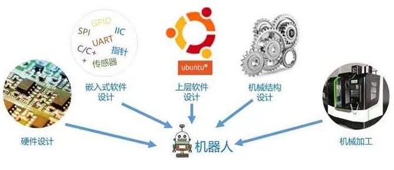

# 1 ROS简介
## 1.0 ROS 诞生背景

> 机器人是一种高度复杂的系统性实现，机器人设计包含了机械加工、机械结构设计、硬件设计、嵌入式软件设计、上层软件设计....是各种硬件与软件集成，甚至可以说机器人系统是当今工业体系的集大成者。



> 机器人体系是相当庞大的，其复杂度之高，以至于没有任何个人、组织甚至公司能够独立完成系统性的机器人研发工作。
> 
> 一种更合适的策略是： _**让机器人研发者专注于自己擅长的领域**，其他模块则直接复用相关领域更专业研发团队的实现，当然自身的研究也可以被他人继续复用_ 。 这种基于"复用"的分工协作，遵循了 **不重复发明轮子** 的原则，显然是可以大大提高机器人的研发效率的，尤其是随着机器人硬件越来越丰富，软件库越来越庞大，这种复用性和模块化开发需求也愈发强烈。

在此大背景下，于 **2007** 年，一家名为 **柳树车库（Willow Garage）** 的机器人公司发布了 _**ROS**_(机器人操作系统)，ROS是一套机器人通用软件框架，可以**提升功能模块的复用性**，并且随着该系统的不断迭代与完善，如今 ROS 已经成为机器人领域的事实标准。


## 1.1 ROS概念

**ROS全称Robot Operating System(机器人操作系统)**

- ROS是适用于机器人的 **开源** 元操作系统

- ROS**集成**了大量的工具，库，协议，提供类似OS所提供的功能，简化对机器人的控制

- 还提供了用于在**多台计算机**上获取，构建，编写和运行代码的工具和库，ROS在某些方面类似于“机器人框架”
	- 分布式项目，可以减缓计算压力

- ROS设计者将ROS表述为 `ROS = Plumbing + Tools + Capabilities + Ecosystem` ，即ROS是 **通讯机制、工具软件包、机器人高层技能以及机器人生态系统** 的集合体


## 1.2 ROS设计目标

机器人开发的分工思想，实现了不同研发团队间的共享和协作，提升了机器人的研发效率，为了服务“ 分工”，ROS主要设计了如下目标：

- **代码复用:** ROS的目标不是成为具有最多功能的框架，ROS的主要目标是支持机器人技术研发中的代码 _重用_ 。

- **分布式:** ROS是进程（也称为 _Nodes_）的分布式框架,ROS中的进程可分布于不同主机，不同主机协同工作，从而分散计算压力

- **松耦合:** ROS中功能模块封装于独立的功能包或元功能包，便于分享，功能包内的模块以节点为单位运行，以ROS标准的IO作为接口，开发者不需要关注模块内部实现，只要了解接口规则就能实现复用,实现了模块间点对点的松耦合连接

- **精简：** ROS被设计为尽可能精简，以便为ROS编写的代码可以与其他机器人软件框架一起使用。ROS易于与其他机器人软件框架集成：ROS已与OpenRAVE，Orocos和Player集成

- **语言独立性：** 包括Java，C++，Python等。为了支持更多应用开发和移植，ROS设计为一种语言弱相关的框架结构，使用简洁，中立的定义语言描述模块间的消息接口，在编译中再产生所使用语言的目标文件，为消息交互提供支持，同时允许消息接口的嵌套使用

- **易于测试：** ROS具有称为[rostest](http://wiki.ros.org/rostest)的内置单元/集成测试框架，可轻松安装和拆卸测试工具。

- **大型应用：** ROS适用于大型运行时系统和大型开发流程。

- **丰富的组件化工具包：** ROS可采用组件化方式集成一些工具和软件到系统中并作为一个组件直接使用，如RVIZ（3D可视化工具），开发者根据ROS定义的接口在其中显示机器人模型等，组件还包括仿真环境和消息查看工具等

- **免费且开源：** 开发者众多，功能包多

## 1.3 ROS发展历程

- ROS是一个由来已久、贡献者众多的大型软件项目。在ROS诞生之前，很多学者认为，机器人研究需要一个开放式的协作框架，并且已经有不少类似的项目致力于实现这样的框架。在这些工作中，斯坦福大学在2000年年中开展了一系列相关研究项目，如斯坦福人工智能机器人（STandford AI Robot, STAIR）项目、个人机器人（Personal Robots, PR）项目等，在上述项目中，在研究具有代表性、集成式人工智能系统的过程中，创立了用于室内场景的高灵活性、动态软件系统，其可以用于机器人学研究。
    
- 2007年，柳树车库（Willow Garage）提供了大量资源，用于将斯坦福大学机器人项目中的软件系统进行扩展与完善，同时，在无数研究人员的共同努力下，ROS的核心思想和基本软件包逐渐得到完善。
    
- ROS的发行版本（ROS distribution）指ROS软件包的版本，其与Linux的发行版本（如Ubuntu）的概念类似。推出ROS发行版本的目的在于使开发人员可以使用相对稳定的代码库，直到其准备好将所有内容进行版本升级为止。因此，每个发行版本推出后，ROS开发者通常仅对这一版本的bug进行修复，同时提供少量针对核心软件包的改进。
    
- 版本特点: 按照英文字母顺序命名，ROS 目前已经发布了ROS1 的终极版本: noetic，并建议后期过渡至 ROS2 版本。noetic 版本之前默认使用的是 Python2，noetic 支持 Python3。
    
建议版本: noetic 或 melodic 或 kinetic

# 2 ROS部署
## 2.1 一键安装解千愁
### 2.1.1 获取安装脚本

[鱼香ROS]() 为我们提供了 Ubuntu 版本的安装脚本，我们可以通过脚本一键安装 ROS 系统。

```Bash
wget http://fishros.com/install -O fishros && ./fishros
```

### 2.1.2 验证安装

1. 新开一个终端

```Bash
ros2 run turtlesim turtlesim_node
```

3. 再新开一个终端

```Bash
ros2 run turtlesim turtle_teleop_key
# 设置键盘，鼠标应聚焦在键盘控制窗口
```

> 若出现一个小乌龟窗口而且能够使用方向键控制其移动，则部署成功


### 2.1.3 卸载

```bash
	sudo apt-get remove ros-humble-*
```

## 2.2 手动安装

### 2.2.1 ROS2
#### 1. Set locale

Make sure you have **a locale which supports `UTF-8`**. If you are in a minimal environment (such as a docker container), the locale may be something minimal like `POSIX`. We test with the following settings. However, it should be fine if you’re using a different UTF-8 supported locale.

```bash
locale  # check for UTF-8

sudo apt update && sudo apt install locales
sudo locale-gen en_US en_US.UTF-8
sudo update-locale LC_ALL=en_US.UTF-8 LANG=en_US.UTF-8
export LANG=en_US.UTF-8

locale  # verify settings
```

#### 2. Setup Sources

You will need to add the ROS 2 apt repository to your system.

1. First ensure that the [Ubuntu Universe repository](https://help.ubuntu.com/community/Repositories/Ubuntu) is enabled.

```bash
sudo apt install software-properties-common
sudo add-apt-repository universe
```

2. Now add the **ROS 2 GPG key** with apt.

```bash
sudo apt update && sudo apt install curl -y
sudo curl -sSL https://raw.githubusercontent.com/ros/rosdistro/master/ros.key -o /usr/share/keyrings/ros-archive-keyring.gpg
```

3. Then add the repository to your sources list.

```bash
echo "deb [arch=$(dpkg --print-architecture) signed-by=/usr/share/keyrings/ros-archive-keyring.gpg] http://packages.ros.org/ros2/ubuntu $(. /etc/os-release && echo $UBUNTU_CODENAME) main" | sudo tee /etc/apt/sources.list.d/ros2.list > /dev/null
```

#### 3. Install ROS 2 Packages

Update your apt repository caches after setting up the repositories.

```bash
sudo apt update
```

ROS 2 packages are built on frequently updated Ubuntu systems. It is always recommended that you ensure your system is up to date before installing new packages.

```bash
sudo apt upgrade
```

Desktop Install (Recommended): ROS, RViz, demos, tutorials.

```bash
sudo apt install ros-humble-desktop
```

ROS-Base Install (Bare Bones): Communication libraries, message packages, command line tools. No GUI tools.

```bash
sudo apt install ros-humble-ros-base
```

Development tools: Compilers and other tools to build ROS packages

```bash
sudo apt install ros-dev-tools
```


#### 4. Evironment Setup

#### 1. bash

```bash
echo "source /opt/ros/humble/setup.bash" >> ~/.bashrc
```

#### 2. fish

```bash
curl -sL https://raw.githubusercontent.com/jorgebucaran/fisher/main/functions/fisher.fish | source && fisher install jorgebucaran/fisher

fisher install edc/bass

echo "bass source /opt/ros/humble/setup.bash" >> ~/.config/fish/config.fish
```

### 2.2.2  ROS1

#### 1. Setup your sources.list

```bash
sudo sh -c 'echo "deb http://packages.ros.org/ros/ubuntu focal main" > /etc/apt/sources.list.d/ros-latest.list'
```

#### 2. Set up your keys

```bash
curl -s https://raw.githubusercontent.com/ros/rosdistro/master/ros.asc | sudo apt-key add -
```

> 在较新版本的 Ubuntu中，会存在这这样没有安装信任钥匙的错误，这样会导致我们在安装的时候找不到对应的软件，解决方法 : 

```bash
sudo apt-key adv --keyserver keyserver.ubuntu.com --recv-keys 40976EAF437D05B5

sudo apt-key adv --keyserver keyserver.ubuntu.com --recv-keys 3B4FE6ACC0B21F32
```

#### 3. Installation

```bash
sudo apt update

sudo apt install ros-noetic-desktop-full
```

#### 4. Environment Setup

1. temporary

```bash
source /opt/ros/noetic/setup.bash
```

2. forever

```bash
echo "source /opt/ros/noetic/setup.bash" >> ~/.bashrc
source ~/.bashrc
```

#### 5. Dependencies for building packages

```bash
sudo apt install python3-rosdep python3-rosinstall python3-rosinstall-generator python3-wstool build-essential
```

Before you can use many ROS tools, you will need to initialize rosdep. rosdep enables you to easily install system dependencies for source you want to compile and is required to run some core components in ROS. If you have not yet installed rosdep, do so as follows.

```bash
sudo apt install python3-rosdep
```

With the following, you can initialize rosdep.

```bash
sudo rosdep init
rosdep update
```

### 2.2.3 For Arch

对于 Arch 用户来说，想要使用 ROS，可以从源码自己构建，也可以通过 AUR 仓库来下载。

```bash
yay -S ros2-humble
yay -S ros-noetic-desktop-full
```

但是，其中有一点很重要的就是，在安装 pyqt5-sip4 的时候会因为包冲突而产生矛盾，因此，我们需要先将原有 `sip4` 卸载，并重新安装 `sip` : 

```bash
yay -Rdd sip4 
yay -S sip
```

然后，我们可以先将一些依赖安装起来 : 

```bash
yay -S ros-arch-deps
```

设置 fish : 

```bash
# 环境变量
yay -S bass
bass source /ros/humble/setup.bash
# 临时激活
echo "bass source /ros/humble/setup.bash" >> ~/.config/fish/config.fish
# 每次启动时激活

# 参数提示
yay -S python-argcomplete
register-python-complete -s fish ros | source
# 临时提示
echo "register-python-complete -s fish ros | source" >> ~/.config/fish/config.fish
```

> 如果 Arch 安装一直失败，可以尝试先将 `conda` 卸载 !


# 3.ROS通信机制进阶
# 4.ROS运行管理