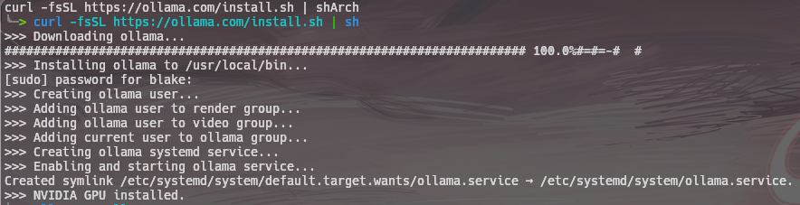
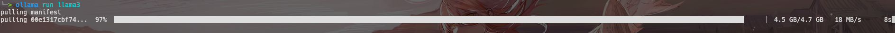
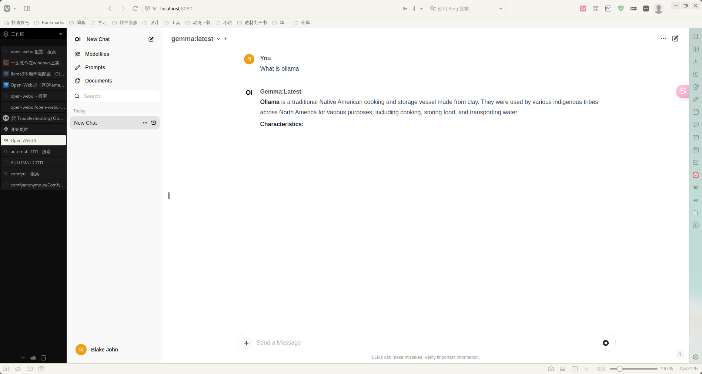
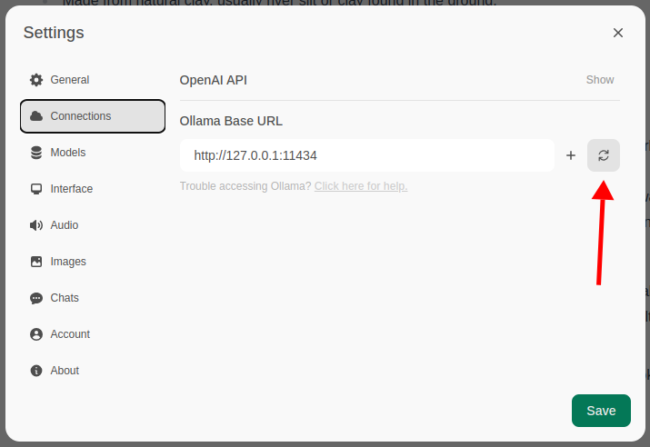

# 01 What is ollama ?

Get up and running with large language models locally.

# 02 Install Ollama on Linux

## 2.1 Normal

```
curl -fsSL https://ollama.com/install.sh | sh
```



## 2.2 Docker

The official [Ollama Docker image](https://hub.docker.com/r/ollama/ollama) `ollama/ollama` is available on Docker Hub.

# 03 Quick Start

## 3.1 Run Model

To run and chat with [Llama 3](https://ollama.com/library/llama3) :

```
ollama run llama3
```

> The available model is in [Ollama](https://ollama.com/library) , such as `llama3` `gemma:2b` `gemma:7b` ...

By running the code above, the ollama will automatically pull the model `llama3` and implement it :



## 3.2 Communicate with Model

You can type `/?` to get the help infomation, or you can directedly ask the model what you want to ask !

# 04 Open-WebUI

`open-webui` is a interactive ui page for the model implementation. We can communicate with our local model by a good UI : 



To deploy the open-webui, we need to use the **docker** .

## 4.1 Installation

First, we need to install docker, look [How to install Docker](../15%20Docker/02%20Docker%20安装.md) .

Then, we can use the commad below : 

```bash
docker run -d -p 3000:8080 --add-host=host.docker.internal:host-gateway -v open-webui:/app/backend/data --name open-webui --restart always ghcr.io/open-webui/open-webui:main
```

Once we run this code, we can open a browser and type `localhost:3000` to start the exploration of open-webui.

## 4.2 Configuration

We first need to check the `ollama service` , open a browser and type `localhost:11434` 
to check if `ollama serve` is running correctedly : 


Then, we can open the `open-webui` and find the `settings > Connections` : 



Presss the button to check if the connections is running without error.

If the open-webui couldn't connect to ollama. We need to **specifiy the host address when creating the container** .

### Trouble shooting : 

Run the code below to create the container instead : 

```bash
docker run -d --network=host -v open-webui:/app/backend/data -e OLLAMA_BASE_URL=http://127.0.0.1:11434 --name open-webui --restart always ghcr.io/open-webui/open-webui:main
```

> Note that the port changes from 3000 to 8080, resulting in the link: `http://localhost:8080` .

