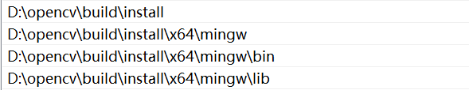

# 0.1 What are the components of Imgs ?

## 0.1.1 黑白图片

黑白图片由 **黑和白** 两种像素组成，各个像素只有两种可能的取值 `0` 或 `255` ，其深度为 `1` ，只有一个颜色通道

## 0.1.2 灰度图

灰度图只有 **一个颜色通道** ，其像素取值范围为 `0 ~ 255` 

## 0.1.3 彩色图片

彩色图片由最基础的 **红、绿、蓝** 三种颜色组成，所以具有 **三个颜色通道 RGB** ，彩色图片利用 **8位bit** 来表示颜色，一共有 $2^8$ 种颜色

# 0.2 How to install the opencv ?

## 0.2.1 Linux

### 1. Get the Package

- `Github` : [opencv/opencv: Open Source Computer Vision Library (github.com)](https://github.com/opencv/opencv)
- `OpenCV` : [OpenCV - Open Computer Vision Library](https://opencv.org/)

选择对应的发行版本 `Release` ，下载压缩包

### 2. Install the Tools and Reliances

#### Tools

```bash
	sudo apt install gcc g++ cmake make qt5-default libssl-dev cmake-qt-gui build-essential lib-eigen3-dev ccache
```

#### Reliance

```bash
	sudo apt install libgtk2.0-dev libavcodec-dev libavformat-dev libjpeg-dev libswscale-dev libtiff5-dev pkg-config
```

### 3. Build the Package from the Source

```bash
	cd opencv
	mkdir build
	cd build
	cmake -DBUILD_EXAMPLES=OFF -DBUILD_PERF_TESTS=OFF -DBUILD_TESTS=OFF -DBUILD_opencv_python3=OFF -DBUILD_opencv_python_bindings_generator=OFF -DBUILD_opencv_python_tests=OFF -DBUILD_JAVA=OFF -DBUILD_opencv_java_bindings_generator=OFF -DBUILD_opencv_js=OFF -DBUILD_opencv_js_bindings_generator=OFF -DBUILD_opencv_dnn=ON -DBUILD_opencv_ml=ON -DOPENCL_FOUND=OFF -DBUILD_opencv_gapi=OFF -DOPENCV_ENABLE_NONFREE=ON -DENABLE_FAST_MATH=ON -DWITH_GSTREAMER=ON -DCMAKE_BUILD_TYPE=Release ..
	make -j16
	sudo make install
```

`OpenCV` 模块会被安装在 `/usr/local/bin` 目录下，且都为 **动态库** 

> [!attention] 
> 在编译OpenCV之前 **不要安装 `anaconda` ，不要安装 `anaconda` ，不要安装 `anaconda` ！** 因为 `anaconda` 会将系统原本的一些 `python` 库 **屏蔽掉** ，导致编译出错

### 4. Check the Installation

```bash
	opencv_version

	# 4.7.0
```

## 0.2.2 Windows

### 1. Get the Package

Windows安装C++版OpenCV也需要从源码进行编译，但是用于编译的源码 **不是发行版本** ，因为发行版本中只含有 `OpenCV` 的核心模块，不含有其他依赖项，而在Windows中想要安装其他依赖项比较麻烦，因此我们使用 `git` **克隆整个仓库下来，再通过分支和哈希值来选择想要的版本** 

```powershell
	git clone https://github.com/opencv/opencv.git
```

### 2. Build the Package

```Powershell
	mkdir build
	cd build
	cmake -G"Unix Makefiles" -DBUILD_EXAMPLES=OFF -DBUILD_PERF_TESTS=OFF -DBUILD_TESTS=OFF -DBUILD_opencv_python3=OFF -DBUILD_opencv_python_bindings_generator=OFF -DBUILD_opencv_python_tests=OFF -DBUILD_JAVA=OFF -DBUILD_opencv_java_bindings_generator=OFF -DBUILD_opencv_js=OFF -DBUILD_opencv_js_bindings_generator=OFF -DBUILD_opencv_dnn=ON -DBUILD_opencv_ml=ON -DCMAKE_BUILD_TYPE=Release ..
	make -j16
	make install
```

### 3. Add the Path to the Environment


