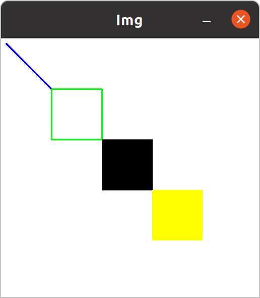

> Drawing some shapes and put the text on the img

In this chapter, we are going to learn : 
- **create an img with the pure color** 
- drawing **lines** 
- drawing **rectangles**
- drawing **points and circles** 
- putting the **text** 

# 4.1 Create an Image

## 4.1.1 Solution

We will use `cv::Mat` class to create a pure color image just like we read an img from the file.

```C++
int main ()
{
	cv::Mat img \(512, 512, CV_8UC3, cv::Scalar (255, 255, 255)\);
	// create a white img
	// (width, height, type, color)
	// cv::CV_8UC3 means the depth is 8 bit unsigned, the channels are 3
}
```

Result : 


## 4.1.2 `cv::Mat img ()` 

There is a lot of `overloaded constructor` in the `cv::Mat` class, we can use these constructors to create an img we want.

Some of the constructors : 
- **Declaration :** 
	- `Mat \(cv::Size size, int type, const cv::Scalar &s\)` 
	- `Mat \(int width, int height, int type, const cv::ScalAR &s\)` 
- **Parameters :**
	- `int type` : The type of the img, they are `CV_<bit><num_type>C<channel_num>` , such as : 
		- `CV_16F` : 16 bit float img
		- `CV_16FC3` : 16 bit float img with 3 channels
		- `CV_8UC3` : 8 bit unsigned img with 3 channels

# 4.2 Draw a line

## 4.2.1 Solution

```C++
int main ()
{
	cv::Mat img (512, 512, CV_8UC3, cv::Scalar (255, 255, 255));

	cv::line (img, cv::Point (10, 10), cv::Point (100, 100), cv::Scalar (255, 0, 0), 2);
	// draw a blue line with the thickness of 2 from point (10, 10) to point (50, 50)
}
```

Result : 


## 4.2.2 `cv::line ()` 

> Draws a line segment connecting two points. The function line draws the line segment between pt1 and pt2 points in the image. The line is clipped by the image boundaries. For non-antialiased lines with integer coordinates, the 8-connected or 4-connected Bresenham algorithm is used. Thick lines are drawn with rounding endings. Antialiased lines are drawn using Gaussian filtering.

**Function Declaration :**
- `void cv::line \(cv::InputOutputArray img, cv::Point pt1, cv::Point pt2, const cv::Scalar &color, int thickness = 1, int lineType = 8, int shift = 0\)` 

**Parameters :**
- `img` – Image.  
- `pt1` – **First poin**t of the line segment.  
- `pt2` – **Second point** of the line segment.  
- `color` – Line color.  
- `thickness` – Line thickness.  
- `lineType` – Type of the line.
- `shift` – Number of fractional bits in the point coordinates.

# 4.3 Draw a rectangle

## 4.3.1 Solution

```C++
int main ()
{
	cv::Mat img (512, 512, CV_8UC3, cv::Scalar (255, 255, 255));

	cv::line (img, cv::Point (10, 10), cv::Point (100, 100), cv::Scalar (255, 0, 0), 2);
	// draw a blue line with the thickness of 2 from point (10, 10) to point (50, 50)

	cv::rectangle (img, cv::Point (100, 100), cv::Point (200, 200), cv::Scalar (0, 255, 0), 2);
	// a rectangle with the boundary thickness of 2 and color of green, whose tl point is (100, 100) and br point is (200, 200)
	cv::rectangle (img, cv::Point (200, 200), cv::Point (300, 300), cv::Scalar (0, 0, 0), cv::FILLED);
	// a rectangle which is filled with black

	// or we can pass a rectangle to draw the rectagle
	cv::Rect roi (300, 300, 100, 100);
	cv::rectangle (img, roi, cv::Scalar (0, 255, 255), cv::FILLED);
	
}
```

Result : 



## 4.3.2 `cv::rectangle ()` 

> Draws a simple, thick, or filled **up-right rectangle**. The function cv::rectangle draws a rectangle outline or a filled rectangle whose two opposite corners are pt1 and pt2

**Function Declaration :** 
- `void rectangle \(cv::InputOutputArray img, cv::Rect rec, const cv::Scalar &color, int thickness = 1, int lineType = 8, int shift = 0\)` 
- `void rectangle \(cv::InputOutputArray img, cv::Point pt1, cv::Point pt2, const cv::Scalar &color, int thickness = 1, int lineType = 8, int shift = 0\)` 

**Parameters :**
- `img` – Image.  
- `pt1` – Vertex of the rectangle.  
- `pt2` – Vertex of the rectangle opposite to pt1 .  
- `rec` – The rectangle to be drawn
- `color` – Rectangle color or brightness (grayscale image).  
- `thickness` – **Thickness of lines** that make up the rectangle. Negative values, like `FILLED` , mean that the function has to draw a **filled rectangle**.  
- `lineType` – Type of the line.

# 4.4 Draw a circle

## 4.4.1 Solution

We will use `cv::circle ()` to draw the circle.

```C++
int main ()
{
	cv::Mat img (512, 512, CV_8UC3, cv::Scalar (255, 255, 255));

	cv::line (img, cv::Point (10, 10), cv::Point (100, 100), cv::Scalar (255, 0, 0), 2);
	// draw a blue line with the thickness of 2 from point (10, 10) to point (50, 50)

	cv::rectangle (img, cv::Point (100, 100), cv::Point (200, 200), cv::Scalar (0, 255, 0), 2);
	// a rectangle with the boundary thickness of 2 and color of green, whose tl point is (100, 100) and br point is (200, 200)
	cv::rectangle (img, cv::Point (200, 200), cv::Point (300, 300), cv::Scalar (0, 0, 0), cv::FILLED);
	// a rectangle which is filled with black

	// or we can pass a rectangle to draw the rectagle
	cv::Rect roi (300, 300, 100, 100);
	cv::rectangle (img, roi, cv::Scalar (0, 255, 255), cv::FILLED);

	cv::circle (img, cv::Point (256, 256), 50, cv::Scalar (0, 69, 255, cv::FILLED));
	// we need to set the center, radius, and other parameters
}
```

Result : 


## 4.4.2 `cv::circle ()` 

> Draws a circle. The function cv::circle draws a simple or filled circle with a given center and radius.

**Function Declaration :** 
- `void cv::circle \(cv::InputOutputArray img, cv::Point center, int radius, const cv::Scalar &color, int thickness = 1, int lineType = 8, int shift = 0\)` 

**Parameters :** 
- `img` – Image where the circle is drawn.  
- `center` – Center of the circle.  
- `radius` – Radius of the circle.  
- `color` – Circle color.  
- `thickness` – Thickness of the circle outline, if positive. Negative values, like `FILLED`, mean that a filled circle is to be drawn.  
- `lineType` – Type of the circle boundary. 
- `shift` – Number of fractional bits in the coordinates of the center and in the radius value.

# 4.5 Put some text

## 4.5.1 Solution

We can use `cv::putText ()` to put the `string` in the specific position

```C++
int main ()
{
	cv::Mat img (512, 512, CV_8UC3, cv::Scalar (255, 255, 255));

	cv::line (img, cv::Point (10, 10), cv::Point (100, 100), cv::Scalar (255, 0, 0), 2);
	// draw a blue line with the thickness of 2 from point (10, 10) to point (50, 50)

	cv::rectangle (img, cv::Point (100, 100), cv::Point (200, 200), cv::Scalar (0, 255, 0), 2);
	// a rectangle with the boundary thickness of 2 and color of green, whose tl point is (100, 100) and br point is (200, 200)
	cv::rectangle (img, cv::Point (200, 200), cv::Point (300, 300), cv::Scalar (0, 0, 0), cv::FILLED);
	// a rectangle which is filled with black

	// or we can pass a rectangle to draw the rectagle
	cv::Rect roi (300, 300, 100, 100);
	cv::rectangle (img, roi, cv::Scalar (0, 255, 255), cv::FILLED);

	cv::circle (img, cv::Point (256, 256), 50, cv::Scalar (0, 69, 255, cv::FILLED));
	// we need to set the center, radius, and other parameters

	cv::putText (img, "Hello OpenCV !", cv::Point (160, 50), cv::FONT_HERSHEY_DUPLEX, 1, cv::Scalar (69, 150, 255), 3);
	// we can choose the font and the size of the text
}
```

Result : 


## 4.5.2 `cv::putText ()` 

> Draws a text string. The function cv::putText renders the specified text string in the image. Symbols that cannot be rendered using the specified font are replaced by question marks.

**Function Declaration :** 
- `void cv::putText \(cv::InputOutputArray img, const cv::String &text, cv::Point org, int fontFace, double fontScale, cv::Scalar color, int thickness = 1, int lineType = 8, bool bottomLeftOrigin = false\)` 

**Parameters :** 
- `img` – Image.  
- `text` – Text string to be drawn.  
- `org` – **Bottom-left** corner of the text string in the image.  
- `fontFace` – Font type
	- `FONT_HERSHEY_SIMPLEX` = 0, normal size sans-serif font
	- `FONT_HERSHEY_PLAIN` = 1, small size sans-serif font
	- `FONT_HERSHEY_DUPLEX` = 2, normal size sans-serif font (more complex than FONT_HERSHEY_SIMPLEX)
	- `FONT_HERSHEY_COMPLEX` = 3, normal size serif font
	- `FONT_HERSHEY_TRIPLEX` = 4, normal size serif font (more complex than FONT_HERSHEY_COMPLEX)
	- `FONT_HERSHEY_COMPLEX_SMALL` = 5, smaller version of FONT_HERSHEY_COMPLEX
	- `FONT_HERSHEY_SCRIPT_SIMPLEX` = 6, hand-writing style font
	- `FONT_HERSHEY_SCRIPT_COMPLEX` = 7, more complex variant of FONT_HERSHEY_SCRIPT_SIMPLEX
	- `FONT_ITALIC` = 16, flag for italic font
- `fontScale` – Font scale factor that is multiplied by the font-specific base size.  
- `color` – Text color.  
- `thickness` – Thickness of the lines used to draw a text.  
- `lineType` – Line type.
- `bottomLeftOrigin` – When true, the image data origin is at the bottom-left corner. Otherwise, it is at the top-left corner.