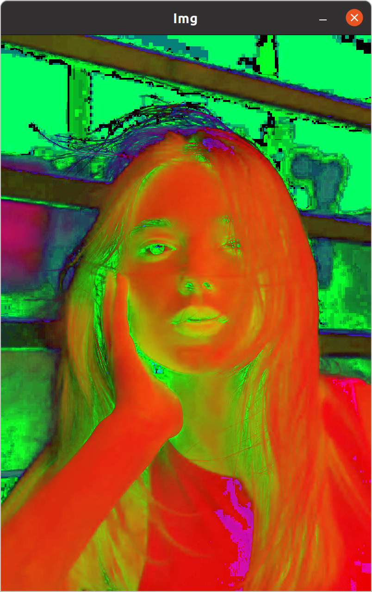
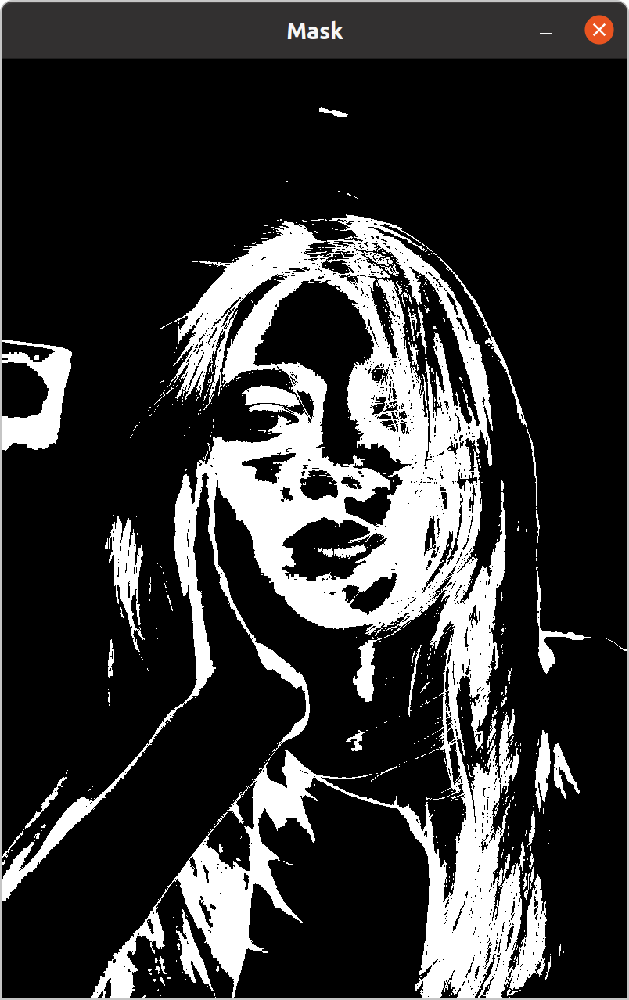

> Color Detect

In this chapter, we are going to learn  the specific **color space `HSV`** and how to **detect the color** .

# 5.1 Color Space
## 5.1.1 What is color space ?

A color space is that the **standard** that how the color is discribed.

Such as the `RGB` color space discribes the color by `R, G, B` three **basic color channels** :
- `R` : the channel of the red color
- `G` : the channel of the green color
- `B` : the channel of the blue color
All the color channel will contribute to the other color.

The `HSV` color space discribes the color by `H, S, V` three color value : 
- `H` : the **hue** of the img (色相), **from 0 to 179** 
- `S` : the **saturation** of the img (饱和度), **from 0 to 255** 
- `V` : the **value** of the img (明度), **from 0 to 255** 

For the computer, the img in `HSV` color space is easier to detect the color than in `RGB` color space.

More about color space, you can see : 
- 
- [三分钟带你快速学习RGB、HSV和HSL颜色空间](https://zhuanlan.zhihu.com/p/67930839) 
- [色彩空间中的 HSL、HSV、HSB 有什么区别？](https://www.zhihu.com/question/22077462)

## 5.1.2 How to convert the color space of the img ?

We can also use `cvtColor ()` to convert the color space : 

```C++
int main ()
{
	std::string path = "test.jpg"
	cv::Mat img, imgHSV;
	img = cv::imread (path);
	cv::cvtColor (img, imgHSV, cv::COLOR_BGR2HSV);

	cv::imshow ("Img", img);
	cv::imshow ("ImgHSV", imgHSV);
}
```

Result : 



# 5.2 Color Range

In the `HSV` color space, we can use the scalar of the **color range** to get the **mask** , **a Gray Scalar img**, of the color we want, in which **the color of the specific pixel in range will be set to `255` (white), and the color out of range (above or bellow) will be set to `0` (black)** .

Let's just assume that we want to get the color in the range of 
- `H` : 79 ~ 150
- `S` : 56 ~ 200
- `V` : 100 ~ 255

## 5.2.1 `inRange ()` 

We wil use the range above to create two `cv::Scalar` variable and `inRange ()` function to get the mask : 

```C++
int main ()
{
	std::string path = "test.jpg"
	cv::Mat img, imgHSV, Mask;
	img = cv::imread (path);
	cv::cvtColor (img, imgHSV, cv::COLOR_BGR2HSV);


	cv::Scalar lower (79, 56, 100), upper (150, 200, 255);
	cv::inRange (img, lower, upper, Mask);

	cv::imshow ("Img", img);
	cv::imshow ("ImgHSV", imgHSV);
	cv::imshow ("Mask", Mask);
}
```

Result : 



