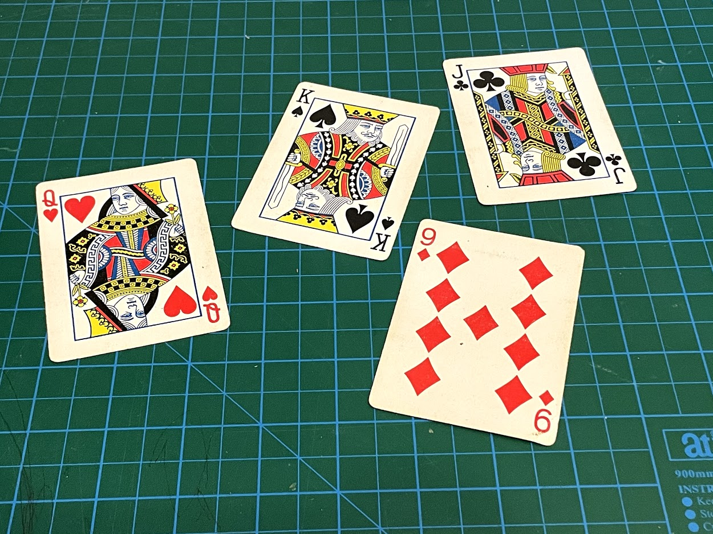

> Shape Detect and Warp Perspective

In this chapter, we are going to warp the img to get the normal perspective of the img.

We will find out all the card below and warp them : 

# 6.0 Pipline

Let's see the pipline first : 
1. find out all the cards in the img
2. get their approximate