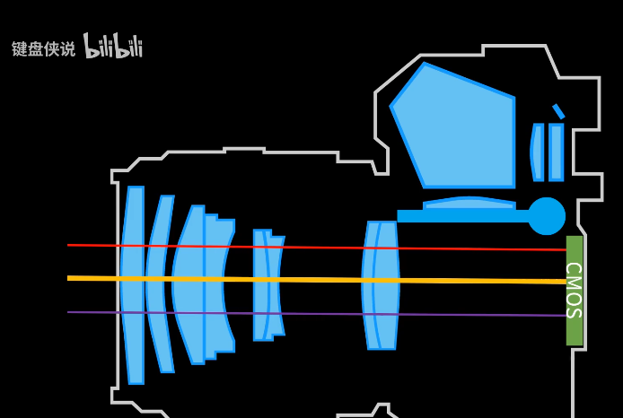

# 1.1 单反相机

## 1.1.1 结构

光线通过透镜，经由反光镜折射，进入取景框

当按下快门时，反光板偏转，露出 CMOS， CMOS将信息传递给 **模数转换器** ，将模拟信号转化为数字信号，最后存储在SD卡中

## 1.1.2 传感器参数
### 1. CMOS尺寸

### 2. 像素和分辨率

像素点是组成一张图片的基本单位，一张图片的分辨率为所有像素点的总数，即 **横向像素点 * 纵向像素点** 。而像素则是传感器的基本参数，决定了图片分辨率的最大值。

### 3. 滤色阵列

滤色阵列是用来记录图像色彩的感应组件，通常有 **RGGB** , **RYYB** , **RGBW** 

### 4. 色深

色深全名 **色位深度** ，指的是用 **比特数 bit 表示色彩数目的单位** ，每一 `bit` 可以表示 **两种颜色** ，所以 `n` 位深度的图片有 $2^n$ 中颜色

### 5. 感光度 ISO

感光度是指 CMOS 对光的感知强度 (敏感度)，一般情况下，ISO 越高，照片亮度越高，但是相应地，噪点也会越多，照片画质越差

### 6. 曝光时间

CMOS 在光线下暴露时长，或者说记录光线的时长，一般情况下，曝光时间越长，照片越亮，但是积累的光线信息也就越多，越容易产生干扰，特别是运动中的物体

## 1.1.3 镜头参数

### 1. 焦距

焦距控制着镜头的 **视角** 和 **视距** ，一般情况下：
1. 焦距越长，视角越小，视距越大
2. 焦距越短，视角越大，视距越短

### 2. 光圈大小

光圈是控制进光量的原件，光圈越大，进光量越大，可以拍摄到的细节越多。而光圈值和光圈大小相反，光圈值越大，光圈越小。

同时，光圈还控制着景深。一般情况下，光圈越大，背景的虚化效果越强，光圈越小，背景越清晰

# 1.2 工业相机

1. 小孔成像
2. 凸透镜成像

## 1.2.1 透镜成像

### 1. 规律：
$$
\frac{1}{u} + \frac{1}{v} = \frac{1}{f}
$$
**物距** 的倒数与 **像距** 的倒数之和等于 **焦距** 的倒数。

### 2. 推导：

$$\Delta ABO \sim \Delta A'B'O \ \Rightarrow \ \dfrac{u}{v} = \dfrac{AB}{A'B'}$$
$$\Delta CFO \sim \Delta A'FB' \ \Rightarrow \ \dfrac{f}{B'F} = \dfrac{CO}{A'B}$$
$$\because AB = CO , \  B'F = v - f$$
$$\therefore \dfrac{u}{v} = \dfrac{f}{v - f}$$
$$\therefore uv - uf = vf$$
$$\therefore \dfrac{uv}{uvf} - \dfrac{uf}{uvf} = \dfrac {vf}{uvf}\ \Rightarrow \ \frac{1}{u} + \frac{1}{v} = \frac{1}{f}$$

## 1.2.2 畸变

### 1. 径向畸变 ： 

- 桶形畸变
- 枕形畸变

### 2. 切向畸变：

镜头与成像芯片 **不平行** 

