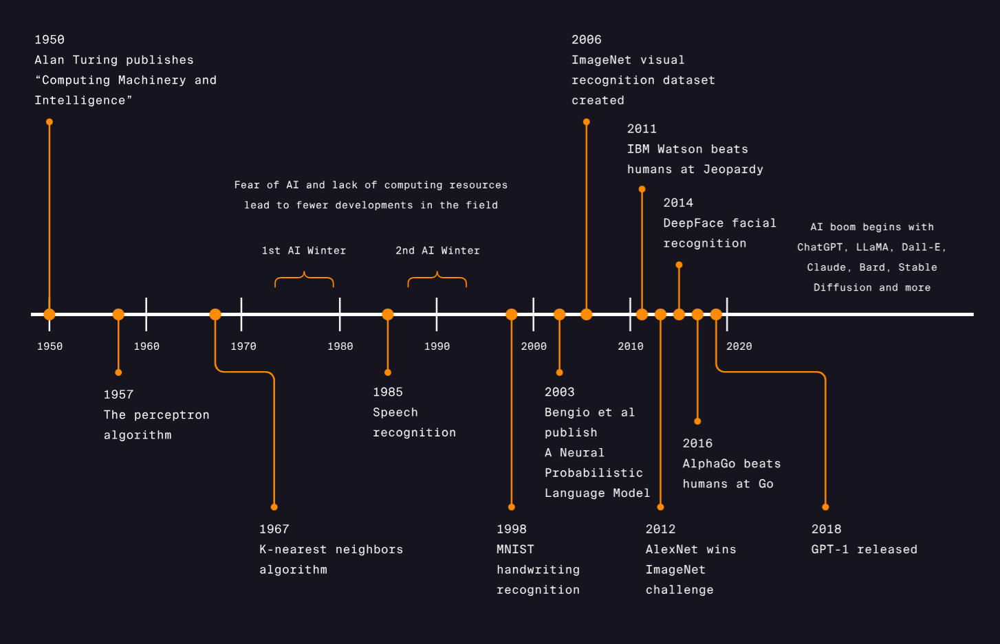

# 1 What is Machine Learning ?

While at IBM, [Arthur Samuel](https://en.wikipedia.org/wiki/Arthur_Samuel) developed a program that learned how to play checkers (1959). He called it :

> “The field of study that gives computers the ability to learn without being explicitly programmed.”

What does this mean?

As programmers, we often approach problems in a **methodical**, **logic-based** way. We try to determine what our desired outputs should be, and then create the proper rules that will transform our inputs into those outputs.

Machine learning **flips the scrip**t. We want the program itself to learn the rules that describe our data the best, by finding patterns in what we know and applying those patterns to what we don’t know.

These algorithms are able to **_learn_**. Their performance gets better and better with each iteration, as it uncovers more hidden trends in the data.

Here is the timeline of the machine learning : 

# 2 Categories

Machine learning can be branched out into the following categories:

- Supervised Learning
- Unsupervised Learning

## 2.1 Supervised Learning

[Supervised Learning](https://www.codecademy.com/article/machine-learning-supervised-vs-unsupervised) is where the **data is labeled** and the program learns to **predict the output from the input data**. For instance, a supervised learning algorithm for credit card fraud detection would take as input a set of recorded transactions. For each transaction, the program would predict if it is fraudulent or not.

Supervised learning problems can be further grouped into **regression** and **classification** problems.

### 2.1.1 Regression

In regression problems, we are trying to predict a **continuous-valued output**. Examples are:

- What is the housing price in Neo York ?
- What is the value of cryptocurrencies ?

### 2.1.2 Classification:

In classification problems, we are trying to predict a **discrete number of values**. Examples are:

- Is this a picture of a human or a picture of an AI ?
- Is this email spam ?

