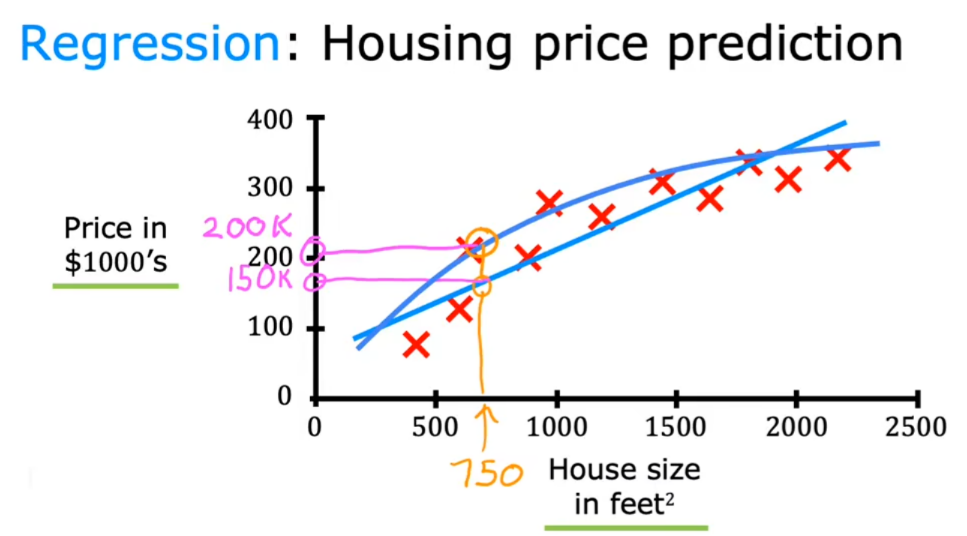
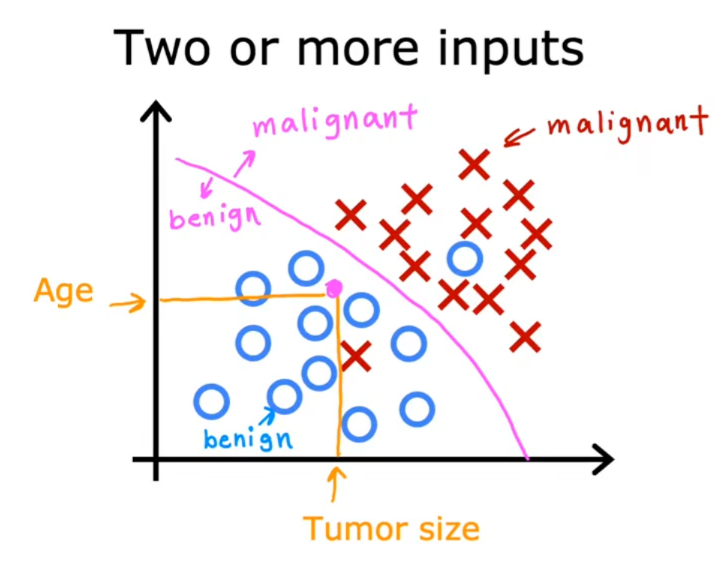
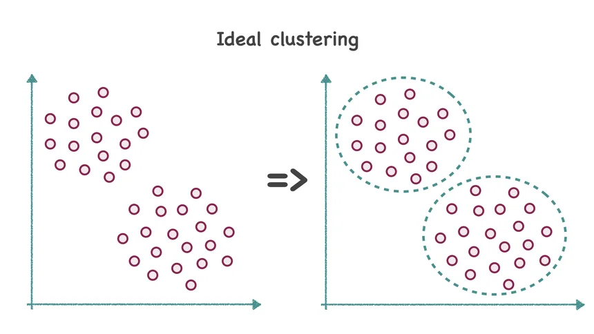
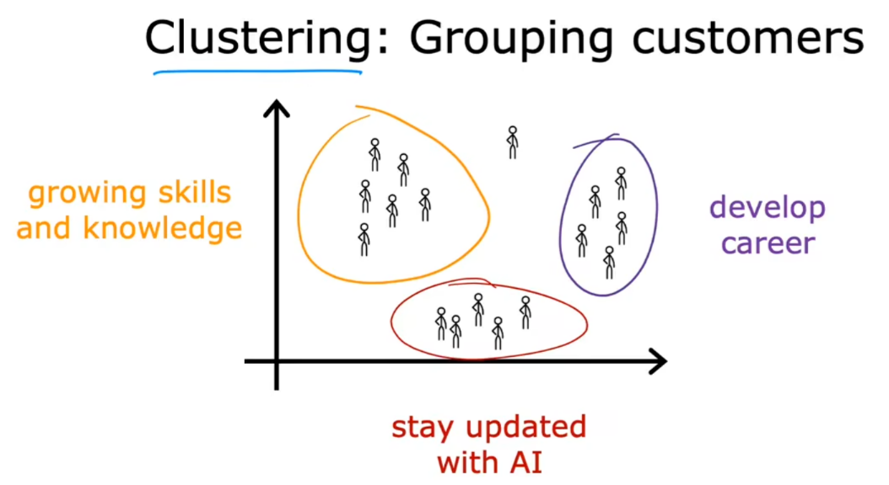

# 1 What is Machine Learning ?

While at IBM, [Arthur Samuel](https://en.wikipedia.org/wiki/Arthur_Samuel) developed a program that learned how to play checkers (1959). He called it :

> “The field of study that gives computers the ability to learn **without being explicitly programmed**.”

What does this mean?

As programmers, we often approach problems in a **methodical**, **logic-based** way. We try to determine what our desired outputs should be, and then create the proper rules that will transform our inputs into those outputs.

Machine learning **flips the scrip**t. We want the program itself to learn the rules that describe our data the best, by finding patterns in what we know and applying those patterns to what we don’t know.

These algorithms are able to **_learn_**. Their performance gets better and better with each iteration, as it uncovers more hidden trends in the data.

Here is the timeline of the machine learning : 

# 2 Categories

Machine learning can be branched out into the following categories:

- Supervised Learning (监督学习)
- Unsupervised Learning (非监督学习)

## 2.1 Supervised Learning

[Supervised Learning](https://www.codecademy.com/article/machine-learning-supervised-vs-unsupervised) is where the **data is labeled** and the program learns to **predict the output from the input data**. For instance, a supervised learning algorithm for credit card fraud detection would take as input a set of recorded transactions. For each transaction, the program would predict if it is fraudulent or not.

Supervised learning problems can be further grouped into **regression** and **classification** problems.

### 2.1.1 Regression

In regression problems, we are trying to predict a **continuous-valued output** (**predict a number from infinitely many possible numbers**). Examples are:

- What is the housing price in Neo York ?
- What is the value of cryptocurrencies ?

### 2.1.2 Classification:

In classification problems, we are trying to predict a **discrete number of values** (**predict categories**) from one or more input. Examples are:

- Is this a picture of a human or a picture of an AI ?
- Is this email spam ?

## 2.2 Unsupervised Learning

Uses machine learning (ML) algorithms to **analyze and cluster unlabeled data sets**. These algorithms **discover hidden patterns** , **structure** or **data groupings** without the need for human intervention. It is said that the input data **contains no information** about the property that we want to predict.

> Unsupervised learning's ability to **discover similarities and differences in information** make it the ideal solution for exploratory **data analysis**, **cross-selling strategies**, **customer segmentation** and **image recognition**.

### 2.2.1 Clustering

A typical example of an unsupervised ML algorithm is **clustering**. Its goal is to group examples from the data into so-called **clusters**, or groups, based on how similar they are.

One of the example is to grouping the customers : 

### 2.2.2 Anomaly Detection

Unsupervised techniques are also commonly used to solve so-called **anomaly detection(异常检测)** tasks, the goal of which is to automatically detect suspicious events that are significantly different from the rest of the data.

### 2.2.3 Dimensionality Reduction

Dimensionality reduction is the process of **reducing the number of features** (or dimensions) in a dataset while **retaining as much information as possible**. This can be done for a variety of reasons, such as to reduce the complexity of a model, to improve the performance of a learning algorithm, or to make it easier to visualize the data.

Dimensionality reduction is a data preparation technique performed on data prior to modeling. It might be performed after data cleaning and data scaling and before training a predictive model.