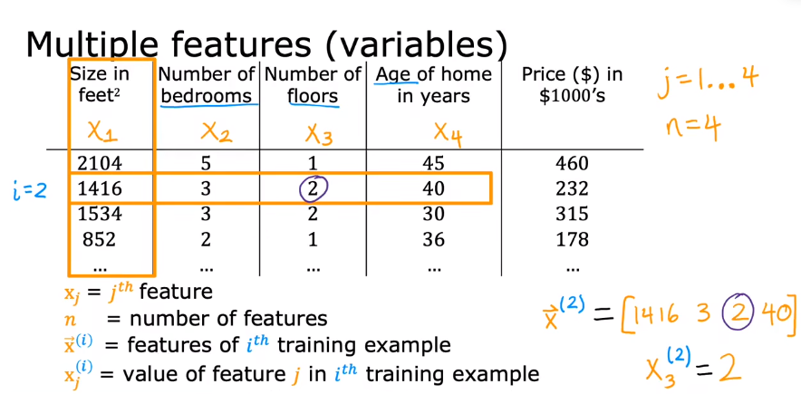

If the price of the house is not only dependent on the size of the house, but also depends on other three features, we will call it **Multiple Features** .



- $w_j$ - the $j - th$ features
- $n$ - the number of the features
- $\vec{x}^{(i)}$ - the features of $i - th$ **trainning example**, which is a **row vector** 
- $x_j^{(i)}$ - the value of the feature $j$ in $i - th$ trainning example

# 01 Model

Since we have not only one input, we need to rewrite the model as : 

$$f_{w, b} (x) = w_1x_1 + w_2x_2 + \cdots + w_nx_n + b$$

In other to simplify the function, we can write the $w_i$ and $x_i$ in a vector form : 

$$\vec{w} = \begin{bmatrix} w_1 && w_2 && w_3 && \cdots && w_n \end{bmatrix}$$
$$\vec{x} = \begin{bmatrix} x_1 \\ x_2 \\ x_3 \\ \vdots \\ x_n \end{bmatrix}$$

So the model becomes : 

$$f_{\vec{w}, b} (\vec{x}) = \vec{w} \cdot \vec{x} + b$$

The **dot product of** $\vec{w}$ and $\vec{x}$ is the expression $w_1x_1 + w_2x_2 + \cdots + w_nx_n + b$ . We will know tha $\vec{w}, b$ are the parameters of the medel. We will call the model as **Multiple Linear Regression** .

By the way, the cost function also becomes a vector form : 

$$J (\vec{w}, b) = \dfrac{1}{2m} \sum_{i = 1}^m {(f_{\vec{w}, b} (\vec{x}^{(i)}) - y^{(i)} )^2} = \dfrac{1}{2m} \sum_{i = 1}^m {(\vec{w} \cdot \vec{x}^{(i)} + b - y^{(i)} )^2}$$

# 02 Vectorization

## 2.1 Calculate the model

If the number of features is large, we need to multiply each $w$ and $x$ and then calculate the sum of them and add $b$ on it.

Without vectorization, $f_{w, b} (x) = w_1x_1 + w_2x_2 + \cdots + w_nx_n + b$ . the code should be : 

```Python
import numpy as np
w = np.array([1.0, 2.5, -3.3])
b = 4
x = np.array([10, 20, 30])

f = w[0] * x[0] + w[1] * x[1] + w[2] * x[2] + b
```

When features $n$ is large, maybe we can write $f_{w, b} (x) = \sum_{j = 1}^n {w_jx_j} + b$ , and the code may becomes : 

```Python
f = 0
for j in range (0, n) :
	f += w[j] * x[j]
f += b
```

The code is write faster than above, but it is still not the good option. But with vectorization, we can write $f_{w, b} = \vec{w} \cdot \vec{x} + b$ , and the code becomes : 

```Python
f = np.dot (w, x) + b
```

It is more convenient when writing the code, and actually, the code **runs faster than without vectorization** .

## 2.2 Gradient descent

In the gradient descent, we need to calculate the derivative of each parameters and then update the parameters. Let's first consider the simplified situation without $b$ . The parameters of $w$ is a vector $\vec{w} = (w_1,\ w_2,\ \cdots,\ w_n)$ , and the derivative is $\vec{d} = (d_1,\ d_2,\ \cdots,\ d_n)$ . We need to compute $w_j = w_j - \alpha d_j$ for $j = 1,\ \cdots,\ n$ .

If without vectorization we need to update $n$ times such as : 

$$\begin{array}{c}
w_1 = w_1 - \alpha d_1 \\
w_2 = w_2 - \alpha d_2 \\
\cdots \\
w_n = w_n - \alpha d_n
\end{array}$$

and the code may be : 

```Python
w = np.array ([0.5, 1.3, ..., 3.4])
d = np.array ([0.3, 0.2, ..., 0.4])
alpha = 0.1

for j in range (16) : 
	w[j] = w[j] - alpha * d[j]
```

But with vectorization, we only need to calculate $\vec{w} = \vec{w} - \alpha \vec{d}$ , in code : 

```Python
w = w - alpha * d
```

And the derivative part with vectorization is : 

$$\dfrac{\partial}{\partial w_j} J(\vec{w}, b) 
= \dfrac{\partial}{\partial w_j} \dfrac{1}{2m} \sum_{i = 1}^m {(\vec{w} \cdot \vec{x}^{(i)} + b - y^{(i)})}^2 
= \dfrac{1}{m} \sum_{i = 1}^m (\vec{w} \cdot \vec{x}^{(i)} + b - y^{(i)})x_j^{(i)} $$
