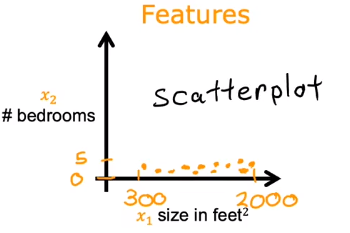
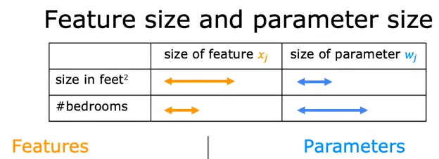
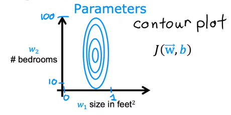
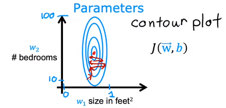
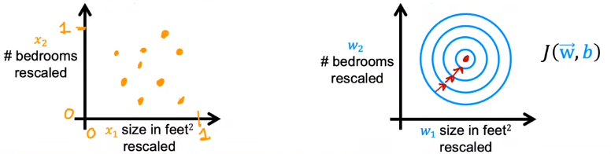
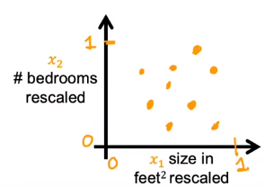
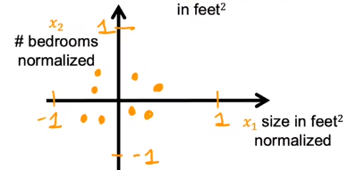

**Feature Scalling** is an important method which **enables gradient descent to run much faster** .

Let' s look at the example of predicting price of a house with two input : size and the number of bedrooms. So we have the predict model $f_{\vec{w}, b} (\vec{x}) = w_1x_1 + w_2x_2 + b$ , and the size is range from 300 to 2000 and the bedrooms is range from 0 to 5.

Assume that $w_1 = 50, w_2 = 0.1, b = 50$ . If we have a sample with $x_1 = 2000, x_2 = 5$ and the real price is $y = 500k$ . So the prediction will be $\hat{y} = 50 \times 2000 + 0.1 \times 5 + 50 = 100050.5 k$ . It is much father away from the real price.

But if $w_1 = 0.1, w_2 = 50, b = 50$ , the predicion will be $\hat{y} = 0.1 \times 2000 + 50 \times 5 + 50 = 500k$ . It is just fit the real price.

# 01 Feature Size

From the example above, we know that different features have different size and maybe their sizes have a very huge difference. So that the parameters will have different values as the graph shows : 

The value of feature bedrooms and size are very different, so we know that **the small change of factor before size $w_1$ will lead to a huge change of model and cost function** , but **the huge change of factor before bedrooms $w_2$ have only little effect on model and cost functoin** . Because of the difference, the factor of two features will range in different size -> $w_1$ has a smaller range and $w_2$ has a larger range : 

Further more, the cost function will also be affected by $w_1$ and $w_2$ : 

Since the graph is so tall and thin, the cost function maybe **bouncing back and forth for a long time before it reach the local mimimum** : 

The way to avoid the boucing is to **scale the features and let them averagely plot on graph** : 

# 02 Scale Features

If $x_1 \in [300, 200]$ and $x_2 \in [0, 5]$ , we can divide the range by the maximum value, that is $x_1 \in [\dfrac{300}{2000}, \dfrac{2000}{2000}], x_2 \in [\dfrac{0}{5}, \dfrac{5}{5}]$ . This is the most simple way to scale the features : 

## 2.1 Mean Normalization

The mean normalizaion will scale the features **polt around the origin** , and the value will range between -1 and 1, like : 

To calculate the mean normalization, we first need to calculate the **average** $\mu$ . We will calculate it by **mining average and dividing by the substract of maximum and minimum** : 

$$x_j' = \dfrac{x_j - \mu_j}{\max{x_j} - \min{x_1}}$$

For $x_1$, $\mu_1$ maybe $600$ , maximum is 2000 and minimum is 300, so we can get $x_1' = \dfrac{x_1 - 600}{2000 - 300}$ . After this step, the $x_1'$ may becomes $-0.18 \le x_1 \le 0.82$ .

## 2.2 Z-score Normalization

This is the way how to get the **normal distribution or the bell-shaped curve** , or we can call it **Gaussian Distribution** . To make z-score normalization, we need the **average** $\mu$ and the **standard deviation** $\sigma$ of the feature. Then, we have : 

$$x_j' = \dfrac{x_j - \mu_j}{\sigma_j}$$

# When to scale ?

If the feature compared to other features is **too large or too small** , we need to rescale the features.