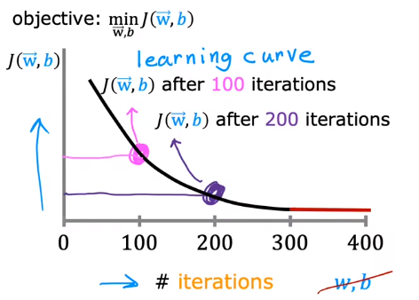
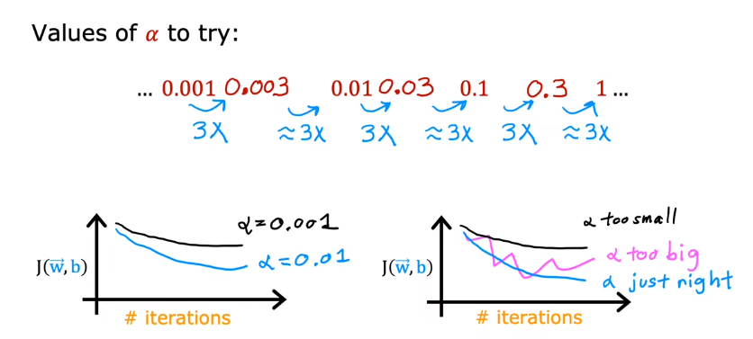

Following is the **Learning Curve** , which represent the effect of gradient descent. If gradient descent is working correctly, $J(\vec{w}, b)$ should **decrease after every iteration** .

# 01 Adjust Learning Rate

The learning rate should be a small number, otherwise it will cause the [diverge](02.Linear%20Regression#3.4%20Learning%20Rate).

# 02 Feature Engineering

We need to consider whether the features are related. The **Feature Engineering** is that using intuition to design **new features by transforming or combining original features** .

