Here are some questions belongs to classification : 

| Question | Answer "y" |
| -------- | ---------- |
|Is the email spam ? | no / yes|
|Is the transaction fraudulent | no / yes |
|Is the tumor malignant ? | no / yes |

In which, $y$ can only be **one of two values** . This is called **binary classification** . The result should be `false/true` or `0/1` .

Let's see a example of recognize the tumor to be malignant or not : 

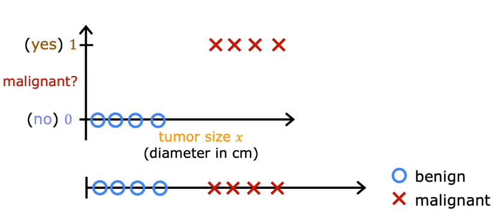

Maybe we will use the linear regression to get a line like this : 

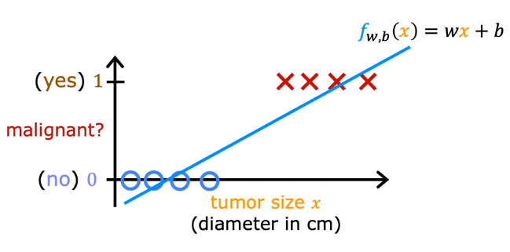

But we need only `0` or `1` rather than the whole number set between 0 and 1. One thing you can try is you can **choose a threshold like 0.5** , and then you can predict the output below 0.5 is not malignant and above is malignant : 

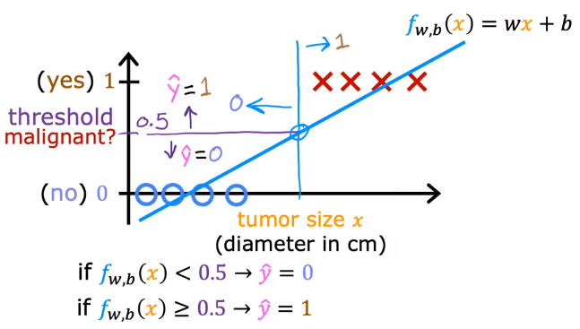

It looks the line works well, but if we put a much bigger tumor on the graph, the **line will shift to fit all the data well** . Also, the decision boundary will shift to the right and the classification may going wrong in some case.

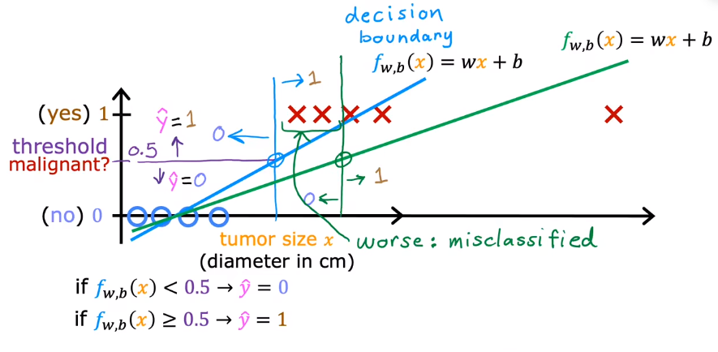

# 01 Logistic Regression

In logistic regression, the model may fit a curve, S-shaped curve, to the tumor dataset : 

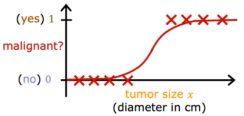

To fit the curve, we need a very important function -> **Sigmoid Function** or we can call it **Logistic Function** : 

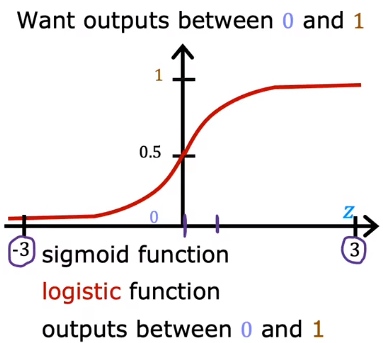

The math expression of sigmoid expression is :

$$g (z) = \dfrac{1}{1 + e^{-z}} \ \ \ \ 0 < g (z) < 1$$

# 02 Model

To define a logistic regression, we first need to get a line and then pass the line to the sigmoid function : 

$$\begin{array}{c}
z = \vec{w} \cdot \vec{x} + b \\
\downarrow \\
z\\
\downarrow \\
g (z) = \dfrac {1}{1 + e^{-z}} \\
\Downarrow \\
f_{\vec{w}, b} (x) = g (\vec{w} \cdot \vec{x} + b) = \dfrac{1}{1 + e^{-(\vec{w} \cdot \vec{x} + b)}} 
\end{array}
$$

# 03 Decision Boundary

## 3.1 Linear Decision Boundary

Let's see an example of two features : 

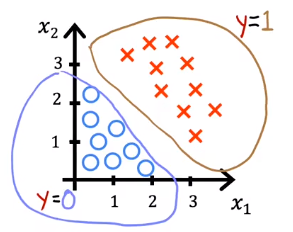

The model becomes $f_{\vec{w}, b} (\vec{x}) = g (z) = g (w_1x_1 +  w_2x_2 + b)$ , when $y = 1$ , $z > 0$ , when$y = 0$ , $z < 0$ . In which, the expression $z = \vec{w} \cdot \vec{x} + b = 0$ is called the **decision boundary** . 

For this example, assume that $w_1 = 1, w_2 = 1, b = -3$ , so the boundary is $x_1 + x_2 - 3 = 0$ . This is a line whose expression is $x_2 = -x_1 + 3$ : 

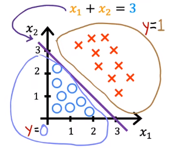

## 3.2 Non-linear Decision Boundary

Let's see another example, what if the decision boundary is not a line ?

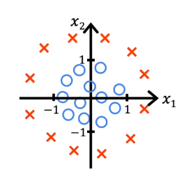

We can use the **polynomials regression** in logistic regression. From the graph, we can konw the polynomials expression should be : 

$$z = w_1x_1^2 + w_2x_2^2 + b$$

Assume that $w_1 = 1, w_2 = 2, b = -1$ , so the decision boundary becomes $z = x_1^2 + x_2^2 - 1 = 0$ , which is a circle in the graph : 

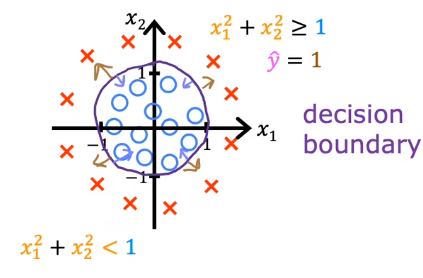

When $x_1^2 + x_2^2 \ge 1$ , $\hat{y} = 1$ , when $x_1^2 + x_2^2 < 1$ , $\hat{y} = 0$ .

# 04 Cost Function

## 4.1 Definition

We may record the mean squared error cost function. But in logitstic regression, we can't use that cost functin because the cost function is not convex, it is said that their are many local minimum so that we can't easily get to the best.

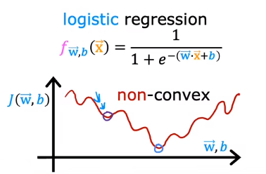

We can change the define of the cost function to make it convex again. To do this, we first define the **loss** of paticular sample as $L (f_{\vec{w}, b} (\vec{x}^{(i)}), y^{(i)})$ , then, the definition of loss is :

$$L (f_{\vec{w}, b} (\vec{x}^{(i)}), y^{(i)}) = 
\left\{\begin{array}{}
-\log (f_{\vec{w}, b} (\vec{x}^{(i)})) && y^{(i)} = 1 \\
-\log (1 - f_{\vec{w}, b} (\vec{x}^{(i)})) && y^{(i)} = 0 \\
\end{array}\right .
$$

For this function, 

1. If the true label of the sample is 1, and the prediction approches 1, then the loss will approch 0. If the prediction approches 0, then the loss will approch infinity
2. If the true label of the sample is 0, and the prediction approches 0, then the loss will approch 0. If the prediction approches 1, then the loss will approch infinity

as the chart shows : 

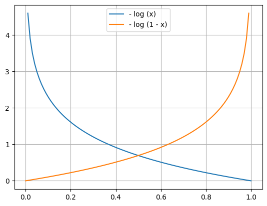

After the definition of the loss, we can say that the cost function is : 

$$J(\vec{w}, b) = \dfrac{1}{m} \sum_{i = 1}^m L (f_{\vec{w}, b} (\vec{x}^{(i)}), y^{(i)})$$

## 4.2 Simplify

Since the output $y$ has only two values 0 or 1, so that we can rewrite the loss function and simplify it : 

$$L \left(f_{\vec{w}, b} (\vec{x}^{(i)}), y^{(i)}\right)
= -y^{(i)} \log \left(f_{\vec{w}, b} (\vec{x}^{(i)})\right) - (1 - y^{(i)}) \log \left(1 - f_{\vec{w}, b} (\vec{x}^{(i)})\right)$$

- When $y^{(i)} = 1$ , so that $(1 - y^{(i)}) = 0$ , $L\left(f_{\vec{w}, b} (\vec{x}^{(i)}), y^{(i)}\right) = - \log \left(f_{\vec{w}, b} (\vec{x}^{(i)}) \right)$ 
- When $y^{(i)} = 0$ , so that $L = - log \left (f_{\vec{w}, b} (\vec{x}^{(i)}), y^{(i)} \right) = - \log \left(1 - f_{\vec{w}, b} (\vec{x}^{(i)}) \right)$ 

With the simplified loss function, we have : 

$$\begin{eqnarray}
J (\vec{w}, b) &=& \dfrac{1}{m} \sum_{i = 1}^m L (f_{\vec{w}, b} (\vec{x}^{(i)}), y^{(i)}) \\
&=& -\dfrac{1}{m} \sum_{i = 1}^m \left[y^{(i)} \log \left(f_{\vec{w}, b} (\vec{x}^{(i)}) \right) + (1 - y^{(i)}) \log\left(1 - f_{\vec{w}, b} (\vec{x}^{(i)}) \right) \right]
\end{eqnarray}$$

By the way, this cost function is **derived from the statistics using a statistical principle called *Maximum Likelihood Estimation*** . And the function is convex. The cost function is known as **Binary Cross Entropy Function** .

# 05 Gradient Descent Implementation

Since we have the cost function, so that we can implement the gradient descent : 

$$\begin{array}{c}
w_j = w_j - \dfrac{\partial}{\partial w_j} J(\vec{w}, b) \\
b = b - \dfrac{\partial}{\partial b} J(\vec{w}, b)
\end{array}$$

Notice that, the derivative of the cost function is : 

$$\begin{array}{c}
\dfrac{\partial}{\partial w_j} J(\vec{w}, b)
= \dfrac{1}{m} \sum_{i = 1}^m \left(f_{\vec{w}, b} (\vec{x}^{(i)}) - y^{(i)} \right)x_j^{(i)} \\
\dfrac{\partial}{\partial b} J(\vec{w}, b)
= \dfrac{1}{m} \sum_{i = 1}^m \left(f_{\vec{w}, b} (\vec{x}^{(i)}) - y^{(i)} \right)
\end{array}
$$

It is the same form as the linear regression, but, **the Definition of $f_{\vec{w}, b} (\vec{x}^{(i)})$ is Different !** 