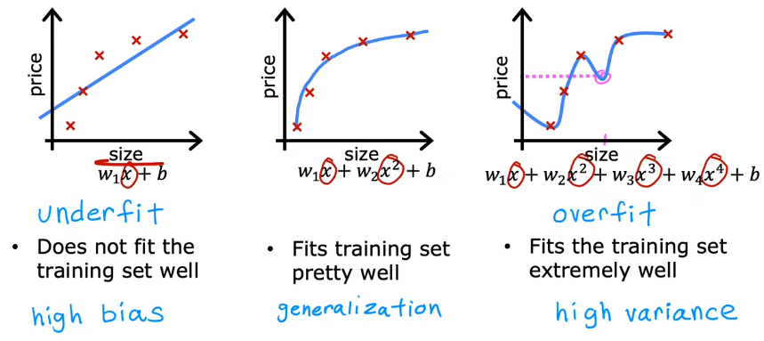
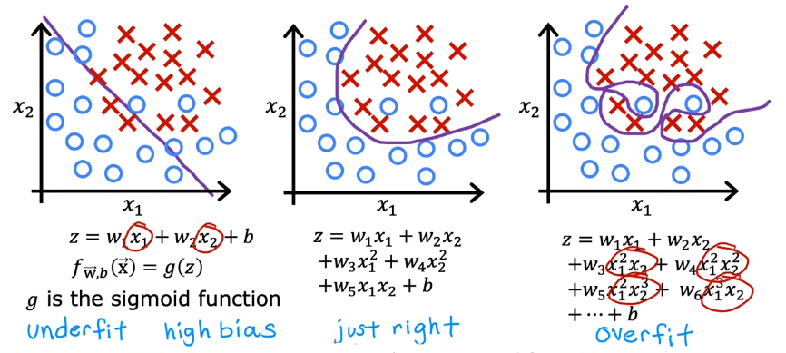
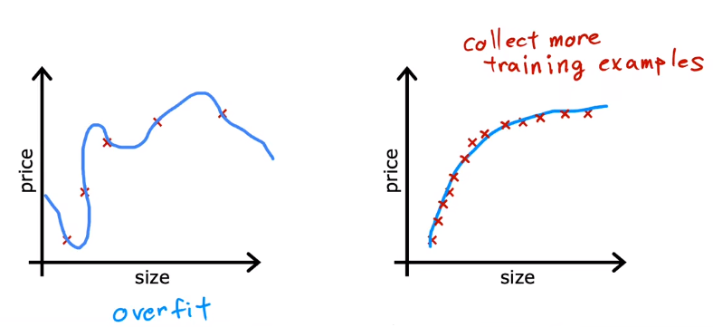
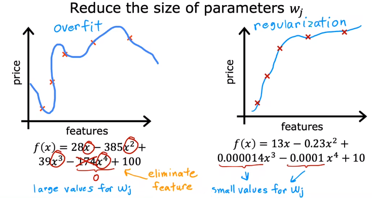

# 01 Definition

Let's see three examples in regression : 

- Graph 1 shows a model that **under fit the data** , which has **high bias** 
- Graph 2 shows a model that fit the data well and meet the require of **generalization** 
- Graph 3 shows a model that **over fit the date** , which hs **high variance** 

Let's see three examples in classification : 

# 02 Addressing Overfitting

## 2.1 Collect more training examples

Collecting more data will be a good example to avoid overfitting.

## 2.2 Select features

Select features to include/exclude

If you include a lot of features but only have insufficient data, it will lead to overfit.

## 2.3 Regularization

The core of regularization is to **reduce the size of parameters** $w_j$ . What regularization does is to encourage the learning algorithm to **shrink the values of the parameters** : 

