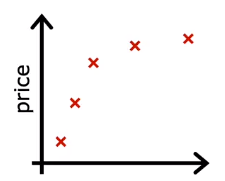
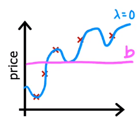

To regularize the parameter, we should select a way to **shrink the parameters down**. In the lesson before, we have learned that the parameter $w_j$ is modified by the gradient descent function : 

$$w_j = w_j - \alpha \dfrac{\partial}{\partial w_j} J(\vec{w}, b)$$

So we can know that, if we want to shrink the value down, we need to **change the cost function** . As we want to find the parameter $w_j$ to **minimize the cost function** , thus, we can change the cost function(in linear regression) to :

$$J (\vec{w}, b) = \dfrac{1}{2m} \sum_{i = 1}^m (f_{\vec{w}, b} (\vec{x}^{(i)}) - y^{(i)})^2 + \dfrac{\lambda}{2m} \sum_{j = 1}^n w_j^2$$

In which, the part $\dfrac{\lambda}{2m} \sum_{j = 1}^n w_j^2$ is called **regularizatoin term** . So that if we want to minimize the cost function, the part $\dfrac{\lambda}{2m}w_j^2$ should be small. We can properly **choose the value of $\lambda$ to a big number, then the value of $w_j$ should be small so as to lower the result of cost function** .

> By the way, the regularization on parameter $b$ is not necessary.

Let's see an example of the regularization. Assume that there are the data plot in graph, and we want to fit the data by a polynomial function $f_{\vec{w}, b} (\vec{x}) = w_1x + w_2x^2 + w_3x^3 + w_4x^4 + b$ , then it will overfit.

If $\lambda = 0$ , it means no regularization applied on the parameters and the model will still overfit. If $\lambda \gg 1$ , it means the regularization term in cost function take a heavy part, then the parameters $w_j$ will be a very small value, and $f_{\vec{w}, b} (\vec{x}) \approx b$ , then the model turns out to be underfitting.

# 01 Regularize Linear Regression

As is talk about, the cost function applied regularization of linear regression is : 

$$J (\vec{w}, b) = \dfrac{1}{2m} \sum_{i = 1}^m (f_{\vec{w}, b} (\vec{x}^{(i)}) - y^{(i)})^2 + \dfrac{\lambda}{2m} \sum_{j = 1}^n w_j^2$$

So in gradient descent, the derivative of cost function are : 

$$\begin{array}{l}
\dfrac{\partial}{\partial w_j} J (\vec{w}, b) = \dfrac{1}{m} \sum_{i = 1}^m (f_{\vec{w}, b} (\vec{x}^{(i)}) - y^{(i)})x_j + \dfrac{\lambda}{m}w_j
\\
\dfrac{\partial}{\partial b} J (\vec{w}, b) = \dfrac{1}{m} \sum_{i = 1}^m (f_{\vec{w}, b} (\vec{x}^{(i)}) - y^{(i)})
\end{array}$$

The gradient descent are : 

$$\begin{array}{l}
w_j &=& w_j - \alpha \left(\dfrac{1}{m} \sum_{i = 1}^m (f_{\vec{w}, b} (\vec{x}^{(i)}) - y^{(i)})x_j + \dfrac{\lambda}{m}w_j\right) \\
&=& w_j - \alpha \dfrac{\lambda}{m}w_j - \alpha \dfrac{1}{m} \sum_{i = 1}^m (f_{\vec{w}, b} (\vec{x}^{(i)}) - y^{(i)})x_j \\
&=& w_j(1 - \alpha \dfrac{\lambda}{m}) - \alpha \dfrac{1}{m} \sum_{i = 1}^m (f_{\vec{w}, b} (\vec{x}^{(i)}) - y^{(i)})x_j
\end{array}
$$

From the expression, we can know waht regularization is doing on every single iteration is **multiply $w_j$ by a number slightly less than 1 so that has the effect of shrinking the value** .

# 02 Regularize Logistic Regression

The cost function after regularization is : 

$$J (\vec{w}, b) = - \dfrac{1}{m} \sum_{i = 1}^m \left( y^{(i)} \log(f_{\vec{w}, b} (\vec{x}^{(i)})) + (1 - y^{(i)}) \log( 1 - f_{\vec{w}, b} (\vec{x}^{(i)})) \right) + \dfrac{\lambda}{2m} \sum_{j = 1}^n w_j^2$$

