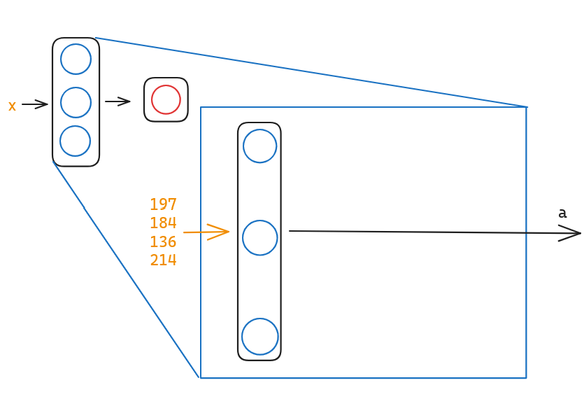
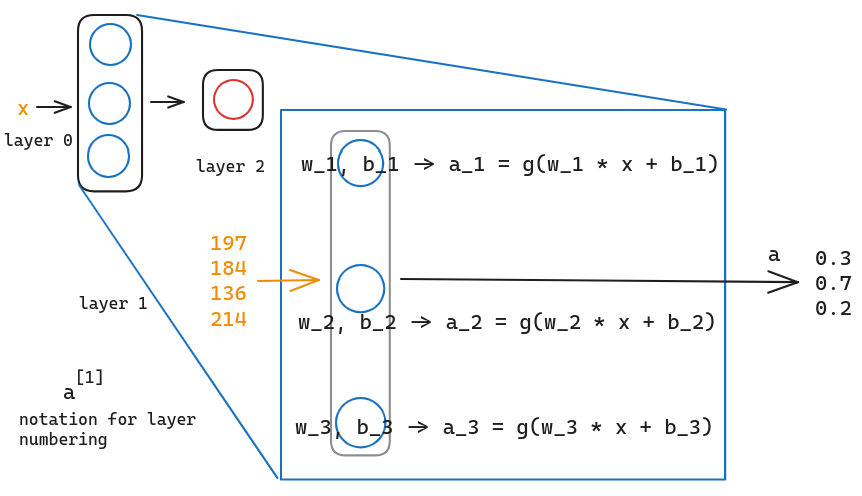
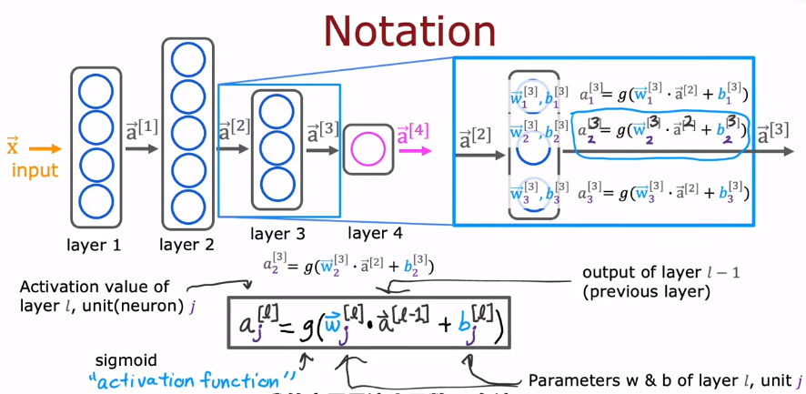

The fundamental block of most modern neural networks is a layer of neurons. In this session, we are going to learn how to construct a layer of neurons and build up a large neural network.

# 01 Simple Neural Network

Let's see the example of the demand prediction : 

Assume that there are 4 features and all of them are inputs to each three neurons. And each of these three neurons is just **implementing a little logistic regression unit** .

Take the first as example, if we input the features in, it will output some **activation value** $a_1$ , which is $a = g(\vec{w}_1 \cdot \vec{x} + b_2)$ and $g(z) = \dfrac{1}{1 + e^{-z}}$  , maybe is 0.3. The second neuron and the third neuron are the same as the first neuron. So there may be a vector of output containing 0.3, 0.7, 0.2 three activation values.

And we will use the notation of superscript n in square bracket 1 to represent **the output of the $n-th$ layer** as $\vec{a}^{[1]}$ : 

$$\vec{a}^{[1]} = 
\begin{bmatrix}
0.3 \\ 0.7 \\ 0.2
\end{bmatrix}
$$

So, the parameters of neuron 2 of layer 1 are represented as $\vec{w}^{[1]}_{2}, b^{[1]}_{2}, a^{[1]}_{2}$ .

Then, if we zoom into the calculation of layer 2, the output of layer 1 $\vec{a}^{[1]}$ is the input of layer 2, and then layer 2 will also calculate the logistic regression :

$$a^{[2]} = g (\vec{w}^{[2]}_{2} \cdot \vec{a}^{[1]} + b^{[2]}_1)$$

# 02 More Complex

The output of the previous layer is the input of the next layer. So that the calculation of the activation values can be represented as : 

$$a^{[l]}_j = g (\vec{w}^{[l]}_j \cdot \vec{a}^{[l - 1]} + b^{[l]}_j)$$

in which, $l$ is **the number of the layer**, $j$ is **the number of the neuron** in $l-th$ layer. And $g(z)$ is called **activation function** . In order to set the notation consistent, we can represent the input feature as $a^{[0]}$ , so that the equation can be used in layer 1.