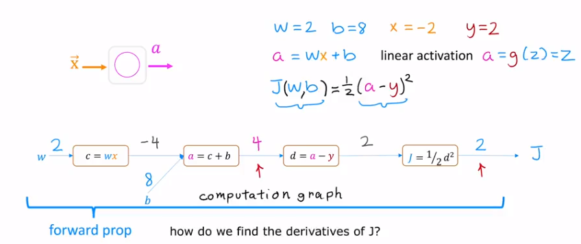
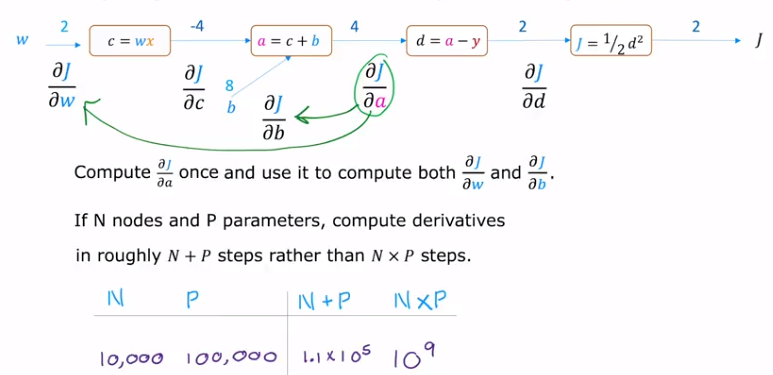

# 01 Forward Propagation

When $J (w, b) = \dfrac{1}{2}(a - y)^2$ , the computer will compute the value of $J (w, b)$ by the following step : 

We first compute $c = wx = -4$ , then compute $a = c + b = 4$ , then compute $d = a - y = 2$ and finally compute $J = \dfrac{1}{2}d^2 = 2$ . This is the simplest computation graph implementing the forward propagation.

After the forward propagation, how do we find the derivative of $J$ ?

# 02 Compute the Derivatives

The derivative is the rate that the output value changes at a specific point.

Assuming that $c = w^2$ , at $w = 3$ , when $w$ increases by a very little value such as $\varepsilon_0 = 0.001$ , $w = w + \varepsilon = 3.001$ , then $c = w^2 = 3.001^2 = 9.006001$ , that is, if $w$ increases by $\varepsilon_0 = 0.001$ , $c$ increases by $\varepsilon = 0.006001$ . It is about $6$ times the $\varepsilon_0$ . So the derivative of $c$ at $w = 3$ is $6$ .

To find the derivative of $J$ , we need to compute from right to left, this is why the step is called **backward propagation** .

We first consider if $d$ increases by $\varepsilon_0 = 0.001$ , $J = \dfrac{1}{2}(d + \varepsilon)^2 = \dfrac{1}{2} \times 2.001^2 = 2.0020005$ . So that $J$ increases by $\varepsilon = 0.0020005$ , about $2$ times of $\varepsilon_0 = 0.001$ , so the derivative $\dfrac{\partial J}{\partial d}$ is $2$ .

Then, we consider the derivative of $d$ . If $a$ increases by $\varepsilon_0 = 0.001$ , then $d = a + \varepsilon_0 - y = 2.001$ , increasing by $\varepsilon = 0.001$ . So the derivative $\dfrac{\partial d}{\partial a}$ is $1$ .

So far, we have calculated two derivatives $\dfrac{\partial J}{\partial d}$ and $\dfrac{\partial d}{\partial a}$ . We can use the **chain rule** to calculate the derivative of $J$ respected to $a$ , that is : 

$$\dfrac{\partial J}{\partial a} = \dfrac{\partial J}{\partial d} \cdot \dfrac{\partial d}{\partial a} = 2 \times 1 = 2$$

Similarly, we can do the steps above to find out $\dfrac{\partial J}{\partial w}$ and $\dfrac{\partial J}{\partial b}$ : 

From the graph above, we can easily know that the derivative $\dfrac{\partial J}{\partial w} = -4$ and $\dfrac{\partial J}{\partial b} = 2$ . Let's check if it is right : 

$$J_0 = \dfrac{1}{2}\left( (wx + b) -y \right)^2 = \dfrac{1}{2}\left( (2 \times (-2) + 8) - 2 \right)^2 = 2$$

When $w$ increases by $\varepsilon_0 = 0.001$ , we have : 

$$J = \dfrac{1}{2}((2.001 \times (-2) + 8) - 2)^2 = 1.996002$$

So the $J$ increases by $\varepsilon = J - J_0 = 1.996002 - 2 = -0.003998$ , which is about $-4$ times of $\varepsilon_0$ . This is the same as the result what we have calculated before.

# 03 Why Backward Propagation ?

Backward Propagation is **an efficient way** to compute the derivatives. 

From the computation above, we calculate $\dfrac{\partial J}{\partial a}$ once and use it to calculate both $\dfrac{\partial J}{\partial b}$ and $\dfrac{\partial J}{\partial w}$ . It is said that the result computed can be use to calculate the next parameters.

So if there is a neural network with $N$ nodes and $P$ parameters, we can compute the derivatives in roughly $N + P$ steps rather than $N \times P$ steps by the backward propagation. This is why we say backward propagation is an efficient way : 

