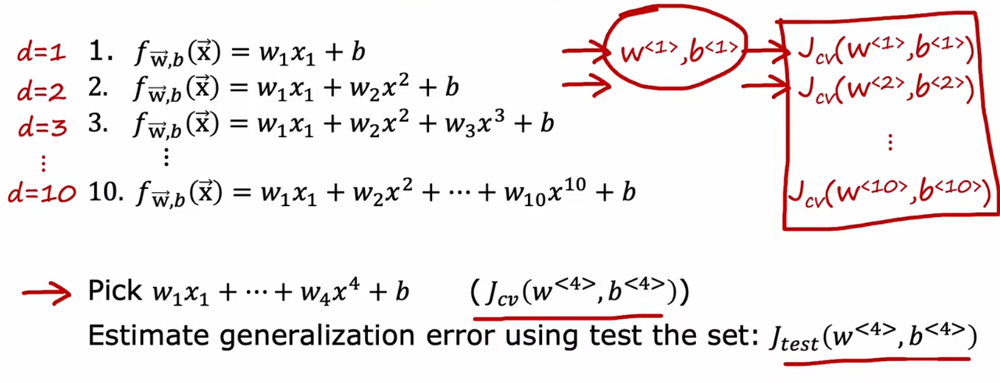
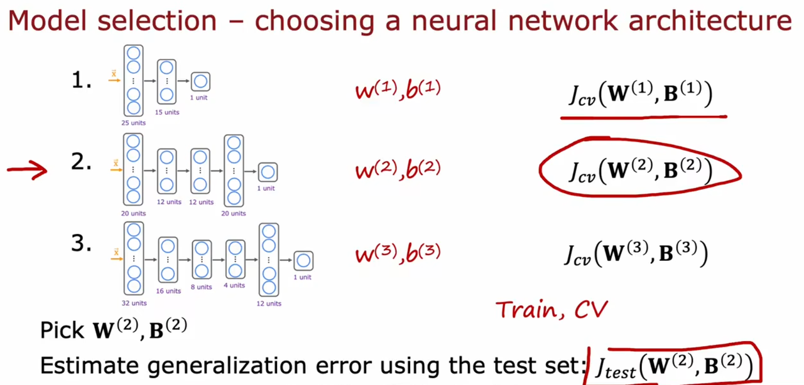

**Diagnostic** : A test that you run to gain insight into **what is/isn’t working with a learning algorithm**, to gain guidance into improving its performance.

In the example of using the house size to predict the price of the house, we can plot the fitted function $f_{\vec{w}, b} (x)$ to get an intuition of the model. But what if we have more than 2 variables ? How can we plot a 3-dimensional function and above ?

# 01 Test Set

## 1.1 Error

One way to evaluate the model is to **split the dataset** . We can divide the dataset into **training sets and test sets** .

We note the input from the training sets as $x_{train}^{(i)}$ , and output of training sets as $y_{train}^{(i)}$ . Similarly, we note the input from test sets as $x_{test}^{(i)}$ and output of test sets as $y_{test}^{(i)}$ . So now, we can **calculate the loss of two sets respectively by the data in sets** .

For Linear Regression :

For Logistic Regression :

But in practice, we always calculate the **fraction of misclassified** . This is a simpler and more exact way to evaluate the loss of the model .

## 1.2 Choose Model

By **using the test sets to calculate the test error of the model**, we can choose a model with the **lowest test error** . This means we use the test set to **fit another virtual parameter** $d$ **: the degree of the model in polynomial (or the number of the model in common)** .

But the way still could be improved because we perceive that **all the dataset is used to fit a parameter of the model**, so, we don't know how good is the generalization of the model in new data.

# 02 Cross-Validation/Validation Set

## 2.1 Choose Model

We can add an additional dataset called **Cross-Validation Set (Validation Set for short)** , which is going to be used to validate the model . Also, we note the input of the validation set as $x_{cv}^{(i)}$ and the output from the validation set as $y_{cv}^{(i)}$ .

Then, we can calculate the error of the model and **select the model with the lowest validation error** .

So far, we use training sets to fit $w, b$ and validation sets to fit $d$ . There is still a dataset the model has not seen, so that we can **estimate the generalization error of the model by using the test sets** .

## 2.2 Choose Neural Network Architecture

Choosing the architecture of a neural network is the same as choosing the model of machine learning . If there are multiple architectures that are available, we can **use the training sets to train the model**, **use validation sets to choose the best model** and **use the test sets to estimate the generalization error of the model** .

