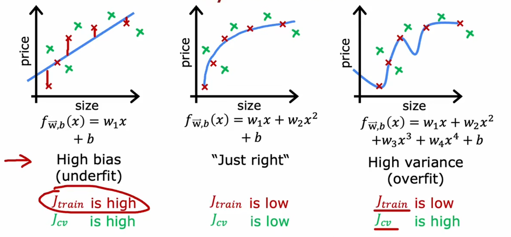
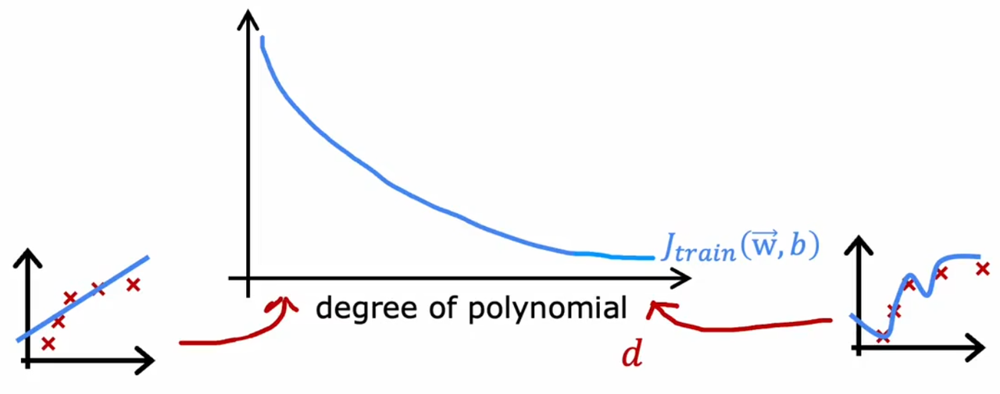
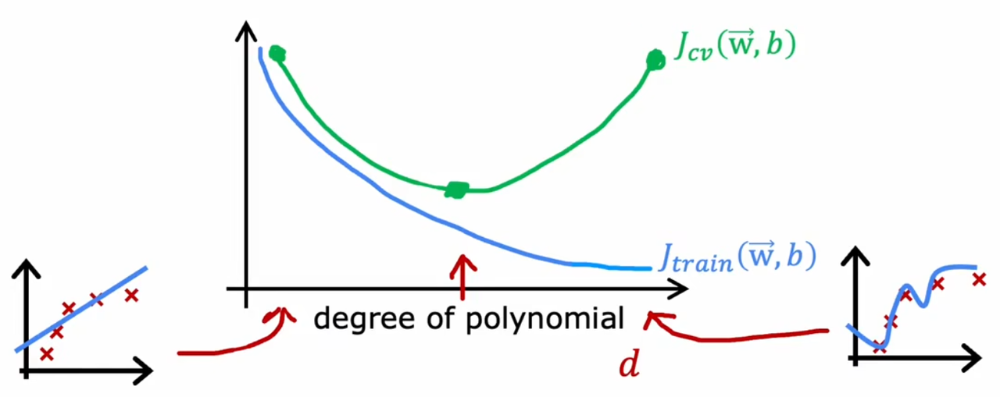
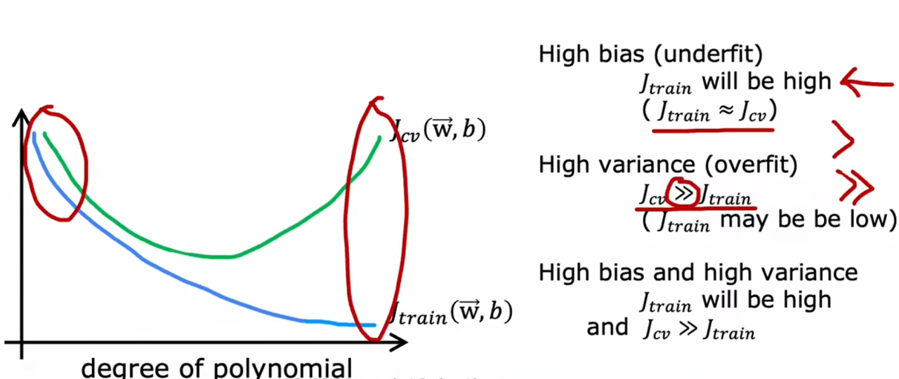
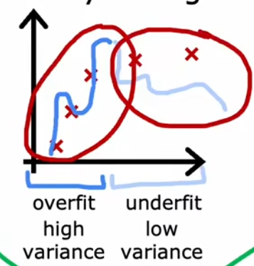
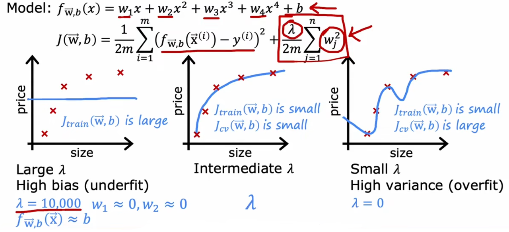
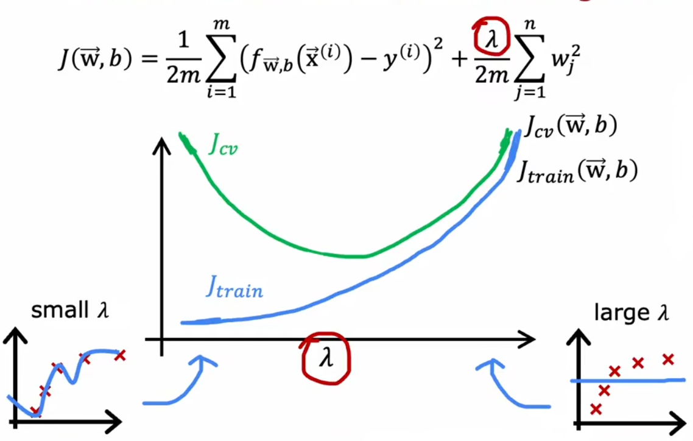

We have talked about the problem of fitting the model in the [linear regression] . If a model is **underfit** , then it can be seen as **high bias** . If a model is **overfit** , then it can be seen as **high variance** .

Let's look at the example of predicting the house price by the size. If we choose the first order function, a linear function, to fit the data, it will be underfit. If we choose the second order function, a quadratic function, to fit the data, it will be just right. If we choose the fourth order function, a quartic function, to fit the data, it will be overfit.

Now, if we calculate the errors in training sets and validation sets, we will find that :

- A _**High Bias**_ **model** has a **high training error** $J_{train}$ and a **high validation error** $J_{cv}$
    
- A _**High Variance**_ **model** has a **low training error** $J_{train}$ while a **high validation error** $J_{cv}$
    
- A **good model** has a **low training error** and a **low validation error**
    

# 01 Bias

If we train the data by an increasing order function, it will commonly behave as **with the increase of the degree, the training error will decrese :**

It is because if we use the high order function, the model will **do its best to go through all the input sample** .

# 02 Variance

While in variance, **the validation error will only have a minimum somewhere** . Because **only the best model can predict the new data well** .

# 03 The Model

A **high bias** model indicates that **it does bad on training sets as well as the validation sets** . A **high variance** model indicates that **it does good on training sets while does bad on validation sets,** and commonly, **the error of validation sets will much larger than the training sets** .

But if you are unfortunately enough, you may meet the model **with both high bias and high variance** . This may take place **especially in neural network** . If the model **overfits some part of the training data** , the model will have **high variance** , while there maybe some part the model **underfits the training data as well as the validation data** , the model will have both high bias and high variance .

In this case, the **training error will be high** and the **validation error will be much higher than training error** .

# 04 Regularization

## 4.1 The influence of lambda

What if we add the regulariztion term to the loss function ? Take linear regression as an example.

- If we choose a **large value** of $\lambda$ , then the parameter $w_i$ will be very small, approximately equal to 0. Then the model will be said to be **high bias.**
    
- If we choose an **extremely samll value of** $\lambda$ , assuming to be 0, then the regularization term will disappear and we will get a normal fourth order polynomial and then the model is **high variance** .
    

## 4.2 Choose lambda

The way to choose $\lambda$ is the same as choosing a model of machine or choosing an architecture of neural network. We can use a series of values of $\lambda$ to fit the parameter, then we use validation sets to calculate the **validation error of each value of** $\lambda$ . The best value of $\lambda$ is with the **lowest validation error** .

## 4.3 Summary

The way the value of $\lambda$ influences the error of training sets and validation sets is opposite from the degree of the polynomial. On the left side of the graph, validation error is high while training error is low, which means the model is high variance. On the right side of the graph, validation error and training error are both high, which means the model is high bias.

