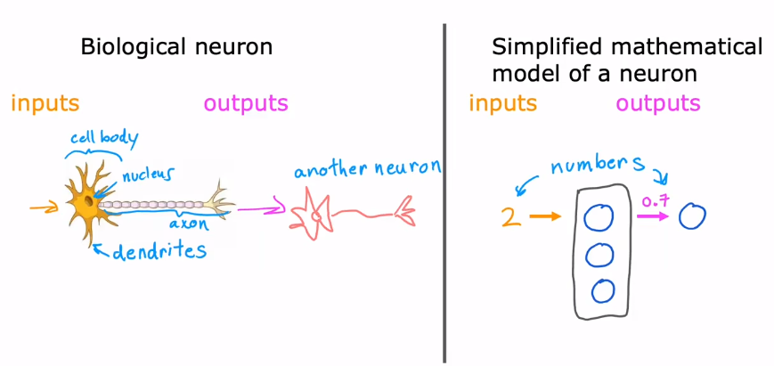
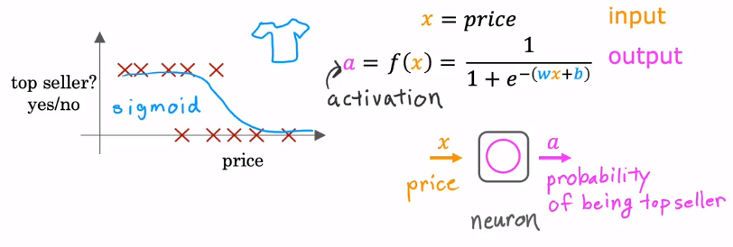
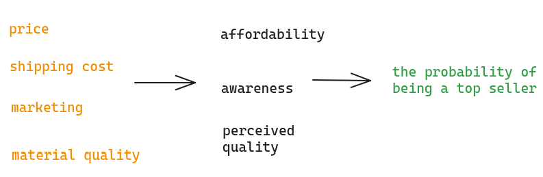
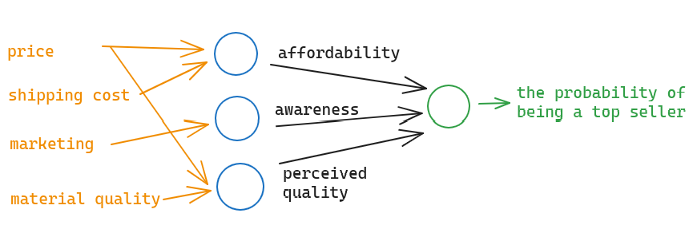
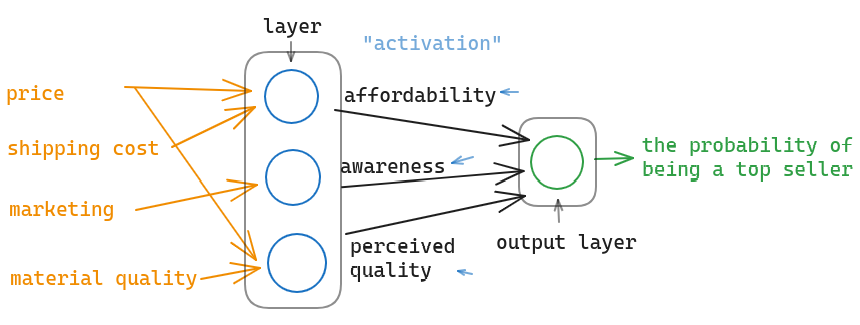
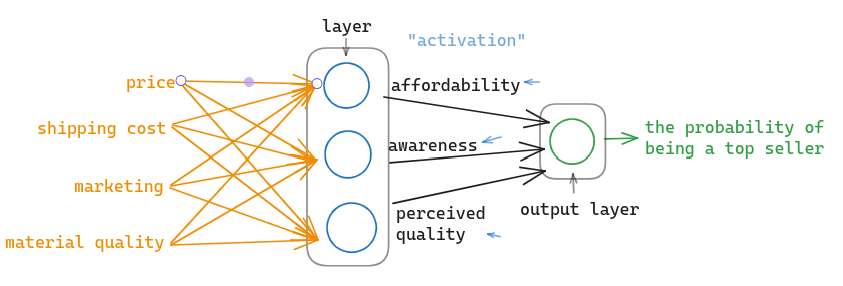
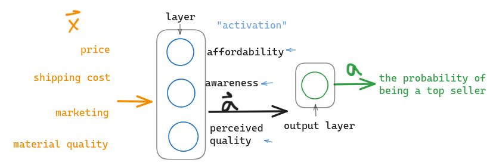

A biological neuron is accept something input and give something output. The neural network is simplified mathematical model of a neuron. It also take some input and compute the data and then pass the output to the next "neuron" : 

# 01 Demand Prediction

## 1.1 Single Feature

Let's look at a prediction in the sale : If there is some data of some T-shirts, is one of the T-shirts will be the top seller ? The prediction consist of only two answer : yes or no, and now we consider only the price of the T-shirt.

In this case, you might easily record what we have learned in Machine Learning, we can fit the data with a **[Sigmoid Function](../16%20Machine%20Learning/06.Classification-Logistic%20Regression.md#01%20Logistic%20Regression)** and then do the **[Logistic Regression](../16%20Machine%20Learning/06.Classification-Logistic%20Regression.md)** . So that **the input will be the price** and the **output will be the probability of the T-shirt to be top seller** . Here, **the output is the result calculated after sigmoid function** : 

$$f (x) = \dfrac{1}{1 + e^{-(wx + b)}}$$

We will use the letter $a$ to represent the output. In fact, $a$ is the abbreviation of ***activation*** . The activation is an important terminology in neural network, simply, which is the output of single neuron : 

If we consider the function $f (x)$ to be a neuron, then we input the price to the neuron and get the output of this neuron, that is, the probability of the T-shirt to be top seller.

## 1.2 Multiple Features

Predict the good to be top seller from only its price is inappropriate. Now, let's consider other factors that affect the probability of being top seller. There may be these features which affect the probability : 

- price
- shipping cost
- marketing
- material quality

But, whether or not a T-shirt becomes a top seller actually depends on a few factors : 

- affordability of the buyers
- the degree of the awareness to buy the T-shirt
- perceived quality of the potential buyers

Now, what we are going to do is **create one artificial neuron to estimate the probability** that the T-shirt is percieived as highly affordable. Because the affordability is **mainly a function** of price and shipping cost, so we **use a neuron here, a logistic regression unit**, to **input price and shipping cost** and **predict do the people think this is affordable** .

Second, we use another neuron to estimate is there high awareness of this T-shirt, which is the function of the marketing of the T-shirt in this case. Finally, we create another neuron to estimate do people perceive this T-shirt to be of high quality, which is the function of the price and material quality.

Given these estimates of affordability, awareness, perceived quality, we then **wire the output of three neurons to another neuron, also a logistic regression unit** . So we will have three input and get the output of the last neuron, the probability of this T-shirt being a top seller.

In the terminology of neural networks, we will group the three neurons together into what's called a layer. **A *layer* is a grouping of neurons which take some features input and output a few numbers together** . A layer can have single or multiple neurons. Thus, there are two layers in the graph. And because the last neuron is the output probability predicted by the neural network, we call it the ***output layer*** . In terminology of neural network, the term affordability, awareness and perceived quality to be ***activations*** .

The term activation comes from biological neurons and it refers to be the degree that the biological neuron is sending a high output value or many electrical impulses to other neurons to the downstream from it.

This simple neural network carries out computations as follows : 

1. Take 4 input numbers represent the features and compute 3 numbers. The new numbers also called **activation values** 
2. The output layer take 3 activation values to compute 1 number. The new number is the output of the neural network

The list of 4 input number is also called ***input layer*** .

In practice, it will take you a long time to design which neuron receives what parameters/features. The way a neural network is implemented in practice is that, **each neuron in a layer will have access to every features from the previous layer** . So you will know that in the learning, it will modify the parameters to ignore some useless features and figure out what features are important.

To simplified the notation, we write the 4 input features as a **vector** $\vec{x}$ . The vecotr $\vec{x}$ is fed into the neural network throught the layer and then the layer output 3 activation value, we write it as $\vec{a}$ and finally the output layer take the activations and have the output $a$ : 

The middle layer also has its name -> ***hidden layer*** . In the hidden layer, it will automatically deal with the 4 features, we needn't design new features to imporve the model, because the neural network will do it !