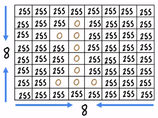
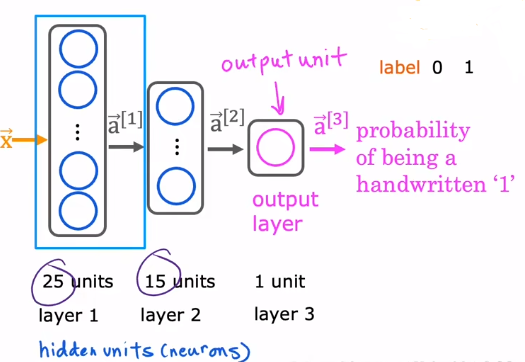
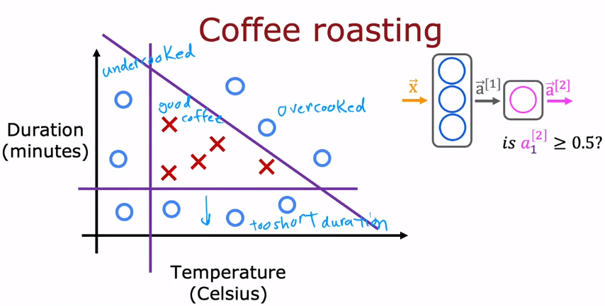

In this session, we are going to learn a important algorithm named ***Forward Propagation*** which let your neural network make inferences or make predictions.

# 01 Handwritten Digit Recognition

For simplicity, we are just going to distinguish between 0 and 1, so it is just a binary classification problem. Let's use an $8 \times 8$ image to show the number : 



in which the value of pixel 255 is represent white, and the value of pixel 0 is represent black.

And we are going to use a neural network with the struct : 



So the layer 1 will accept the input feature $\vec{x}$ and calculate the $\vec{a}^{[1]}$ as : 

$$\vec{a}^{[1]} = 
\begin{bmatrix}
a^{[1]}_1 = g (\vec{w}^{[1]}_1 \cdot \vec{x} + b^{[1]}_1) \\
a^{[1]}_2 = g (\vec{w}^{[1]}_2 \cdot \vec{x} + b^{[1]}_2) \\
\vdots \\
a^{[1]}_{25} = g (\vec{w}^{[1]}_{25} \cdot \vec{x} + b^{[1]}_{25}) \\
\end{bmatrix}
$$

And then, layer 2 will calculate $\vec{a}^{[2]}$ , layer 3 will calculate $\vec{a}^{[3]}$ .

Because this computation goes from left to right, you start from $\vec{x}$ and compute $\vec{a}^{[1]}$ and then $\vec{a}^{[2]}$ and then $\vec{a}^{[3]}$ . This album is also called **forward propagation** .

# 02 Inference in Code

**Tensorflow** is one of the leading frameworks to implement deep learning algorithms.

Let's see a appliance of the neural network. Assume that you will cook your coffee beans and there are two important factors that affect the quality of your cooked coffee beans -> Durations(minutes) and Temperature (Celsius). 



So only the points located in the triangle area is the well cooked. How will the neural network solves our problem ?

```Python
x = np.array ([200.0, 17.0])
layer_1 = Dense (units=3, activation='sigmoid')
a1 = layer_1 (x)

layer_2 = Dense (units=1, activation='sigmoid')
out = layer_2 (a1)

if out >= 0.5 :
	yhat = 1
else : 
	yhat = 0
```
^23456