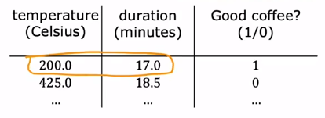

The dataset maybe : 



So the input features is written as : 

```Python
x = np.array ([[200.0, 17.0]])
```

Why there is the double square bracket ? We should first know how datas are stored in Numpy.

# 01 How the data is in Numpy ?

Assume that we have a matrix : 

$$A = 
\begin{bmatrix}
1 && 2 && 3 \\
4 && 5 && 6
\end{bmatrix}
$$

So the matrix is $2 \times 3$ matrix, and can be represent as : 

```Python
x = np.array ([[1, 2, 3],
               [4, 5, 6]])
```

If another matrix : 

$$B = 
\begin{bmatrix}
0.1 && 0.2 \\
-3 && -4 \\
-.5 && -.6 \\
7 && 8
\end{bmatrix}
$$

it is represented as :

```Python
x_ = np.array ([[0.1, 0.2],
               [-3.0, -4.0],
               [-0.5, -.6],
               [7, 8]])
print (x_)
```

For the numpy, `x = np.array ([200, 17])` is just a **1D "Vector"** , it has only one dimensions, but in tensorflow, the features is represented as matrix, so we need to add another dimension.

```Python
x = np.array ([[200, 17]])       # 1 x 2 -> 2 dimension
x = np.array ([[200],
			  [17]])             # 2 x 1 -> 2 dimension
x = np.array ([200, 17])         # 1 dimensoin
```

So let see the output of the layer : 


If we print out `a1` , it will be : 

```Python
print (a1)
# tf.Tensor([[0.2 0.7 0.3]], shape=(1, 3), dtype=float32)
print (a1.numpy ())
# array ([[0.2, 0.7, 0.3]], dtype=float32)
```

Then we can see what the `out` : 

```Python
print (out)
# tf.Tensor([[0.8]], shape=(1, 3), dtype=float32)

print (out.numpy ())
# array ([[0.8]], dtype=float32)
```

> The value type `Tensor` is a datatype created by google that simplify the computation on the large data. You can treat it as a matrix.

# 02 Build a Neural Network

Assume that we have such a dataset : 

```Python
x = np.array ([[200.0, 17.0],
			  [120.0, 5.0],
			  [425.0, 20.0],
			  [212.0, 18.0]])
# 4 x 2 matrix

y = np.array ([1, 0, 0, 1])
```

So that the neural network can be defined as : 

```Python
import tensorflow as tf
from tensorflow.keras.layers import Dense
from tensorflow.keras import Sequential

layer_1 = Dense (units=3, activation='sigmoid')
layer_2 = Dense (units=1, activation='sigmoid')
model = Sequential ([layer_1, layer_2])
```

> We can check the details of the function by `model.summary ()` 

To train the model, we can use : 

```Python
model.compile (...)
model.fit (x, y)
```

> more about the training can see -> 

Once we have trained the model, we can use the model to make inferences : 

```Python
model.predict (x_new)
```

# 03 Forward Propagation in Numpy

We can define a function of `dense (a_in, W, b, g)` to calculate the output of layers.

For layer 1, assume that we have the parameters : 

$$\vec{w}^{[1]}_1 = \begin{bmatrix}1 \\ 2\end{bmatrix}, \ 
\vec{w}^{[1]}_2 = \begin{bmatrix}-3 \\ 4\end{bmatrix}, \ 
\vec{w}^{[1]}_3 = \begin{bmatrix}5 \\ -6\end{bmatrix}$$
$$b^{[1]}_1 = -1, \ b^{[1]}_2 = 1, \ b^{[1]}_3 = 2$$

We can write these parameters as :

```Python
W = np.array ([[-1, -3, 5],
			  [2, 4, -6]])
# each of w_j is one of the columns of the matrix
# and the matrix has the shape of (2, 3)
b = np.array ([-1, 1, 2])

a_in = np.array ([-2, 4])
```

So the `dense` function should be : 

```Python
def dense (a_in, W, b, g) :
	units = W.shape[1]         # the number of columns
	a_out = np.zeros (units)   # initialize the a to be [0, 0, 0]
	for j in range (units) : 
		w = W[:, j]            # pull out all the columns
		z = np.dot (w, a_in) + b[j]
		a_out[j] = g (z)
	return a_out
```

The `dense` function is to take the activations of previous layer and use the parameters $\vec{w}, b$ of this layer to calculate the activation values of this layer.

Then we can string all the layers together : 

```Python
def sequential (x) :
	a1 = dense (x, W1, b1)
	a2 = dense (a1 , W2, b2)
	a3 = dense (a2 , W3, b3)
	a4 = dense (a3 , W4, b4)
	return a4
```

