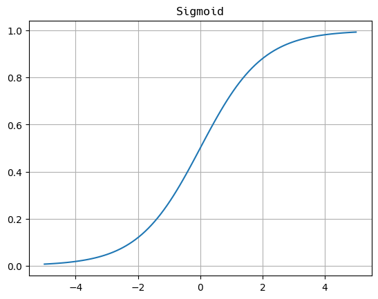

# 01 Activation Functions

## 1.1 Linear Activation Function

$$g (z) = z$$

## 1.2 Sigmoid

$$g (z) = \dfrac{1}{1 + e^{-z}}, \ z = \vec{w} \cdot \vec{x} + b$$

## 1.3 ReLU

$$g (z) = \max\{0, z\}$$

# 02 Choose Activation Function

## 2.1 Output Layer

The choice is depending on the target or the ground truth label y.

- Specifically, if you are doing the **binary classification** with the result either 0 or 1, then the **sigmoid function** is the best choice. 
- If you are doing the regression problem, for example, you are predict the weather tomorrow, it is recommended to choose the linear activation function.
- Finally, if y is only the non-negative value, the **ReLU Function** is the most naturely choice.

## 2.2 Hidden Layer

How about the hidden layer in the neural network ? It turns out that the ReLU activation function is by far **the most common choice for neural network** .

Compared to the sigmoid function, the computation speed of ReLU is faster than sigmoid. And the even more important is that, the ReLU function **goes flat only in one part of the graph while sigmoid function goes flat in two parts** .

When you are using gradient descent to train a neural network, if there are many flat in a lot of places, gradient descent would be really slow because of the too many local minimum.

# 03 Why do we need Activation function ?

Because the linear function of linear function is also a linear function, so that if we have no activation function or the activation function is linear activation function, what the neural network can do is the same as the linear regression.

So the purpose of the activation function is to **introduce non-linearity into the output of a neuron** .