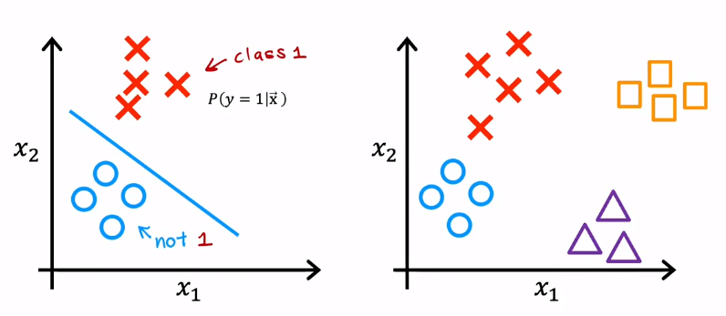
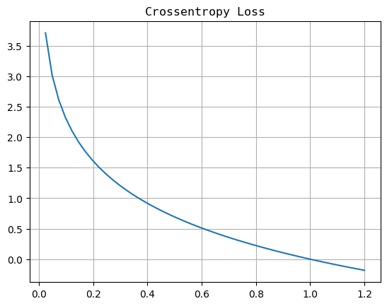
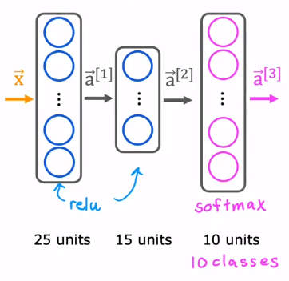

Multiclass classification can let the output takes more than 2 values.

# 01 Softmax

Logistic regression is applied on 2 possible output values, so we can treat the output as the probability of the target being one class : $a_1 = g (z) = P(y = 1 | \vec{x})$ and $a_2 = 1 - a_1 = P (y = 0 | \vec{x})$ .

For the softmax regression, assume that there are 4 possible outputs. So we will have four outputs : $z_i = \vec{w}_i \cdot \vec{x} + b_i, \ i = 1, 2, 3, 4$ , then, we can define our activation function as :

$$\begin{array}{l}
a_i &=& \dfrac{e^{z_i}}{\sum_{j = 1}^4 {e^{z_j}}} \\
&=& \dfrac{e^{z_i}}{e^{z_1} + e^{z_2} + e^{z_3} + e^{z_4}} \\
&=& P(y = i | \vec{x})
\end{array}$$

By the konwledge of probability, the whole outputs of possible classes should **have a sum of 1** , that is : $a_1 + a_2 + \cdots + a_N = 1$ .

# 02 Cost

For the logistic regression, we have the loss and the cost function: 

$$\begin{array}{l}
L &=& -y\log{(f(\vec{x}))} - (1 - y)\log{(1 - f(\vec{x})}) \\
&=& -y\log{a_1} - (1 - y)\log{(1 - a_1)} \\
&=& -y\log{a_1} - (1- y)\log{a_2}
\end{array}$$
$$
J (\vec{w}, b) = \dfrac{1}{m}\sum_{i = 1}^m L = -\dfrac{1}{m}\sum_{i = 1}^m{y^{(i)}\log a_1 + (1 - y^{(i)})\log a_2}
$$

But for the softmax regression, the loss is :

$$L(a_1, \cdots , a_N, y) = \left\{\begin{array}{}
-\log a_1 && if\ y = 1 \\
-\log a_2 && if\ y = 2 \\
&\vdots \\
-\log a_N && if\ y = N
\end{array}\right.$$

The loss of the multiclass regression is konwn as **Crossentropy loss** , and the graph of the loss is : 

If the prediction is very approach to the right answer, the loss will very approach 0.

# 03 Neural Network with Softmax Output

Let's consider the handwrite digits recognition. We need to replace the output layer with 10 units layer which output the result of softmax function : 

