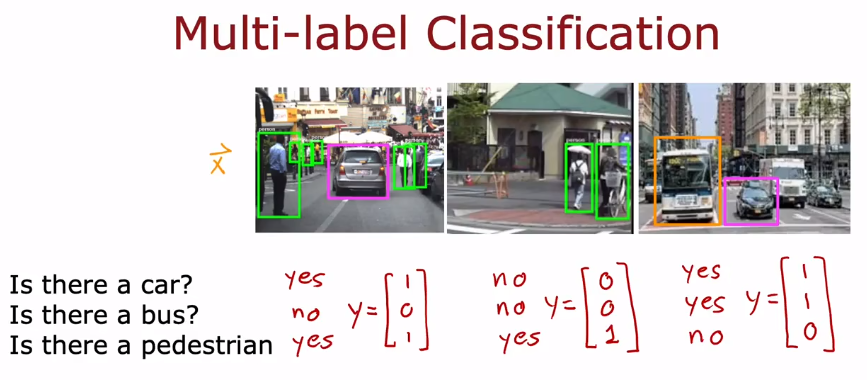
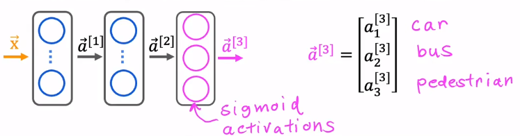

What if we want to deal with the picture of multi-label ? One way we can do is to train 3 neural network for each class. But if the number of the classes is really large, this is a terrible way.

Alternatively, we can train one neural network to detect all of the labels simultaneously. That is **applying the sigmoid function to each units** in the output layer.

It is different from the multiclass classification.