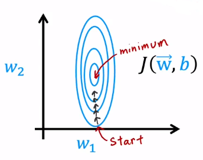
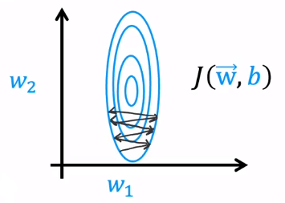
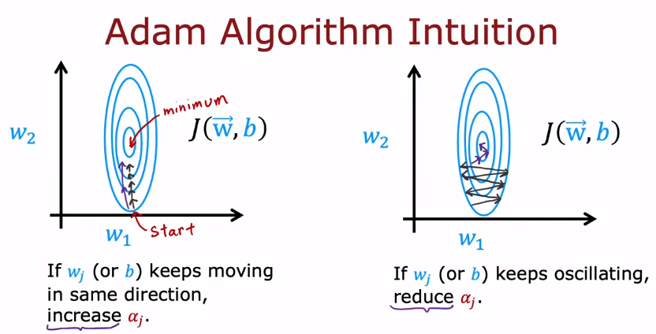

To minimize the cost function, there are now some other optimization algorithms that are even better than gradient descent. In this session, we are going to learn about the optimization algorithms.

# 01 Gradient Descent

For gradient descent, we know that : 

$$w_j = w_j - \alpha \cdot \dfrac{\partial}{\partial w_j} J (\vec{w}, b)$$
And the picture might be : 



You will find that the stride of each step is the same, but we can have a quicker speed to reach the minimum by take a larger step. To take a larger step, you might think to **increase the value of learning rate** . So if there is any algorithm that can automatically increase the value of learning rate ? That is **Adam Algorithm** .

By contrast, if we have a large initialized value of learning rate, each step may be too large and never reach the minimum : 



Then, we might think if there is any algorithm to automatically decrease the value of learning rate. That is also Adam Algorithm.

# Adam Algorithm

***Adam Algorithm*** is **Adaptive Moment Estimation Algorithm** . And the algorithm will apply different learning to different parameters such as : 

$$w_1 = w_i - \alpha_i \cdot \dfrac{\partial}{\partial w_i} J(\vec{w}, b)$$

- If $w_j$ or $b$ keeps **moving in same direction** , then the learning $\alpha_j$ will be **increased** .
- If $w_j$ or $b$ keeps **oscillating back and forth** , then the learning $\alpha_j$ will be **decreased** .



And the code is that : 

```Python
model = Sequential ([
				 Dense (units=25, activation='relu'),
				 Dense (units=15, activation='relu'),
				 Dense (units=10, activation='linear'),
])

model.compile (
		optimizer=tf.keras.optimizers.Adam (learning_rate=0.03),
		loss=tf.keras.losses.SparseCategoricalCrossentropy (from_logits=True)
)

model.fit (X, Y, epoches=100)
```