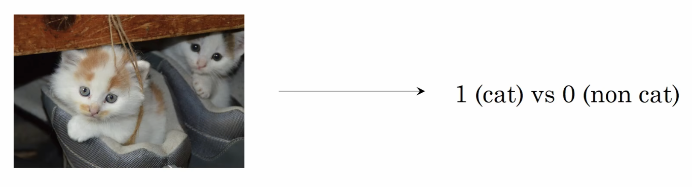
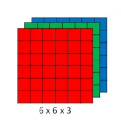
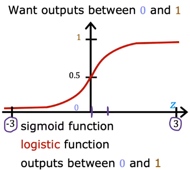
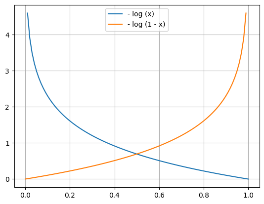

In this section, we are going to **build a neural network to judge whether there is a cat in the picture** ? That is, whether the **output of the network is 0 or 1**. This is a **binary classification problem**, which belongs to **logistic regression**. So we need to build up a network implementing binary classification, take the picture of cat as input of the nerwork and then train the network by the data.

But now, we first need to figure out **how the computer store the img and how to input a picture into the network** .

# 01 How does the computer store a img ?

The picture can be stored as a **simulated image** or a **digital image** . In the computer, the picture is stored as a **digital image** .

## 1.1 Digital Image

Digital images use `0/1` to **record information**, and the ones we use every day are **generally 8-bit images** with **256 (** $0 \rightarrow 2^8 - 1$ **) steps of grey**, from **0 to 255**, where **0 is the blackest** and **255 is the whitest**.

The computer will use a **matrix to store the whole information of the image** . For example, to store a binary image with 64 rows and 64 columns, the computer will use a matrix with the size of 64x64 to **store each pixel value of the image** .

## 1.2 Class of image

### 1.2.1 Binary Image

The binary image matrix of a binary image **consists of only two values, 0 and 1**, with `0` representing black and `1` representing white. Since each pixel (each element of the matrix) has only two possible values, 0 and 1, **the data type of a binary image in a computer is usually 1 bit**. Binary images are commonly used for **scanning recognition (OCR) of text** , **line drawings**, and storage of **masked images**.

### 1.2.2 Gray Image

An image that has only **one sample colour per pixel**, which is usually **shown as a scale of grey from the darkest black to the brightest white**, although theoretically this sample could be different shades of any color, or even different colors at different levels of brightness.

A grayscale image is **different from a black and white image**, which in the field of computer graphics has only two colors, black and white; however, a **grayscale image has many levels of color depth between black and white**. Grayscale images are often **obtained by measuring the brightness of each pixel** within a single electromagnetic spectrum such as visible light, and grayscale images for display are usually saved on a nonlinear scale of 8 bits per sampled pixel, which allows for 256 levels of grey (or 65,536 levels if 16 bits are used).

### 1.2.3 Color Image

**Each pixel is usually represented by three components, red (R), green (G), and blue (B)**, ranging from (0, 255). An RGB image can be used to represent a color image as well as an indexed image. Like an indexed image, it **represents the color of each pixel as a combination of the primary colours red (R), green (G) and blue (B)**. However, unlike indexed images, the color value of each pixel of an RGB image (represented by the three primary colours of RGB) is **stored directly and respectively in the image matrix**, and since the color of each pixel is represented by the three components of R, G, and B, and M and N represent the number of rows and columns of the image, the **three MxN matrices represent the R, G, and B colour components of the pixels respectively**.The data type for an RGB image is generally 8-bit unsigned shaping, which is usually used to represent the colour of a pixel. **The data type of an RGB image is generally 8-bit unsigned plastic**, which is usually used to represent and store true colour images.

# 02 Notation

Since the input is an image, we can not represent the image by some value as in machine learning, thus we use a **column vector** $\vec{x}$ **to represent an image by storing all pixel values in three channels** :

$$\vec{x} = \begin{bmatrix} 255 \\ 231 \\ \vdots \\ 255 \\ 134 \\ \vdots \\ 215 \\ 12 \end{bmatrix}$$

Let's assume that the color image is 64x64 and then, the number of the input is 64x64x3=12288. We note the dimension of input as $n$, so $\vec{x} \in \mathbb{R^n}$ and $y \in \{0, 1\}$ . To simplify the notation, we use $x$ to note the input as before. If we have a training set with $m$ samples, each sample can be represented by $(x^{(i)}, y^{(i)}), i = 0, 1, \cdots, m$ . To represent all the input data of the training set, we can use a **matrix** to note it :

$$X = \begin{bmatrix} | && | && && | \\ x^{(1)} && x^{(2)} && \cdots && x^{(m)} \\ | && | && && | \end{bmatrix}$$

In which, the $X$ is a $n \times m$ matrix and $X \in \mathbb{R^{n \times m}}$. Also, we use a matrix to represent the label :

$$Y = \begin{bmatrix} y^{(1)} && y^{(2)} && \cdots && y^{(m)} \end{bmatrix}$$

In which, the $Y$ is a $1 \times m$ matrix and $Y \in \mathbb{R^{1 \times m}}$.

# 03 Logistic Function

To judge whether the input image contains a cat, we need the network output a prediction $\hat{y}$ , **a number between 0 and 1**, which is **the probability of the image containing a cat** .

Given the input $x \in \mathbb{R^n}$ , the parameter $w \in \mathbb{R^n}, b \in \mathbb{R}$ . So what is the output ? How to represent it ? Here, we will use a **Sigmoid Function** :

$$\sigma(z) = \dfrac{1}{1 + e^{-z}} \ \ \ \ 0 < g (z) < 1$$

As is in linear regression, we calculate $z = w^Tx + b$ , and then put it into the sigmoid function to get the probability $\hat{y} = \sigma(w^Tx + b)$ . The graph of the sigmoid function is :

# 04 Cost Function

## 4.1 Loss Function

Our demand is to judge whether there is a cat in the image, which is a binary classification problem. Since the output $\hat{y}$ is between 0 and 1, and the reality is only 0 and 1. We can use such a loss function to calculate the difference between prediction and reality :

$$L (\hat{y}^{(i)}, y^{(i)}) = L \left(f_{\vec{w}, b} (\vec{x}^{(i)}), y^{(i)}\right) = -y^{(i)} \log \left(f_{\vec{w}, b} (\vec{x}^{(i)})\right) - (1 - y^{(i)}) \log \left(1 - f_{\vec{w}, b} (\vec{x}^{(i)})\right)$$

- When $y^{(i)} = 1$ , $(1 - y^{(i)}) = 0$ , $L\left(f_{\vec{w}, b} (\vec{x}^{(i)}), y^{(i)}\right) = - \log \left(f_{\vec{w}, b} (\vec{x}^{(i)}) \right)$ 
- When $y^{(i)} = 0$ , $L = - log \left (f_{\vec{w}, b} (\vec{x}^{(i)}), y^{(i)} \right) = - \log \left(1 - f_{\vec{w}, b} (\vec{x}^{(i)}) \right)$ 

## 4.2 Cost
This loss function gives a good result of the loss. Then we can calculate the cost by :

$$J(\vec{w}, b) = \dfrac{1}{m} \sum_{i = 1}^m L (f_{\vec{w}, b} (\vec{x}^{(i)}), y^{(i)})$$

The cost should be the average of the losses.

# 05 Gradient Descent Implementation

Since we have the cost function, we can implement the gradient descent : 

$$\begin{array}{c}
w_j = w_j - \dfrac{\partial}{\partial w_j} J(\vec{w}, b) \\
b = b - \dfrac{\partial}{\partial b} J(\vec{w}, b)
\end{array}$$

Notice that, the derivative of the cost function is : 

$$\begin{array}{c}
\dfrac{\partial}{\partial w_j} J(\vec{w}, b)
= \dfrac{1}{m} \sum_{i = 1}^m \left(f_{\vec{w}, b} (\vec{x}^{(i)}) - y^{(i)} \right)x_j^{(i)} \\
\dfrac{\partial}{\partial b} J(\vec{w}, b)
= \dfrac{1}{m} \sum_{i = 1}^m \left(f_{\vec{w}, b} (\vec{x}^{(i)}) - y^{(i)} \right)
\end{array}
$$

It is **the same form as linear regression**, but, **the Definition of $f_{\vec{w}, b} (\vec{x}^{(i)})$ may be Different !** 