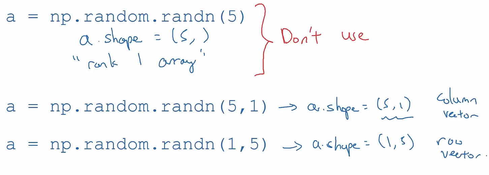

The computer is good at doing matrix computation by using the specific hardware.

# 01 For loops vs. Vectorization

Assume that there is a group of data and parameters :

```Python
x = np.array ([200, 17])
W = np.array ([[1, -3, 5],
			  [-2, 4, -6]])
b = np.array ([-1, 1, 2])
```

If we do the computation of the activation value by for loop, it should be : 

```Python
def dense (a_in, W, b, g) :
	a_out = np.array (W.shape[1])
	for j in range (W.shape[1])
		w = W[:, j]
		z = np.dot (w, x) + b[j]
		a[j] = g (z)
	return a
```

If we do the computation by vector : 

```Python
x = np.array ([[200, 17]])
W = np.array ([[1, -3, 5],
			  [-2, 4, -6]])
b = np.array ([[-1, 1, 2]])

def dense (a_in, W, b, g) :
	Z = np.matmul (a_in, W) + b
	a_out = g (Z)
	return a_out
```

# 02 Comparison

Assume that we initialize two 1x100000 vectors. If we use `for` loop to calculate the result, we need to go on 100000 loops while vector operation only does once.

```Python
import numpy as np
import time


a = np.random.randn (1000000)
b = np.random.randn (1000000)

tic = time.time ()
c = np.dot (a, b)
toc = time.time ()
print (c)
print ("Total Time : ", 1000 * (toc - tic), " ms")

c = 0
tic = time.time ()
for i in range (1000000) :
    c += a[i] * b[i]
toc = time.time ()
print (c)
print ("Total Time : ", 1000 * (toc - tic), " ms")
```

The output is :

```Plain
298.83310749193083
Total Time :  2.113819122314453  ms
298.83310749193845
Total Time :  535.5434417724609  ms
```

We can find that the time difference is very huge.

# 03 Vectorizing Logistic Regression

If we do not use the vectorization, we may need to use `for` loop twice while we can **avoid** any `for` loop by using vectorization .

We have talked about that the input data can be represented as $X$ . Let's assume that the number of samples is $n$ , then we may have n + 1 parameters $w_1, w_2, \cdots , w_n, b$ . If we set all the $w_i$ into a matrix $W$ :

$$W = \begin{bmatrix} w_1 \\ w_2 \\ \vdots \\ w_n \end{bmatrix}$$

Then, we can calculate the linear part as : 

$$z = W^TX + b = W^T\begin{bmatrix}
| && | && && | \\
x^{(1)} && x^{(2)} && \cdots && x^{(m)} \\
| && | && && |
\end{bmatrix} + \underbrace{[b\ b\ \cdots \ b]}_{m} = [W^Tx^{(1)} + b\ \ \ \ W^Tx^{(2)} + b\ \ \ \ \cdots \ \ \ \ W^Tx^{(m)} + b]$$

In the numpy, we can simply use :

```Python
w = np.zero ((n, 1))
b = 0
z = np.dot (W.T, x) + b
```

Then, we can do the calculation on all the samples.

To apply the gradient descent, we can let `dz` to be a row vector :

$$\mathrm{d}z = [\mathrm{d}z^{(1)}\ \ \mathrm{d}z^{(2)}\ \ \cdots \ \ \mathrm{d}z^{(m)}]$$

Then, since $\mathrm{d}z^{(i)} = a^{(i)} - y^{(i)}$ , we can use two vector $A, Y$ to perform the calculation :

$$\begin{array}{}
A = [a^{(1)}\ \ a^{(2)}\ \ \cdots \ \ a^{(m)}] \\
Y = [y^{(1)}\ \ y^{(2)}\ \ \cdots \ \ y^{(m)}] \\
\mathrm{d}z = A - Y = [a^{(1)} - y^{(1)}\ \ a^{(2)} - y^{(2)}\ \ \cdots \ \ a^{(m)} - y^{(m)}]
\end{array}$$

Then the derivatives `db` and `dw` can use the matrix to represent :

$$\begin{array}{}
\mathrm{d}b = \dfrac{1}{m}\sum_{i = 1}^m{\mathrm{d}z^{(i)}} \\ 
\mathrm{d}w = \dfrac{1}{m}X\mathrm{d}z^T
\end{array}$$

In the code, we can simply use :

```Python
a = np.dot(w.T, x) + b
dz = a - y
db = np.sum (dz) / m
dw = np.dot(x, dz.T) / m
```

# 04 Vector in Python Numpy

## 4.1 Broadcast

In Python, when we use numpy to deal with matrices, the numpy will automatically enhance the usability of the matrix operation. Such as :

### 4.1.1 Expand a Real Number

A real number will be automatically expanded to a matched matrix

- `[1, 2, 3] + 1 == [2, 3, 4]` , `1` will be automatically expanded to be a vector `[1, 1, 1]` 
- `[1, 2, 3] - 1 == [0, 1, 2]` 
- `[1, 2, 3] * 2 == [2, 4, 6]` 
- `[1, 2, 3] / 2 == [.5, 1, 1.5]` 

### 4.1.2 Expand a Matrix

A matrix will also be expanded into a matched matrix

```Python
a = np.array ([[1, 2, 3],
			[4, 5, 6]])
b = np.array ([1, 2, 3])
c = a - b
d = a / b
print (c)
# [[0, 0, 0],
#  [3, 3, 3]]
print (d)
# [[1, 1, 1],
#  [4, 2.5, 2]]
```

`[1, 2, 3]` will be expanded to `[[1, 2, 3],[1, 2, 3]]` .

```Python
a = np.array ([[1, 2, 3],
			   [4, 5, 6]])
b = np.array ([[1],
			   [2]])
c = a - b
print (c)
# [[0, 1, 2],
#  [2, 3, 4]]
d = a / b
print (d)
# [[1, 2, 3],
#  [2, 2.5, 3]]
```

## 4.2 Rank 1 Array

In numpy, we need to avoid using the **"rank 1 array"**  which is in the shape of **(n,)** . We'd better **specify the shape of the matrix** .

