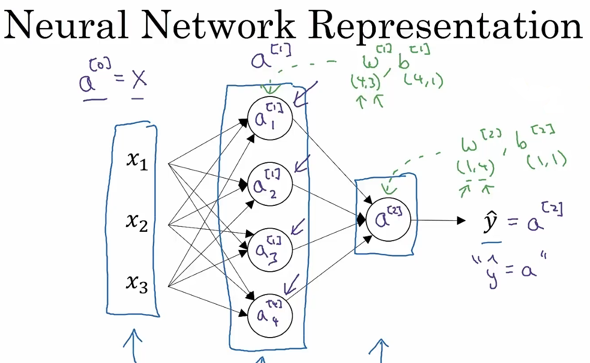
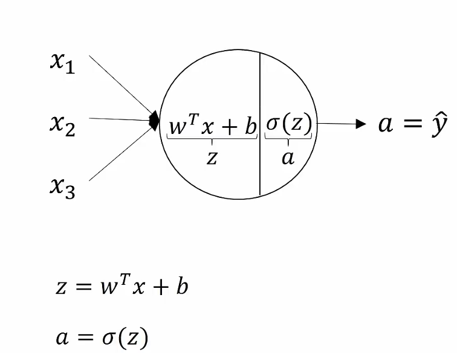
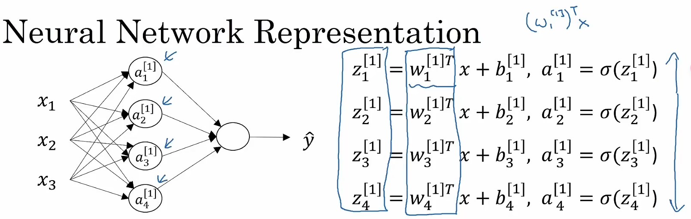
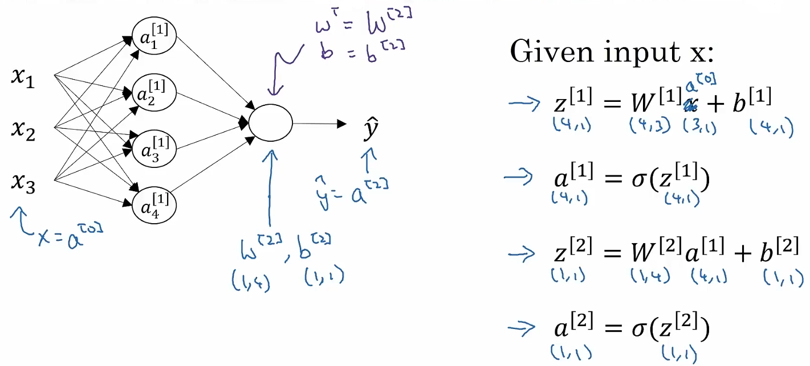
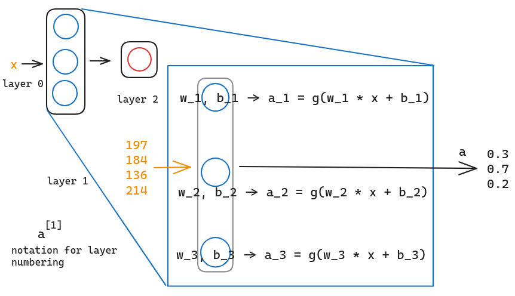
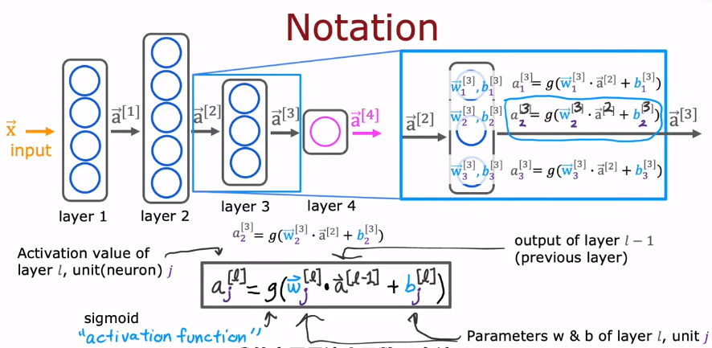
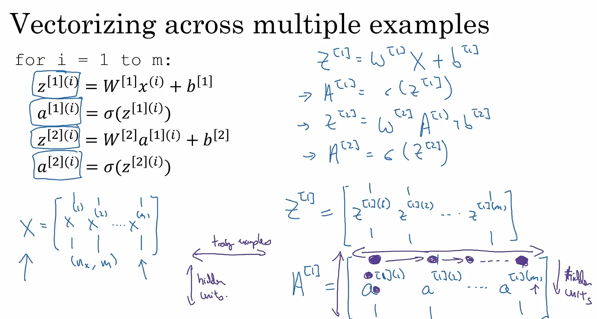

# 01 Notation

Let's look at the example of a neural network :

We use **superscript** to represent where the variables comes from. Such as, the ***activations*** from layer 1 (a hidden layer) is represented as $a^{[1]}$ , and it is **a column vector with 4 components** $a^{[1]}_1, a^{[1]}_2, a^{[1]}_3, a^{[1]}_4$ . In layer 1, there will be 5 parameters , 1 vector with 4 elements and 1 number. We can also note it as $w^{[1]}, b^{[1]}$ .

To get the notation consistent, we can also perceive the input layer as layer 0 with $a^{[0]} = x$ , the output layer as layer 2 with $a^{[2]} = \hat{y}$ .

# 02 Neuron Unit

As we have mentioned, the neuron unit in a common neural network is just a **logistic unit** which calculate the result of logistic function, and the logistic function can be called as ***activative function*** while the results are called ***activations*** . So let's look at a neuron unit :

Each unit takes all the input as a column vector and  first calculates $z = w^Tx +b$ , and then passes $z$ to the activative function to calculate the activations $a = \sigma (z)$ . 

>[!faq]
>**Why calculate the result step by step ?**
>
>It is because by seperating the calculation, we can easily use these results to perform **forward propagation and backward propagation** much more better. You can look at [03 Computing Graph](03%20Computing%20Graph.md) for more details.

# 03 Process

Let's look at the whole neural network. For each unit, they all perform the logistic regression to calculate the activations.

Then, we can [vectorize](04%20Vectorization.md) it as :

$$\begin{array}{}
a^{[0]} = \begin{bmatrix} x_1 \\ x_2 \\ x_3 \end{bmatrix}, 
W^{[1]} = \begin{bmatrix} - w^{[1]T}_1 - \\ - w^{[1]T}_2 - \\ - w^{[1]T}_3 - \\ - w^{[1]T}_4 - \end{bmatrix}, b^{[1]} = \begin{bmatrix} b^{[1]}_1 \\ b^{[1]}_2 \\ b^{[1]}_3 \\ b^{[1]}_4 \end{bmatrix} \\ \Downarrow \\
z^{[1]} = W^{[1]}a^{[0]} + b^{[1]} =  \begin{bmatrix} - w^{[1]T}_1 - \\ - w^{[1]T}_2 - \\ - w^{[1]T}_3 - \\ - w^{[1]T}_4 - \end{bmatrix}\begin{bmatrix} x_1 \\ x_2 \\ x_3 \end{bmatrix} + \begin{bmatrix} b^{[1]}_1 \\ b^{[1]}_2 \\ b^{[1]}_3 \\ b^{[1]}_4 \end{bmatrix} = \begin{bmatrix} w^{[1]T}_1a^{[0]} + b^{[1]}_1 \\ w^{[1]T}_2a^{[0]} + b^{[1]}_2 \\  w^{[1]T}_3a^{[0]} + b^{[1]}_3 \\  w^{[1]T}_4a^{[0]} + b^{[1]}_4 \end{bmatrix} = \begin{bmatrix} z^{[1]}_1 \\ z^{[1]}_2 \\ z^{[1]}_3 \\ z^{[1]}_4 \end{bmatrix}
\end{array}
$$

So the activations $a^{[1]} = \sigma (z^{[1]})$ . Now, you can check out the dimension of each matrix :

Let's see another example of the demand prediction : 

Assume that there are 4 features and all of them are inputs to each three neurons. And each of these three neurons is just **implementing a little logistic regression unit** .

Take the first as example, if we input the features in, it will output some **activation value** $a_1$ , which is $a = g(\vec{w}_1 \cdot \vec{x} + b_2)$ and $g(z) = \dfrac{1}{1 + e^{-z}}$  , maybe is 0.3. The second neuron and the third neuron are the same as the first neuron. So there may be a vector of output containing 0.3, 0.7, 0.2 three activation values.

And we will use the notation of superscript n in square bracket 1 to represent **the output of the $n-th$ layer** as $\vec{a}^{[1]}$ : 

$$\vec{a}^{[1]} = 
\begin{bmatrix}
0.3 \\ 0.7 \\ 0.2
\end{bmatrix}
$$

So, the parameters of neuron 2 of layer 1 are represented as $\vec{w}^{[1]}_{2}, b^{[1]}_{2}, a^{[1]}_{2}$ .

Then, if we zoom into the calculation of layer 2, the output of layer 1 $\vec{a}^{[1]}$ is the input of layer 2, and then layer 2 will also calculate the logistic regression :

$$a^{[2]} = g (\vec{w}^{[2]}_{2} \cdot \vec{a}^{[1]} + b^{[2]}_1)$$

# 04 More Complex

The output of the previous layer is the input of the next layer. So that the calculation of the activation values can be represented as : 

$$a^{[l]}_j = g (\vec{w}^{[l]}_j \cdot \vec{a}^{[l - 1]} + b^{[l]}_j)$$

in which, $l$ is **the number of the layer**, $j$ is **the number of the neuron** in $l-th$ layer. And $g(z)$ is called **activation function** . In order to set the notation consistent, we can represent the input feature as $a^{[0]}$ , so that the equation can be used in layer 1.

# 05 Vectorizing across Multiple Examples

We have vectorized an input example and a parameter from a layer. Now, we are going to vectorize them together :

$^{(i)}$ represents the different examples, while $^{[i]}$ represents the different layers.