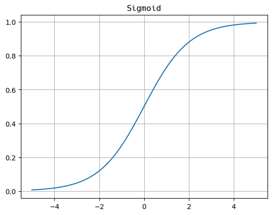
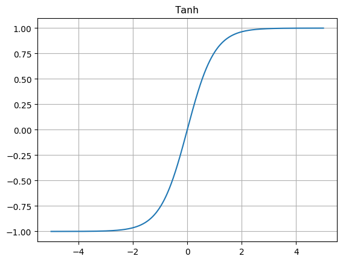
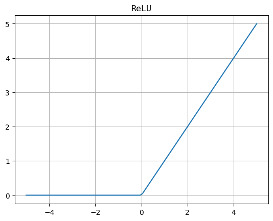
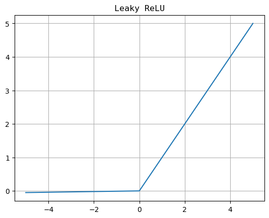

The activation function calculates the activation of the result of linear part. It can **introduce non-linearity into the output of a neuron, allowing the network to learn and represent complex patterns in the data** . 

**Without non-linearity, a neural network would essentially behave like a linear regression model, regardless of the number of layers it has** .

> The activation function decides **whether a neuron should be activated or not** by calculating the weighted sum and further adding bias to it.

# 01 Variant

## 1.1 Sigmoid Function

### 1.1.1 Definition

$$g (z) = \dfrac{1}{1 + e^{-z}}, \ z = \vec{w} \cdot \vec{x} + b$$

Usually used in output layer of a binary classification, where result is either 0 or 1, as value for sigmoid function lies between 0 and 1 only so, result can be predicted easily to be ***1*** if value is greater than ***0.5*** and ***0*** otherwise.

### 1.1.2 Derivative

$$g'(z) = \dfrac{\mathrm{d}}{\mathrm{d}z}g(z) = \dfrac{1}{1 + e^{-z}}(1 - \dfrac{1}{1 + e^{-z}}) = g (z)\left(1 - g (z)\right) $$

Since we use $a$ to represent the activation, the derivative of sigmoid function can also be noted as :

$$g' (z) = a(1 - a)$$

## 1.2 Tanh Function

### 1.2.1 Definition

$$g(z) = \dfrac{e^x - e^{-x}}{e^{x} + e^{-x}}$$

The activation that **works almost always better than sigmoid function** is **Tanh** function also known as ***Hyperbolic Tangent function***.

Usually used in hidden layers of a neural network as it’s values lies between ***-1*** to ***1*** hence the mean for the hidden layer comes out be 0 or very close to it, hence helps in __centering the data__ by bringing mean close to 0. This makes learning for the next layer much easier.

### 1.2.2 Derivative

$$g' (z) = \cosh^2{z} = 1 - \tanh^2{z} = 1 - a^2$$

## 1.3 ReLU Function

### 1.3.1 Definition

$$g(z) = \max{(0, z)}$$

It Stands for ***Rectified Linear Unit***. It is the most widely used activation function. Chiefly implemented in __hidden layers__ of Neural network. ReLu is **less computationally expensive** than tanh and sigmoid because it involves simpler mathematical operations. At a time only a few neurons are activated making the network sparse making it efficient and easy for computation.

Also, when $z \gg 0$ , the **derivatives of sigmoid and tanh function almost equal to *0*** . This will lead to **a decline in the speed of implementing gradient descent** , while the derivatives of ReLU are always a good value when $z > 0$ .

### 1.3.2 Derivative

$$g' (z) = \left\{ \begin{array}{} 1 && z > 0 \\ 0 && z < 0\end{array} \right.$$

We can let the derivative at $z = 0$ to be 0 or 1.

## 1.4 Leaky ReLU

### 1.4.1 Definition

$$g (z) = \max{(0.01z, z)}$$

The difference between ReLU and Leaky ReLU is that, the derivative of negative part is not 0. This will make negative results also participate in the network although they do not affect really much.

### 1.4.2 Derivative

$$g' (z) = \left\{ \begin{array}{} 1 && z > 0 \\ 0.01 && z < 0 \end{array} \right.$$

Similarly, we can let the derivative at $z = 0$ to be 1 or 0.01.

# 02 Choice

## 2.1 Output Layer

The choice depends on the target or the ground truth label y.

- Specifically, if you are doing the **binary classification** with the result either 0 or 1, then the **sigmoid function** is the best choice. 
- If you are doing the regression problem, for example, you are predict the weather tomorrow, it is recommended to choose the linear activation function.
- Finally, if y is only the non-negative value, the **ReLU Function** is the most naturely choice.

## 2.2 Hidden Layer

How about the hidden layer in the neural network ? It turns out that the ReLU activation function is by far **the most common choice for neural network** .

Compared to the sigmoid function, the computation speed of ReLU is faster than sigmoid. And the even more important is that, the ReLU function **goes flat only in one part of the graph while sigmoid function goes flat in two parts** .

When you are using gradient descent to train a neural network, if there are many flat in a lot of places, gradient descent would be really slow because of the too many local minimum.