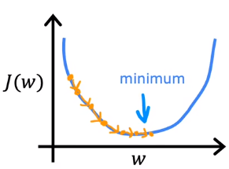

# 01 Introduction

**Gradient Descent** is the most important algorithm in Machine Learning, Deep Learning and so on.

If we have some functoin $J (w, b)$ for linear regression or any other function $J(w_1, w_2, \dots , w_n, b)$ , we also want to minimize the $J$ by finding some values of $w, b$ .

Now, let's see a visualization of cost function : 

When you are standing on the peak, our goal is to start up where you stands and **get to the bottom one of these valleys *as efficiently as possible*** . Each valley is called **local minimum** .

Such as : 

# 02 Math Expression

The gradient descent algorithm in $w$ is : 

$$w = w - \alpha \dfrac{\partial}{\partial w} J (w, b)$$
 
In which , $=$ is **Assignment** in coding, $w$ on the left is the **previous value of $w$** , and the $w$ on the right is the **new value of $w$** , $\alpha$ is called **Learning Rate** , $\dfrac{\partial}{\partial w} J (w, b)$ is the **derivative of function $J$** .

The expression is saying **assign $w$ after by taking the current value of $w$ and adjusting it to a small amount** .

**$\alpha$ Learning Rate** is usually a small positive number between 0 and 1 and what the learning rate does is that **it basically controls how big of a step you take downhill** .

$\dfrac{\partial}{\partial w} J (w, b)$ tells you **in which direction** you want to take your baby step. And in combination with the learning rate $\alpha$ , it also **determine the of the step you want to tak downhill** .

Similarly, the gradient descent algorithm in $b$ is : 

$$b = b - \alpha \dfrac{\partial}{\partial b} J (w, b)$$

So we will repeat the two expressions until **convergence** , which means the function $J (w, b)$ reaches the local minimum.

But one important thing is **the update of $w$ and $b$** . We need to **simultaneously update $w$ and $b$ rather than update them in two terms** . Look at the picture following : 

On the left side, **the derivative of $b$ is including the *old value of* $w$** , but in the right side, **the derivative of $b$ is including the *updated value of* $w$** .

# 03 Simplified

Let's also consider the cost function with only a parameter $J (w)$ .

So the gradient descent algorithm on $w$ is : 

$$w = w - \alpha \dfrac{\mathrm{d}}{\mathrm{d}w} J (w)$$

We can look at the graph : 

The part $\dfrac{\mathrm{d}}{\mathrm{d}w} J (w)$ is **the slope of the red line** . When we consider the point in the graph, we can know that the slope of the red line is **positive** , which means $\dfrac{\mathrm{d}}{\mathrm{d}w} J (w)$ is positive. 
So the expression will lead to $w$ **mines a positive value** , resulting a **smaller value of** $w$ . It is, on the graph, the new point will **move to the left** . You may notice that the direction of the changes of $w$ will lead to **a smaller value cost function** $J (w)$ , which is approaching our goal -> **minimize the cost function** .

Similarly, if the initial point of $w$ is at the left part of the graph, the derivative will be negative and the $w$ will increase, which also **causes the decline of the cost function** $J (w)$ .

# 04 Learning Rate

If the learning rate $\alpha$ is too small, it will cause the expression to **take a tiny step to change the value** of $w$ . Although the step is too small, the $w$ will still reach the lowest point another time, as the picture shows

But if the learning rate $\alpha$ is too large, it will cause to a result of **taking a step too large and over the lowest point**, as the graph shows. This situation is called **overshoot** , which will lead to the function never reaching the minimum. Worsely, it my cause the function **fails to converge, even becomes *diverge(发散)*** .

Let's see another cost function : 

If the cost function has may valleys, it is said that the function has may point which is local minimum. The slope of these points is $0$ , so the expression $w = w - \alpha \dfrac{\mathrm{d}}{\mathrm{d}w} J (w)$ will cause the $w$ to not be changed. This is why we say the gradient descent algorithm will find out the value of $w$ causes the $J (w)$ to be **local minimum** .

# 04 Logistic Regression Model

Now, we are going to dive into the math model of logistic regression.

First, let's consider what the part $\dfrac{\partial}{\partial w} J (w, b)$ is :

$$\dfrac{\partial}{\partial w} J (w, b) 
= \dfrac{\partial}{\partial w} \dfrac{1}{m} \sum_{i = 1}^m{L (f_{\vec{w}, b} (\vec{x}^{(i)}, y^{(i)}))}$$

which yields : 

$$\dfrac{\partial}{\partial w_j} J (w, b) 
= \dfrac{1}{m} \sum_{i = 1}^m {\left(f_{\vec{w}, b} (\vec{x}^{(i)}) - y^{(i)} \right)x_j^{(i)}}$$

And the part $\dfrac{\partial}{\partial b} J (w, b)$ is : 

$$\dfrac{\partial}{\partial b} J (w, b) 
= \dfrac{\partial}{\partial b} \dfrac{1}{m} \sum_{i = 1}^m{L(f_{\vec{w}, b} (\vec{x}^{(i)}), y^{(i)})} = \dfrac{1}{m} \sum_{i = 1}^m \left(f_{\vec{w}, b} (\vec{x}^{(i)}) - y^{(i)}\right)$$

So we will substitute $(1)$ and $(2)$ with the expression $w = w - \alpha \dfrac{\partial}{\partial w} J (w, b)$ and $b = b - \alpha \dfrac{\partial}{\partial b} J (w, b)$ , repeat the step until the cost function reaches to a local minimum.