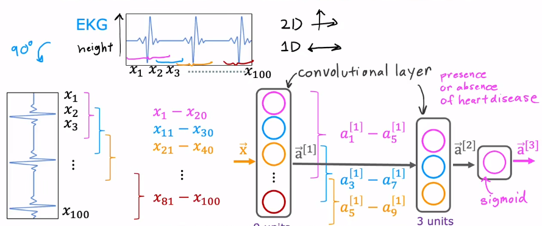

The Convolutional layer applies filters to the input image to **extract features** .

A neural network with multiple convolutional layers is called convolutional neural network (CNN). The units of the convolutional layer look only a limited input : 

If there are 100 input features, the first unit of the convolutional layer takes only from $x_1$ to $x_{20}$ , the second unit takes only from $x_{11}$ to $x_{30}$ and so on util the 9th unit. the next convolutional layer is the same as the previous. This is what we say **look only a limited input** .