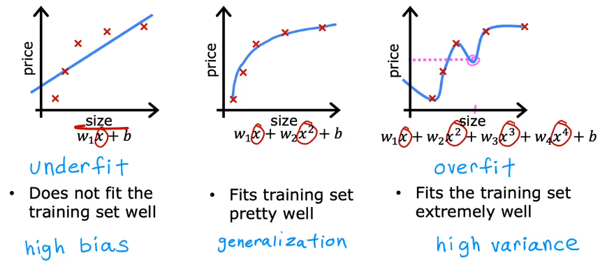

# 01 Underfitting and Overfitting

Let's see three examples in regression : 

- Graph 1 shows a model that **under fit the data** , which has **high bias** 
- Graph 2 shows a model that fit the data well and meet the require of **generalization** 
- Graph 3 shows a model that **over fit the date** , which hs **high variance** 

Let's see three examples in classification : 

From the examples above, if we calculate the errors in training sets and validation sets, we will find that :

- A _**High Bias**_ **model** has a **high training error** $J_{train}$ and a **high validation error** $J_{cv}$
    
- A _**High Variance**_ **model** has a **low training error** $J_{train}$ while a **high validation error** $J_{cv}$
    
- A **good model** has a **low training error** and a **low validation error**

# 02 Bias

If we train the data by an increasing order function, it will commonly behave as **with the increase of the degree, the training error will decrese :**

It is because if we use the high order function, the model will **do its best to go through all the input sample** .

# 03 Variance

While in variance, **the validation error will only have a minimum somewhere** . Because **only the best model can predict the new data well** .

# 04 The Model

A **high bias** model indicates that **it does bad on training sets as well as the validation sets** . A **high variance** model indicates that **it does good on training sets while does bad on validation sets,** and commonly, **the error of validation sets will much larger than the training sets** .

But if you are unfortunately enough, you may meet the model **with both high bias and high variance** . This may take place **especially in neural network** . If the model **overfits some part of the training data** , the model will have **high variance** , while there maybe some part the model **underfits the training data as well as the validation data** , the model will have both high bias and high variance .

In this case, the **training error will be high** and the **validation error will be much higher than training error** .

# 05 The Recipe For Development

