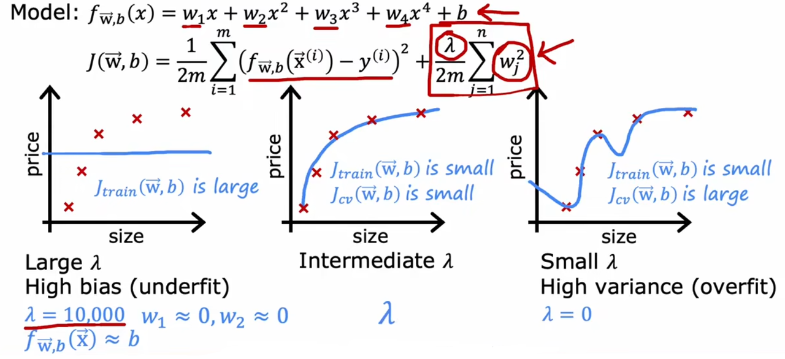
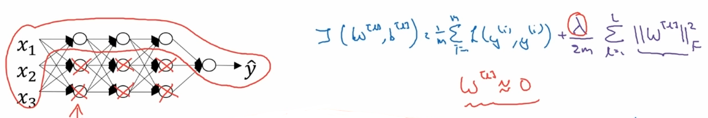
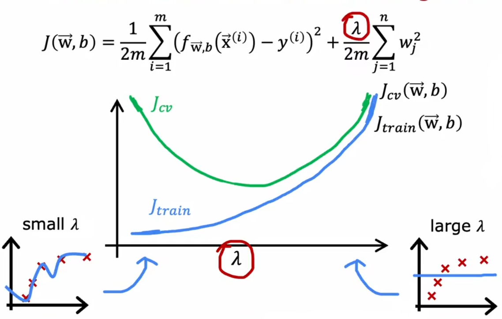

# 01 Definition

We have talked about the function of the regularization -> to change the parameter to avoid overfitting. 

To regularize the parameter, we should select a way to **shrink the parameters down**. In the lesson before, we have learned that the parameter $w_j$ is modified by the gradient descent function : 

$$w_j = w_j - \alpha \dfrac{\partial}{\partial w_j} J(\vec{w}, b)$$

So we can know that, if we want to shrink the value down, we need to **change the cost function** . As we want to find the parameter $w_j$ to **minimize the cost function** , thus, we can change the cost function(in linear regression) to :

$$J (\vec{w}, b) = \dfrac{1}{2m} \sum_{i = 1}^m (f_{\vec{w}, b} (\vec{x}^{(i)}) - y^{(i)})^2 + \dfrac{\lambda}{2m} \sum_{j = 1}^n w_j^2$$

In which, the part $\dfrac{\lambda}{2m} \sum_{j = 1}^n w_j^2$ is called **regularizatoin term** . So that if we want to minimize the cost function, the part $\dfrac{\lambda}{2m}w_j^2$ should be small. We can properly **choose the value of $\lambda$ to a big number, then the value of $w_j$ should be small so as to lower the result of cost function** .

> By the way, the regularization on parameter $b$ is not necessary. It is because the only one parameter $b$ could do little to the model compared to $w_j$ .

# 02 Application

## 2.1 Regularize Linear Regression

As is talk about, the cost function applied regularization of linear regression is : 

$$J (\vec{w}, b) = \dfrac{1}{2m} \sum_{i = 1}^m (f_{\vec{w}, b} (\vec{x}^{(i)}) - y^{(i)})^2 + \dfrac{\lambda}{2m} \sum_{j = 1}^n w_j^2$$

So in gradient descent, the derivative of cost function are : 

$$\begin{array}{l}
\dfrac{\partial}{\partial w_j} J (\vec{w}, b) = \dfrac{1}{m} \sum_{i = 1}^m (f_{\vec{w}, b} (\vec{x}^{(i)}) - y^{(i)})x_j + \dfrac{\lambda}{m}w_j
\\
\dfrac{\partial}{\partial b} J (\vec{w}, b) = \dfrac{1}{m} \sum_{i = 1}^m (f_{\vec{w}, b} (\vec{x}^{(i)}) - y^{(i)})
\end{array}$$

The gradient descent are : 

$$\begin{array}{l}
w_j &=& w_j - \alpha \left(\dfrac{1}{m} \sum_{i = 1}^m (f_{\vec{w}, b} (\vec{x}^{(i)}) - y^{(i)})x_j + \dfrac{\lambda}{m}w_j\right) \\
&=& w_j - \alpha \dfrac{\lambda}{m}w_j - \alpha \dfrac{1}{m} \sum_{i = 1}^m (f_{\vec{w}, b} (\vec{x}^{(i)}) - y^{(i)})x_j \\
&=& w_j(1 - \alpha \dfrac{\lambda}{m}) - \alpha \dfrac{1}{m} \sum_{i = 1}^m (f_{\vec{w}, b} (\vec{x}^{(i)}) - y^{(i)})x_j
\end{array}
$$

From the expression, we can know waht regularization is doing on every single iteration is **multiply $w_j$ by a number slightly less than 1 so that has the effect of shrinking the value** .

## 2.2 Regularize Logistic Regression

The cost function after regularization is : 

$$J (\vec{w}, b) = - \dfrac{1}{m} \sum_{i = 1}^m \left( y^{(i)} \log(f_{\vec{w}, b} (\vec{x}^{(i)})) + (1 - y^{(i)}) \log( 1 - f_{\vec{w}, b} (\vec{x}^{(i)})) \right) + \dfrac{\lambda}{2m} \sum_{j = 1}^n w_j^2$$

From the two examples above, we could find that there is the same term $\dfrac{\lambda}{2m}\sum_{j = 1}^n{w_j^2}$ in the cost function. The sum $\sum_{j = 1}^n{w_j^2}$ is **the norm of $w$** , which is :

$$||w||_2^2 = w^Tw$$

This norm of $w$ is called ***L2 Norm*** , so the method to regularize the parameter is called **L2 Regularization** .

> There is another method called **L1 Regularization** , it use the norm $||w||_1 = \sum_{j = 1}^n{w}$ to regularize the parameter. But L1 Regularization will lead to the **sparse of the parameter** .
> 
> Some one think of it can shrink the size of the model but many people choose to use L2 instead of L1.

## 2.3 Neural Network

In neural network, the regularization term is a bit different. It is associated with all the parameters in all layers. So the cost function is :

$$J (w^{[1]}, b^{[1]}, \cdots, w^{[l]}, b^{[l]}) = \dfrac{1}{m} \sum_{i = 1}^m {L (\hat{y^{(i)}}, y^{(i)})} + \dfrac{\lambda}{2m} \sum_{l = 1}^L {||w^{[l]}||_F^2}$$

in which $||w^{[l]}||_F^2 = \sum_{i = 1}^{n^{[l - 1]}} {\sum_{j = 1}^{n^{[l]}} {(w_{ij}^{[l]})^2}}$ is called **Frobenius Norm** . It calculate the norm of the parameters in the matrix in the specific layer.

> [!note] 
> The parameter matrix $W^{[l]} in layer $l$ is with the shape of $(n^{[l]}, n^{[l - 1]})$ , $n$ is the number  of hidden units in each layer.
> 
> For example, if layer $l - 1$ has $n^{[l - 1]}$ hidden units, then the **the number of inputs of layer $l$ will be $n^{[l - 1]}$** . Assume that layer $l$ has $n^{[l]}$ hidden units, then each unit will have $n^{[l - 1]}$ parameter $w$ . To multiply the inputs and parameters, the matrix $W^{[l]}$ must be with the shape of $n^{[l]}$ rows and $n^{[l - 1]}$ columns (after transported) and the input is a column vector with the shape of $(n^{[l - 1]}, 1)$ .

# 03 Influence

## 3.1 The influence of lambda

### 3.1.1 In Regression

What if we add the regulariztion term to the loss function ? Take linear regression as an example.

- If we choose a **large value** of $\lambda$ , then the parameter $w_i$ will be very small, approximately equal to 0. Then the model will be said to be **high bias.**
    
- If we choose an **extremely samll value of** $\lambda$ , assuming to be 0, then the regularization term will disappear and we will get a normal fourth order polynomial and then the model is **high variance** .
    

### 3.1.2 In Neural Network

The regularization term will shrink down the parameter, so that there will be **many parameters approach 0** . So that if we have a complex neural network with multiple hidden units, some of the parameters approaching 0 will lead to **the invalidation of some of the hidden units** , that is, we ***decline the model size*** and the network becomes a simpler one.

## 3.2 Choose lambda

The way to choose $\lambda$ is the same as choosing a model of machine or choosing an architecture of neural network. We can use a series of values of $\lambda$ to fit the parameter, then we use validation sets to calculate the **validation error of each value of** $\lambda$ . The best value of $\lambda$ is with the **lowest validation error** .

## 3.3 Summary

The way the value of $\lambda$ influences the error of training sets and validation sets is opposite from the degree of the polynomial. On the left side of the graph, validation error is high while training error is low, which means the model is high variance. On the right side of the graph, validation error and training error are both high, which means the model is high bias.

