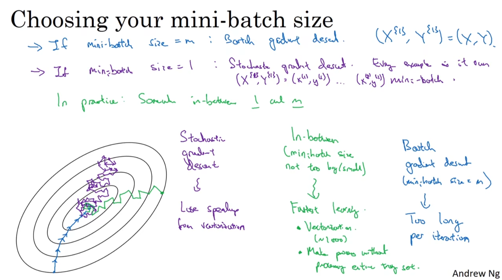

We can vectorize the whole dataset to calculate the result at once. But if the dataset is too large, such as we have a dataset with 5 million samples, it will **take a greate time to process the dataset and go on the next step**. Actually, this is a inefficient way to train the model.

So that we are going to split the dataset into smaller one, which is called **mini-batch** . If we determine that each mini-batch is with 1000 samples, then there will be 5000 mini-batches. We just need to apply the training process on theese mini-batches and get a faster calculation speed and faster gradient descent speed.

To notate the mini-batch, we use the $X^{\{t\}}$ to represent the $t$ mini-batch and $Y^{\{t\}}$ to represent the $t$ labels : 

$$X^{\{t\}} = \begin{bmatrix} x^{(t_0)} && x^{(t_0 + 1)} && \cdots && x^{(t_0 + 1000)} \end{bmatrix}$$

in which the shape of $X^{\{t\}}$ is $(n_x, 1000)$ .

# Choose the Batch Size

- If you choose the batch size to be the whole dataset size $m$ , then it turns out to be **Batch Gradient Descent**
	- The disadvantage of this is that you will take too long to iterate once
- If you choose the batch size to be 1, then it is called **Stochastic Gradient Descent (SGD)** 
	- The disadvantage of this is that **you lose the vectorization and the gradient will be oscillation** 
- If you choose the batch size to be in-between, then it is greate !

Commonly, we will choose a batch size that is the power of 2, such as 32, 64, 128, 256, 512 **because of the way computer memory is layed out and accessed** . 

**But the most important thing is that, we need to choose a proper batch size based on our devices, which should not exceed the memory of GPU or CPU** .