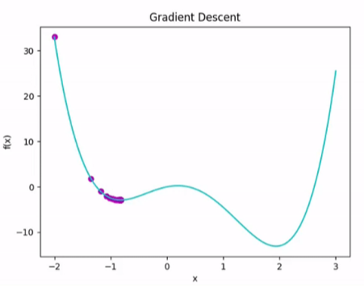
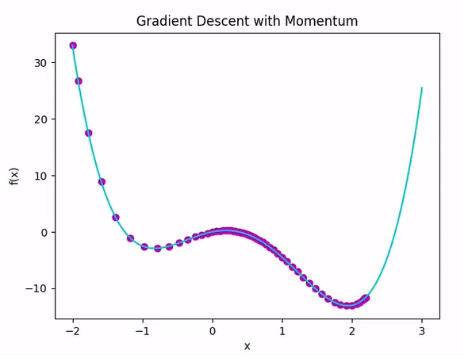
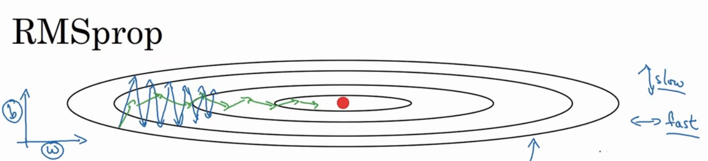

# 01 GDM

**GDM** is **Gradient Descent with Momentum** , which addresses some issues by **accelerating convergence**, **escaping local minima**, and r**educing oscillations**.

The update rule for gradient descent with momentum incorporates a **momentum term** to the standard gradient descent update rule. The momentum helps smooth out the updates and accelerates convergence, especially when the cost function has a lot of small oscillations or noisy gradients.

Here's the update rule for gradient descent with momentum:

$$\begin{array}{}
v_{\mathrm{d}w} = \beta v_{\mathrm{d}w} + (1 - \beta) \mathrm{d}w \\
v_{\mathrm{d}b} = \beta v_{\mathrm{d}b} + (1 - \beta) \mathrm{d}b \\
w = w - \alpha v_{\mathrm{d}w} \\
b = b - \alpha v_{\mathrm{d}b}
\end{array}
$$

in which, $v_{\mathrm{d}w}$ and $v_{\mathrm{d}b}$ is the momentum with time steps, $\beta$ is the **momentum coefficient between 0 and 1** . The way to **accumulate the momentum is called *Exponentially Weighted Average (Moving Average)*** , which calculate the average through the time .

By applying exponentially weighted average, we can accumulate the momentum or eliminate the oscillation. The difference between GD and GDM is shown as follow : 

# 02 RMSprop

**RMSprop** is **Root Mean Square Propagation** , which is also a adaptive algorithm deals with the oscillation and accelerates the convergence. Compared to GDM, GDM uses moving average to calculate the update value directly while RMSprop uses it to **perform as a factor** : 

$$\begin{array}{}
E[g^2]_t = \beta E[g^2]_{t - 1} + (1 - \beta)g_t^2 \\
\theta_{t + 1} = \theta_{t - 1} - \alpha \dfrac{g_t}{\sqrt{E[g^2]_t + \varepsilon}}
\end{array}
$$

in which, 
- $E[g^2]_t$ is **the moving average of the squared gradients** 
- $\beta$ is the **factor in moving average** 
- $\varepsilon$ is a real number $\ll 1$ to guarantee the denominator not be 0

So in practice, the RMSprop is :

$$\begin{array}{}
S_{\mathrm{d}w} = \beta S_{\mathrm{d}w} + (1 - \beta)\mathrm{d}w^2 \\
S_{\mathrm{d}b} = \beta S_{\mathrm{d}b} + (1 - \beta)\mathrm{d}b^2 \\
w = w - \alpha \dfrac{\mathrm{d}w}{\sqrt{S_{\mathrm{d}w} + \varepsilon}} \\
b = b - \alpha \dfrac{\mathrm{d}b}{\sqrt{S_{\mathrm{d}b} + \varepsilon}} \\
\end{array}
$$

# 03 Adam

**Adam** is **Adaptive Moment Estimation** , which updates each parameter individually and **uses the exponentially decaying average (moving average)** of the past squared gradients ($m_t$​) along with the exponentially decaying average of the past gradients ($v_t$​), similar to Momentum GD:

$$\begin{array}{}
m_t = \beta_1 m_{t - 1} + (1 - \beta_1) g_t \\
v_t = \beta_2 v_{t - 1} + (1 - \beta_2) g_t^2
\end{array}$$

in which, 
- $m_t$ - (**mean** , also known as the **first moment estimate**), a decayed running average of all gradients for tt iterations. mtmt​ keeps track of the direction of the gradients
- $v_t$ (**variance**, also known as the **second moment estimate**), a **decayed moving average of the _squared_ gradients** for $t$ iterations. 
- $g_t$ the gradient of the cost function at step $t$ 

$m_t$​ and $v_t$​ are initialized as zero vectors, making them biased towards 0, which introduces the bias-corrected first and second moment estimates:

$$\begin{array}{}
\hat{m}_t = \dfrac{m_t}{1 - \beta_1^t} \\
\hat{v}_t = \dfrac{v_t}{1 - \beta_2^t}
\end{array}$$

The Adam parameter update then becomes :

$$\theta_{t + 1} = \theta_{t} - \alpha \dfrac{\hat{m}_t}{\sqrt{\hat{v}_t} + \varepsilon}$$

We can find that the Adam algorithm is the combination of GDM and RMSprop. In practice, the Adam will be :

$$\begin{array}{}
v_{\mathrm{d}w} = \beta_1 v_{\mathrm{d}w} + (1 - \beta_1)\mathrm{d}w,\ v_{\mathrm{d}b} = \beta_1 v_{\mathrm{d}b} + (1 - \beta_1)\mathrm{d}b\ \leftarrow Moment \\

S_{\mathrm{d}w} = \beta_2 S_{\mathrm{d}w} + (1 - \beta_2)\mathrm{d}w^2,\ S_{\mathrm{d}b} = \beta_2 S_{\mathrm{d}b} + (1 - \beta_2)\mathrm{d}b^2\ \leftarrow RMSprop\\

v_{\mathrm{d}w}^{corrected} = \dfrac{v_{\mathrm{d}w}}{1 - \beta_1^2},\ v_{\mathrm{d}b}^{corrected} = \dfrac{v_{\mathrm{d}b}}{1 - \beta_1^2} \\

S_{\mathrm{d}w}^{corrected} = \dfrac{S_{\mathrm{d}w}}{1 - \beta_2^2},\ S_{\mathrm{d}b}^{corrected} = \dfrac{S_{\mathrm{d}b}}{1 - \beta_2^2} \\

w = w - \alpha \dfrac{v_{\mathrm{d}w}^{corrected}}{\sqrt{S_{\mathrm{d}w}^{corrected}} + \varepsilon},\ b = b - \alpha \dfrac{v_{\mathrm{d}b}^{corrected}}{\sqrt{S_{\mathrm{d}b}^{corrected}} + \varepsilon}
\end{array}$$

Generally, you can use the decay rate as :

- $\beta_1 = 0.9$ 
- $\beta_2 = 0.999$ 
- $\varepsilon = 10^{-8}$ 

