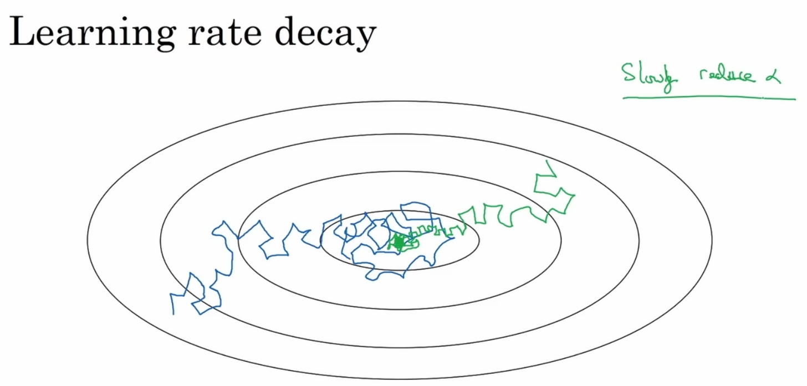

# Why

If the learning rate is a constant, it will lead to a convergence chaos in the complex model. That is, the step will take too large in the deep training process so the cost will oscillate around a region. But if we decay the learning rate, the step will be more steady towards the minima.

# How

-  $\alpha = \dfrac{1}{1 + decay\_rate * epoch\_num} \alpha_0$ 
- $\alpha = decay\_rate^{epoch\_num} \alpha_0$ 
- $\alpha = \dfrac{decay\_rate}{\sqrt{epoch\_num}} \alpha_0$ 

